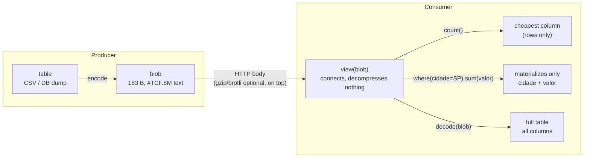
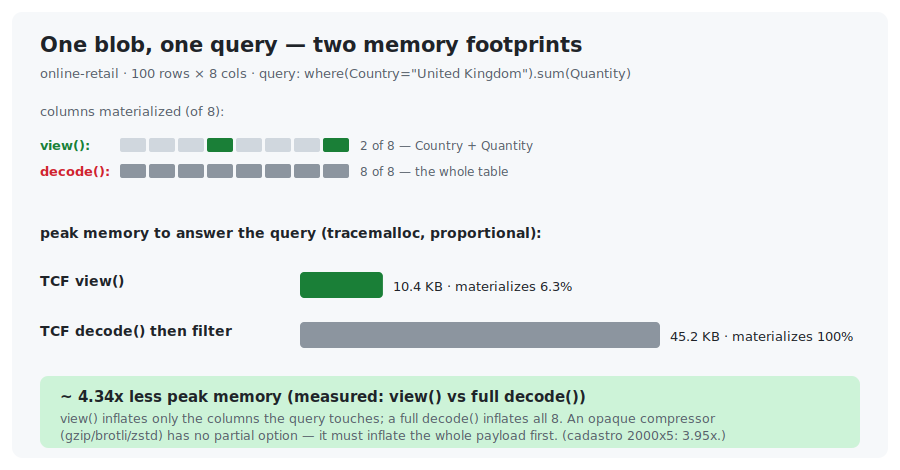

<!-- l10n: doc_id=readme · lang=en · canonical -->
**English** · [Português](README.pt-BR.md)

# TCF · Tabular Compact Format

[](https://github.com/LeoPR/TCF/actions/workflows/ci.yml)


-orange)


> **What if you could transmit the same table with far fewer bytes,
> without turning it into a binary blob nobody can open and read anymore?**

A small record set, in three formats (real bytes, real output):

**JSON** *(596 B)*: repeats every field name on every row.

```json
[ { "nome": "Ana Souza",  "email": "ana@acme.com.br",
    "cidade": "Sao Paulo", "plano": "Premium",
    "cpf": "111.111.111-11" },
  { "nome": "Bruno Lima", "email": "bruno@acme.com.br",
    "cidade": "Sao Paulo", "plano": "Premium",
    "cpf": "222.222.222-22" }, … ]
```

**CSV** *(277 B)*: drops the repeated names, one line per record.

```csv
nome,email,cidade,plano,cpf
Ana Souza,ana@acme.com.br,Sao Paulo,Premium,111.111.111-11
Bruno Lima,bruno@acme.com.br,Sao Paulo,Premium,222.222.222-22
Carla Nunes,carla@acme.com.br,Sao Paulo,Basic,333.333.333-33
Diego Rocha,diego@acme.com.br,Rio de Janeiro,Premium,444.444.444-44
```

**TCF** *(242 B, format 0.8, real `encode` output)*: what repeats becomes a reference; what is unique
stays raw.

```
#TCF.8M!2c=nome,2a=email,1c=cidade,14=plano,!cpf
Ana Souza
Bruno Lima
Carla Nunes
Diego Rochaan*a*@acme.com.br
brun*o3
carl2,3
dieg5,3
*3|Sao Paulo
Rio de Janeiro
*2|Premium
Basic
^1
111.111.111-11
222.222.222-22
333.333.333-33
444.444.444-44
```

**TCF + CPF nature** *(210 B)*: in this example, an opt-in CPF filter called the `cpf` *nature* shrinks even a column with no repeated values.

```
#TCF.8M!2c=nome,2a=email,1c=cidade,14=plano,!cpf:cpf
Ana Souza
Bruno Lima
Carla Nunes
Diego Rochaan*a*@acme.com.br
brun*o3
carl2,3
dieg5,3
*3|Sao Paulo
Rio de Janeiro
*2|Premium
Basic
^1
%g$.u
)K%7l
.1&Cc
0r(LU
```

The `cpf` column carries no factorable repetition, so the default pipeline stores it raw (`!cpf`). The
`cpf` *nature* removes the punctuation and check digit, stores the 9 useful digits in a compact form
and rebuilds the original value on `decode`. If the result is smaller, the header records `:cpf`; each
value goes from 14 characters to 5 (`%g$.u` = `111.111.111-11`).

**How to read it** *(the example data is Portuguese — `nome`=name, `cidade`=city, `plano`=plan, `cpf`=Brazilian tax ID — kept verbatim because the byte counts are measured from it):*

- Line 1, the format signature and inline meta: `#TCF.8M` is format 0.8, multi-column;
  sizes are hexadecimal.
- The column meta (`size=name`) uses `!` for raw, `@` for dictionary and `%` for structural
  split when those candidates win. The `!` marks a column stored **raw** (when raw comes out smaller than TCF).
  The last one (`cpf`) carries no size (it runs to the end) and shows `!cpf:cpf`: `!` means the body was
  kept raw by the general pipeline, while `:cpf` identifies the filter (so `decode` reverses it without
  receiving that filter).
- The bodies come concatenated, **delimited by size, not by line break**.
  That is why the raw `nome` column (`…Diego Rocha`) runs straight into the email (`an*a*…`).
- In the body: `*3|Sao Paulo` means *"Sao Paulo, 3×"* (a repetition).
  `^1` means *"same as line 1"* (a substitution).
- In the **email** column TCF goes deeper (unique prefix + a referenced common domain).
  That is where it saves the most, and where the text gets densest.
- The **`cpf`** nature is opted in via `nature_per_col={"cpf": SPEC_CPF}` (see the two blocks above).
  *(These are repeated-digit placeholders: mod-11-valid but never issued by the tax office — safe
  fakes. See "Nature filters" below.)*

**And the same records nested** — the JSON your API actually sends. Since 0.8, `#TCF.8H` round-trips
the **dataset your language builds from JSON**: nested objects/arrays, `null`, and typed
`true`/`false`/numbers. It reads the *dataset* (dict / list / scalar), never the JSON text.

**JSON** *(184 B)*:

```json
[ {"nome":"Ana Souza","cpf":"111.111.111-11","ativo":true,"fones":["11 98765-4321","11 3555-0100"]},
  {"nome":"Bruno Lima","cpf":"999.999.999-99","ativo":false,"fones":["21 99888-7766"]} ]
```

**TCF + CPF nature** *(146 B, real `encode_hierarchical` output)*: the object is *shredded into columns*
(one per field), so field names are written **once** in the header — not per record; the same opt-in
`cpf` nature from the flat table applies here too:

```
#TCF.8Hnome:21,cpf:12:cpf,ativo:11b,fones#:8[
Ana Souza
Bruno Lima
%g$.u
AJ/}}
true
false
*2-1|\2
\11 *\98765-\4321
1\3555-\0100
\21 \99888-\7766
```

- `cpf:12:cpf` is the same opt-in **`cpf` nature** as the flat table above — it strips the punctuation
  and check digit, so the two values compress to `%g$.u` / `AJ/}}`; the trailing `:cpf` lets `decode`
  rebuild them without being told the filter.
- `ativo:…b` is a **typed bool** — `true`/`false`, distinct from the string `"true"`; a number field
  would carry a type tag too.
- `fones#:…[` is an **array** column; `*2-1|\2` reads the array lengths as a run — *2 phones, then 1*
  — so you count the structure **without expanding it**. Digits get a `\` escape so they never collide
  with the reference syntax (`\11 ` = `11 `); `decode` reverses it exactly.

The whole JSON class round-trips byte-exact — nested objects/arrays, `null` (distinct from absent and
from `"null"`), ragged records, any value at the root. Full mapping and the declared frontier:
[`docs/reference/json-equivalence.md`](docs/reference/json-equivalence.md).

JSON repeats the whole structure.
CSV repeats the values.
**TCF factors out what repeats**, references the rest and **keeps unique data raw** (without inflating), while staying **ASCII text you can open and read**.

But the deeper it factors (look at the email), the denser the text gets.
*Readable does not mean obvious at first glance.*

On large tables the gap grows: see [Results](#results).

## What TCF is

A **textual**, **lossless** format (`decode(encode(x)) == x`) for tables of strings.

It compresses somewhat like a zip/gzip, but with a difference: the result **stays ASCII text that you open and inspect**, without decompressing.
It is not as obvious as the original (the more TCF factors, the denser the text), but it never becomes an opaque blob.
Each column goes through its own pipeline.

That is the niche TCF occupies: **compact like a compressor, inspectable like text**.
(Need maximum ratio? You can run gzip/brotli on top: they compose.)

## How it does it: OBAT + HCC

Two layers, explained by purpose (specs: [`docs/algorithms/`](docs/algorithms/)).

**OBAT** (Online Bidirectional Affix Tokenizer) *finds what the strings have in common.*
For each value, it looks for the longest prefix **and** suffix shared with earlier ones (email domains, URL roots, codes of the same family).
It writes the shared piece once and references the rest.

It is **bidirectional front-coding**: it generalizes the classic front-coding of string dictionaries (Witten et al.; HTFC/RPDac, Brisaboa et al.).
The "bidirectional" part is what captures the shared **suffix** (`@acme.com.br`), not just the prefix.

The affix search belongs to the **prefix/suffix tree** family: tries, **Patricia/radix tree** (Morrison 1968), suffix trees.
In practice OBAT speeds up that search with a **trigram index**, which drops the naive O(N²) cost to ~O(N^1.42) (sub-quadratic, near-linear).
*(Swapping the index for a Patricia trie is a future candidate: [exploration](docs/theory/patricia-trie-exploration.md).)*

**HCC** (Hierarchical Compositional Coding) *decides what is worth naming and groups repetitions.*
It takes OBAT's tokens, factors recurring compositions into **reusable named references** (the `~` operator) and collapses repeated runs, including near-identical sequences, like IDs that only change at the end.

Since a reference points to a reference, the result is a **directed acyclic graph (DAG) of fragments**: in practice a *grammar* / straight-line program of the content.
It is the spirit of **Re-Pair** (Larsson & Moffat 1999) and **Sequitur** (Nevill-Manning & Witten 1997), but operating on OBAT's **tokens** (not on bytes) and with its own operators (`~` creates a named node, `,` just concatenates).

That is what keeps the output small **and** inspectable: the `*N|...` repetition groups stay in plain sight.

**Speed.**
The expensive side is the **encode** (OBAT's affix search), brought to near-linear by the trigram index (plus the optional Cython accelerator).
The **decode** is a **single linear pass**: it only expands references (O(1) lookups) and repetition groups, with no search at all.
Fast and predictable.

## Nature filters (opt-in)

Some values have **known structure** that a generic compressor does not exploit.
A CPF `123.456.789-09` is really just **9 useful digits**: the punctuation is fixed and the final 2 digits
(the check digits) are **derivable** from the other 9. A *nature filter* (opt-in) uses that:

- **encode** strips the punctuation, stores the 9 digits as a short number (safe base, ~5 chars;
  the current alphabet has 80 usable characters)
  and **discards the check digit**;
- **decode** **recomputes** the check digit (mod-11) and reinserts the punctuation — an **exact** reconstruction.

Each nature is a candidate, not a mandatory transformation. For each column, TCF compares the complete
blob, including the header that identifies the filter. If the filtered version is larger, it keeps the
ordinary encoding and omits `:id`. Tests showed why this matters for CNPJ: the filter reduced synthetic
columns but increased a real ordered table. The measured cases are recorded in
[`T-SPEC-STATUS-08`](tickets/T-SPEC-STATUS-08.md).

Filters already implemented ([ADR-0015](docs/adr/0015-natures-templated-checked-weld.md)):

| filter | format | what decode reconstructs |
|---|---|---|
| `SPEC_CPF`  | `NNN.NNN.NNN-DD`     | punctuation + 2 check digits (mod-11) |
| `SPEC_CNPJ` | `NN.NNN.NNN/NNNN-DD` | punctuation + 2 check digits (mod-11) |
| `SPEC_IP`   | IPv4 `N.N.N.N`      | dots + canonical octets (normalizes to make subnet repetitions visible) |

The same filter mechanism works for **numbers**: `SPEC_IP` above is already numeric (octets);
numeric sequences and IDs with cadence the difference-based pipeline captures on its own
(`*N+delta|`); and **decimal / monetary / precision** specs are on the roadmap
(they cross into lossy → 2.0).

```python
from tcf import encode, decode
from tcf import SPEC_CPF

# Repeated-digit placeholders: they PASS the mod-11 check (so the nature
# compresses them), but the tax office never issues them, so they do not map
# to a real person — safe for public examples.
cpfs = ["111.111.111-11", "222.222.222-22", "333.333.333-33", "444.444.444-44"]

blob = encode(cpfs, nature=SPEC_CPF)   # the nature WINS here (4 distinct CPFs)
print(blob)
# #TCF.8 :cpf     <- self-describing single-col header: the spec IS applied
# %g$.u           <- "111.111.111-11" (14 B) -> 5 chars: 9-digit body in base-80,
# )K%\7l             the mask and the 2 check digits dropped (decode recomputes them)
# .\1&Cc
# \0r(LU
assert decode(blob) == cpfs            # decode reads `:cpf` from the header, no spec needed

# Same 4 CPFs: 76 B raw single-col -> 39 B with the nature (-49%). In a table,
# pass it per column: encode(table, nature_per_col={"cpf": SPEC_CPF}); the cpf
# column's inline meta then carries `:cpf` (e.g. `#TCF.8M!15=nome,!cpf:cpf`).
```

Two honest details:

- Core natures are **opt-in and self-describing when they win**: single-column output carries
  `#TCF.8 name:id`; multi-column output carries `:id` in the inline meta. `decode(blob)` recognizes
  the official `cpf`, `cnpj` and `ip` filters automatically.
- A custom spec can also be used, but its decoder declaration must match the header ID exactly:
  `decode(blob, nature=custom_spec)` or `decode(blob, nature_per_col={"col": custom_spec})`.
- A value that does not match (invalid check digit, masked format) falls back to **literal** (`_`) without
  ever breaking the round-trip — the filter **never corrupts** the data.

> **Scope note.** CEP, RG, driver identification, telephone and generic fixed-alphabet codes were
> explored in a separate lab. They are not canonical `.8` specs yet; see the measured decision in
> [`T-SPEC-STATUS-08`](tickets/T-SPEC-STATUS-08.md).

## Getting started (1 minute)

```python
from tcf import encode, decode

# Single-column: a list of strings
text = encode(["joao@gmail.com", "maria@gmail.com", "pedro@gmail.com"])
assert decode(text) == ["joao@gmail.com", "maria@gmail.com", "pedro@gmail.com"]

# Multi-column: a dict of columns
table = {
    "id":    ["1", "2", "3"],
    "email": ["joao@gmail.com", "maria@gmail.com", "pedro@gmail.com"],
}
text = encode(table)
assert decode(text) == table  # lossless round-trip

# Optional filter for structured values: CPF/CNPJ/IP.
# The header records the filter when it produces the smaller result, so decode
# does not need to receive it.
from tcf import SPEC_CPF
cpfs = ["111.111.111-11", "222.222.222-22", "333.333.333-33"]  # repeated digits: mod-11-valid, never issued (safe fakes)
text = encode(cpfs, nature=SPEC_CPF)
assert decode(text) == cpfs
```

`encode` dispatches by type (list → single-column, dict → multi-column).
`decode` routes by the format signature.

Step-by-step tutorial: [`docs/tutorials/getting-started.md`](docs/tutorials/getting-started.md).
Practical guides: [`docs/how-to/`](docs/how-to/).

## Format 0.8 (default): where the bytes go

Multi-column `encode` emits **0.8 / `#TCF.8M`** by default ([ADR-0032](docs/adr/0032-tcf8-default-format.md)).
Four things, all automatic (no flag), each column choosing the smallest representation:

- **Per-column fallback.**
  Stores the column raw when raw is smaller than TCF ("never worse than raw").
  Marked with `!` in the meta ([ADR-0022](docs/adr/0022-v2a-fallback-identity-weld.md)).
- **Low-cardinality dictionary.**
  A column with few distinct values becomes a table of uniques + compact indices,
  instead of one ref per row.
  Marked with `@` in the meta ([ADR-0025](docs/adr/0025-v2b-dictionary-categorical-weld.md)).
- **Structural split.**
  A structured value (decimal, date, datetime, CPF) with a uniform template becomes
  separate fields (the template stored once), and each low-card field falls into the dictionary.
  Marked with `%` in the meta ([ADR-0026](docs/adr/0026-structural-split-weld.md)).
- **Minimal header.**
  The `M` flag in the signature already declares that columns follow, so the meta is inline, sizes
  are hexadecimal, separators in names are escaped, and the last column carries no size
  ([ADR-0023](docs/adr/0023-v2-minimal-header-weld.md)).
- **Filters for structured values.**
  CPF/CNPJ/IP are optional candidates. The encoder compares each option with the ordinary column
  encoding using the complete blob; if the filtered version is not smaller, it keeps the original
  column and emits no `:id`.

```python
text = encode(table)        # 0.8 / #TCF.8M, the default, no flags

# opt-out knobs (default True) — to change the behavior / inspect:
text = encode(table, fallback=False, min_header=False)  # only TCF candidates, verbose meta
text = encode(table, min_header=False)                  # #TCF.8M with all sizes
text = encode(table, min_len=5)                         # override OBAT's min_len (default: auto)
text = encode(table, sort_by="cidade")                  # sorts rows by the column (order-free, +compression)
```

> `sort_by` reorders the rows by the column (groups similar ones → fewer bytes,
> 5-15% with a low-card key). It is **order-free**: `decode` returns the sorted
> order, not the original. Use it only when row order does not matter.

For the top 5-column record set, the default `#TCF.8M` output is **242 B**
(meta `!2c=nome,2a=email,1c=cidade,14=plano,!cpf`). That comes from the current fallback candidates
and minimal inline header: the `cpf` column falls to **raw** (`!cpf`) instead of inflating; sizes are
hexadecimal and the last column has no size. The gain is proportionally larger on **small payloads**.

Pre-1.0, the encoder only writes the newest format; older blobs are reproduced via `git checkout`
([ADR-0024](docs/adr/0024-pre-1.0-versioning-git-as-compat.md)).
The low-card dictionary (V2-B) and the structural split are already in the default; lossy compression stays on the [roadmap](docs/adr/0018-v2-format-roadmap.md).

## Status (pre-1.0)

- **Pre-1.0** ([ADR-0024](docs/adr/0024-pre-1.0-versioning-git-as-compat.md)).
  The current format minor (`#TCF.8`) is a development iteration toward a **solid 1.0**, with no rigid compat between minors (git reproduces older versions).
  v2.0 comes later.
- Canonical implementation in [`src/tcf/`](src/tcf/).
  Round-trip is always lossless (`decode(encode(x)) == x`).
- Default **0.8 / `#TCF.8M`**: fallback, dictionary, structural split, hexadecimal inline meta,
  escaping and header-authoritative filter IDs, see the section above. Legacy `.6/.7` are recovered through git.
- Test suite: **861 passed, 3 skipped** in the current local full run; run `pytest` for the number in your environment.
  Byte baselines = regression guards, re-pinnable on an intentional change ([ADR-0024](docs/adr/0024-pre-1.0-versioning-git-as-compat.md)).
- Changes: [`CHANGELOG.md`](CHANGELOG.md).
  M0-M14 history: [`experiments/lab/dirty/notas/historia-dirty-lab.md`](experiments/lab/dirty/notas/historia-dirty-lab.md).

> The **v0.5** cycle (columnar format for the LLM benchmark) is accessory and lives separately.
> See the "LLM Benchmark v0.5" section further down.

## Results

**With no compressor at all, TCF is the most compact _text_ format in the set.**
Across the 15 synthetic datasets in [EXP-008](experiments/lab/clean/EXP-008-compressao-comparada/):

| format (plain text, no compressor) | bytes |
|---|---:|
| **TCF** | **3131** |
| CSV | 4872 |
| JSON | 5409 |
| JSONL | 7001 |

~36% smaller than CSV and ~42% smaller than JSON, while staying readable.

Core pinned in tests: D1-D9 = **1523 B** (51.1% of raw, single-col); D17a multi-col = **300 B** (`#TCF.8M`, inline hexadecimal meta).
Real-world multi-column (9 Adult + TPC-H tables, 136k rows): **−33.02% weighted** vs raw CSV.

**And against gzip / brotli / zstd?**
A different category: those are *opaque* binary compressors (you must decompress to read anything —
and, crucially, **you cannot `view()` them**: any query means fully inflating the payload first).
On the **record set above**, under HTTP compression (`Content-Encoding`, max level):

| format | raw | gzip | br | zstd |
|---|---:|---:|---:|---:|
| JSON  | 596 | 218 | 212 | 211 |
| JSONL | 449 | **205** | 194 | 194 |
| TCF   | **242** | 206 | **185** | **193** |

Against the formats an API actually sends — JSON and its streaming/bulk cousin JSONL — TCF is the
smallest **raw** and stays competitive once compressed (smallest under `br`/`zstd`; within a byte of
JSONL under `gzip`), while remaining readable and `view()`-able. (A compact *tabular* format like CSV —
not a typical API payload — is smaller still and edges TCF once compressed at this tiny size:
CSV 277 raw, and CSV+br 162 < TCF+br 185; that gap closes and flips with volume, see below.) TCF
**trades some ratio for readability** and composes with these compressors — its advantage in *ratio*
shows up with volume, while *inspectability and selective decompression* (`view()`) hold at any size.
`gzip` still carries fixed framing bytes per message; `br`/`zstd`, almost none — on a tiny payload that
counts. (The numbers use the compressors at **maximum level** — best case for them; on a simple API
compression is sometimes not even on, and when it is it uses a low default level: nginx gzip `1`,
brotli `6`. See [compressor notes](experiments/lab/clean/EXP-008-compressao-comparada/notes/classificacao-compressores.md).)

Across the aggregate of 15 synthetic **single-column** datasets (EXP-008, where the 0.7 multi-col welds
do not apply) the same story: `csv+brotli` = 1742 B against `tcf+brotli` = 2116 B. Full tables:
[EXP-008 reports](experiments/lab/clean/EXP-008-compressao-comparada/reports/).

**A note on scale — the record set above is tiny (4 rows).** On **real multi-column** data
(thousands of rows) the picture **flips**: **full TCF + brotli beats CSV + brotli** —
e.g. Adult with 3,000 rows, `tcf-0.8+brotli` = **21.8 KB** vs `csv+brotli` = 30.4 KB (−28%).
And the **more** TCF, the **smaller** the post-brotli result (measured on 4 real datasets:
[`2026-06-16-staged-and-ordering-brotli/`](experiments/lab/dirty/old/refuted/2026-06-16-staged-and-ordering-brotli/)).
On a tiny payload the framing dominates and there is nothing to factor; **TCF's advantage shows up with volume**.

The same pattern holds across the **Parquet** compressor family (snappy, lz4, zstd), not just the HTTP
ones (gzip, brotli, zstd): on a **single dense free-text column** the binary compressor alone wins and
putting TCF underneath *usually hurts* it (as much as −41% — TCF's reference rewriting disrupts its
entropy model; a few cells are near-neutral and one, lz4 on retail-description, even helps +7%);
on a **structured multi-column table** TCF wins standalone (−72% vs CSV) **and** composes (`tcf+brotli`
−30% vs `brotli(raw)`). **Structure, not the container, decides.** Measured with RT counter-proof in
[`2026-07-13-0156-compressores-http-parquet/`](experiments/lab/dirty/2026-07-13-0156-compressores-http-parquet/result.md).

## Where 1.0 is headed — querying almost without decompressing

What TCF already does today points to the **1.0** goal: use the **compression's own structure
as an index**, to answer questions **almost without decompressing** and with **little memory**.

The textual output already carries hints that work as metadata:
- `*N|Sao Paulo` says there are **N equal rows** there — a **count/grouping** ready to go,
  without expanding the N items.
- `^1` says "same as line 1" — multiplicity/dedup made visible.
- `*N+delta|template` describes a **progression** (e.g. sequential IDs) without listing
  each value.

In other words, you can **count elements, group, and even sum** by reading the markers — materializing
only the piece you need. A binary compressor (gzip/brotli) on top would do the opposite: you would have
to **allocate memory and decompress everything** just to then scan the data. That is the niche 1.0
wants to lock in: **compact and at the same time queryable**, not an opaque blob. The nature filters
(CPF/CNPJ/IP and, on the roadmap, numeric ones) fit here — they add explicit semantic structure
without losing readability (still evolving, see above).

### `view()` — SQL-like query paths with selective decompression *(core read-only API)*

A *lazy* API over the blob: it connects **without decompressing**, and only materializes the column
(and rows) the aggregator needs. Filtering by something decompresses **only** what is related.
It is SQL-like in capability, not a SQL parser: projection, equality/predicate filters, AND chaining,
aggregates and group operations are exposed as Python methods. It does not implement joins, SQL parsing,
NULL semantics, ordering/limit or a general query planner.

```python
from tcf import encode
from tcf_lazy import view                       # scripts/ on sys.path

# a small sales table — loaded from a CSV, a DB dump, wherever
table = {
    "cliente": ["Ana Souza", "Bruno Lima", "Carla Nunes", "Diego Rocha", "Eva Martins", "Ana Souza"],
    "cidade":  ["Sao Paulo", "Sao Paulo", "Sao Paulo", "Rio de Janeiro", "Sao Paulo", "Rio de Janeiro"],
    "plano":   ["Premium",   "Premium",   "Basic",     "Premium",        "Basic",     "Premium"],
    "valor":   ["120",       "100",       "170",       "200",            "80",        "80"],
}

blob = encode(table)                           # 183 B of ASCII text — this is what you store/transmit
v = view(blob)                                 # connects, decompresses nothing
v.count()                                      # 6        touches: valor (cheapest column)
v.sum("valor")                                 # 750      touches: valor
v.avg("valor")                                 # 125
v.max("valor"), v.min("valor")                 # 200, 80
v.where("cidade", "Sao Paulo").count()         # 4        touches: cidade
v.where("cidade", "Sao Paulo").sum("valor")    # 470      touches: cidade, valor
```
*(Real PoC output — the table above `encode`s to a 183 B blob and round-trips exactly.)*

The `touches:` is the point (real PoC output): the filtered sum materialized **only** `cidade` +
`valor` — `cliente` and `plano` were never decompressed. A `decode()` (or a gzip/brotli on top)
would materialize all 4 columns **entirely** before any computation. Aggregators:
`count`, `sum`, `min`, `max`, `avg` + `where`; **L3–L5 already implemented** — count/group
**without expanding** (via dictionary/raw; the `*N|` of tcf-mode is interleaved, **not separable**),
filtering through the dictionary index, and group-by via a **sorted layout** (`sort_by`).

On real data (online-retail, 5,000 × 8), answering *"how many items did user X buy"*
(`where(CustomerID=X).sum("Quantity")`) **materializes 7.9% of the blob** — `count()` touches 0.2% —
against 100% for a `decode()`. Low memory and latency fall straight out of the structure. And it is
a **read-only core API, not a format version**: it reads the current `#TCF.8M`.

Current query-like surface: `count`, `sum`, `min`, `max`, `avg`, `where`, `select`,
`group_count`, plus experimental `group_ranges`/`agg_by` for sorted layouts. Dictionary/raw columns
can be scanned structurally; an interleaved `tcf` column may require full materialization. The detailed
contracts are in [`docs/reference/lazy-view.md`](docs/reference/lazy-view.md).

**End-to-end: transmit the compact text, query it on arrival.** Because the blob stays small **and**
stays text, the producer can `encode` once and send it as a normal HTTP body; the consumer runs
`view()` and only decompresses the columns a given question touches — nothing else is expanded to answer
a `count()` or a filtered aggregate.



The same blob serves three access levels off one transmission: a cheap `count()`, a selective
filtered aggregate, or a full `decode()` — the caller picks how much to pay.

An opaque compressor cannot do this: to answer *any* question you must `gunzip`/`unbrotli` the **whole**
payload first — which is also where the memory goes.



Measured with round-trip counter-proof (timing throughput + `tracemalloc` peaks) in
[`2026-07-13-0156-compressores-http-parquet/`](experiments/lab/dirty/2026-07-13-0156-compressores-http-parquet/result.md):
answering `where(Country).sum(Quantity)` on online-retail (100×8) peaks at **10.4 KB** through `view()`
versus **45.2 KB** through a full decode — **≈4.3× less** (cadastro 2000×5: 3.95×). Decompression
throughput is high for every codec (gzip ~60, zstd ~130, lz4 ~850 MB/s decompress), but a compressor
pays it over **100%** of the payload; `view()` pays it over the touched fraction (**6.3%** here). The
latency win is not decompressing *faster* — it is decompressing **less**.

## Roadmap 2.0

After a solid 1.0 (registered, **not** implemented — see
[ADR-0018](docs/adr/0018-v2-format-roadmap.md)):

- **Lossless aggregates even while lossy per row** — exact sums/averages in the aggregate when
  rounding with a residual (e.g. installments, `valor = sum(installments)`) and *dropping* a
  derivable column (`total = base + tax`). Crosses the lossless line → explicit decision + a GATE
  (Package 10, [`loss-taxonomia.md`](experiments/lab/dirty/notas/loss-taxonomia.md)).
- **Streaming / low latency (V2-J)** and **zero-copy disk / column-pruning (V2-K)** —
  transmit and read in chunks, without buffer-over-buffer.
- **Internal binary layer (V2-L)** — pack the body into bytes while keeping the textual header and
  visible groups (Parquet-style, but still explainable). It does not compete with gzip/brotli: it is
  a binary representation of the **same** logical content.
- **More specs** (templated/checksummed/numeric), gain limits, local query indexes and
  **intra-value repetition** (factoring `111.` inside a CPF) — target `.9`/pre-1.0 with gates.

## Install

```bash
pip install tcf-format        # or: uv pip install tcf-format
```

The **distribution** is called `tcf-format`; the **importable package** is `tcf` (with no
runtime dependencies):

```python
from tcf import encode, decode

tabela = {
    "nome": ["ana", "bruno", "carla"],
    # example CPFs with repeated digits: invalid by convention (rejected by any
    # validator; the tax office never issues them). They do not map to real people.
    "cpf":  ["111.111.111-11", "222.222.222-22", "333.333.333-33"],
}
blob = encode(tabela)
assert decode(blob) == tabela        # lossless round-trip
```

For CPF/CNPJ/IP there are opt-in *natures* (ADR-0015, `encode(column, nature=SPEC_CPF)`)
that regenerate the check digit on decode.

Pre-1.0 (ADR-0024): the package is at `0.8.0` — the *minor* tracks the format
(`#TCF.8`) and the *patch* is a release counter, decoupled from behavior.

## First-time setup (dev)

```bash
# Clone + install dev deps
git clone https://github.com/LeoPR/TCF.git && cd TCF
pip install -e ".[dev]"

# (recommended) install pre-commit hooks
pre-commit install

# Run hooks on all files (optional, baseline)
pre-commit run --all-files
```

Configured hooks (see [`.pre-commit-config.yaml`](.pre-commit-config.yaml)):
- `ruff` lint + format
- `detect-secrets` (scan)
- basics: trailing-whitespace, end-of-file-fixer, check-merge-conflict, check-added-large-files
- custom: blocks cache dirs (`__pycache__/`, `.pytest_cache/`, etc.) accidentally staged

## How to cite

See [`CITATION.cff`](CITATION.cff). GitHub renders a "Cite this
repository" badge on the repo page automatically.

---

## LLM Benchmark v0.5 (accessory, parallel project)

> This section summarizes the **v0.5** cycle (a columnar format for LLM consumption).
> It is **not** the TCF v0.7 algorithm above. All the material lives separately.

The v0.5 cycle measured LLM comprehension of tables (CSV/JSON/TOON/TCF,
Track A "LLM reads and computes" + Track B "LLM generates SQL"): 7 commercial models
+ 13 local, 2 datasets, 2256 records, 38 findings.
It used the **levels engine** (`EncodeConfig(level=N)`) in [`old/tcf/`](old/tcf/).
See [`old/tcf/LEVELS-REVIEW.md`](old/tcf/LEVELS-REVIEW.md) for the L0–L3 semantics.

- **Harness** (runners, llm_eval, scripts): [`llm-benchmark/`](llm-benchmark/)
- **Findings catalog** F-Q01..Q38: [`docs/findings/`](docs/findings/)
  + [`docs/FINDINGS_SUMMARY.md`](docs/FINDINGS_SUMMARY.md)
- **Manual / paper v0.5**: [`docs/archive/manual_v05/`](docs/archive/manual_v05/)
  + [`docs/archive/article_v05/`](docs/archive/article_v05/)

A spin-off candidate (`tcf-llm-tools`) for the future. It could re-validate against v0.7
if Phase 2 is revived.

---

## Repository layout

```
TCF/
├── src/tcf/                 ← CANONICAL v0.8 API (OBAT+HCC, encode/decode/view, #TCF.8)
├── old/tcf/                 ← v0.5 engine (levels L0–L3), frozen-historical (see LEVELS-REVIEW.md)
├── scripts/                 ← Shaper (stratified sampling), CSV→SQLite, setup_* datasets
├── experiments/lab/         ← v0.8 labs (dirty + clean): compositional compression
├── llm-benchmark/           ← LLM benchmark v0.5 (harness: runners + llm_eval), accessory
├── tests/                   ← pytest suite (v0.8)
├── datasets/                ← canonical metadata + samples (real data on Z:)
├── tickets/                 ← markdown planning (YAML frontmatter)
├── docs/
│   ├── algorithms/          ← canonical v0.8 specs (OBAT, HCC, TCF-format) [reference]
│   ├── adr/                 ← numbered, immutable decisions
│   ├── theory/              ← theoretical foundations [explanation]
│   ├── how-to/, tutorials/  ← Diataxis
│   ├── findings/            ← v0.5 LLM scientific catalog (F-Q01..Q38) [historical]
│   ├── workbench/           ← dev timeline, research notes (parts in _archive/)
│   └── archive/             ← frozen v0.5/v0.1 material (manual_v05, article_v05, etc.)
├── config/                  ← storage.json (points to Z:), api_keys (gitignored)
├── README.md                ← you are here
└── CHANGELOG.md             ← release history
```

> For the detailed map, see [MAP.md](MAP.md). The `docs/manual/`
> and `docs/article/` directories do NOT exist; the corresponding v0.5 material is in
> `docs/archive/manual_v05/` and `docs/archive/article_v05/`.

---

## Tools shipped (v0.8)

The encoder is the main tool; support helpers (NOT TCF-core):

- **Shaper** (`scripts/shaper/`): stratified, FK-preserving sampling framework.
  Standalone-able as a separate library; see
  [shaper-as-standalone-tool note](docs/workbench/research-notes/_archive/2026-04-25-shaper-as-standalone-tool.md)
- **DatasetReader** (`scripts/dataset_reader.py`): uniform interface
  over SQLite hubs (rows, columns, query, column_stats)
- **setup_\*.py** (`scripts/`): download/generation of the canonical datasets
  (Adult, TPC-H, IBGE, CNPJ, etc.); see [datasets/README.md](datasets/README.md)

> Pre-1.0: **library-only** (no CLI; see `pyproject.toml`).
> The LLM benchmark v0.5 (CommercialClient, M-series runners) lives in
> [`llm-benchmark/`](llm-benchmark/), with reproduction instructions in its own README.

---

## Where to go next

- **I want to use TCF in my pipeline** → v0.8 API: `from tcf import encode, decode` ([src/tcf/](src/tcf/)); see [getting started](docs/tutorials/getting-started.md) and [how-to guides](docs/how-to/).
- **I want to read the findings** → [docs/findings/](docs/findings/) (v0.5 LLM, historical)
- **I want to run the LLM benchmark** → [llm-benchmark/](llm-benchmark/) (accessory v0.5)
- **I want to understand the architecture** → [docs/theory/](docs/theory/)
- **I want to see the roadmap** → [ROADMAP.md](ROADMAP.md) (tiers: pre-1.0 / 2.0 / research); granular detail in [roadmap-hipoteses.md](experiments/lab/dirty/notas/roadmap-hipoteses.md)
- **I want SQL-like query paths without full materialization** → [`tcf.view`](docs/reference/lazy-view.md) (`count`/`sum`/`where`/group-by touching only what is needed where the column mode permits)
- **I want to share / pitch TCF** → [docs/divulgacao-tcf.md](docs/divulgacao-tcf.md) (outreach material, post style)
- **I want to read the paper** → v0.5 drafts: [docs/archive/article_v05/](docs/archive/article_v05/) (v0.7 paper pending)
- **I want to see how it evolved** → [CHANGELOG.md](CHANGELOG.md) +
  [docs/workbench/](docs/workbench/)

---

## License

MIT. See [LICENSE](LICENSE).

## Acknowledgements

Project conceived as part of an academic dissertation (TCC). Datasets:
[UCI Adult Census](https://archive.ics.uci.edu/ml/datasets/adult) and
[TPC-H](https://www.tpc.org/tpch/) (via the DuckDB tpch extension).
(v0.5 cycle) Commercial LLM testing supported by personal credits;
total spend $9.46 USD for 1968 records (75% cache savings).
