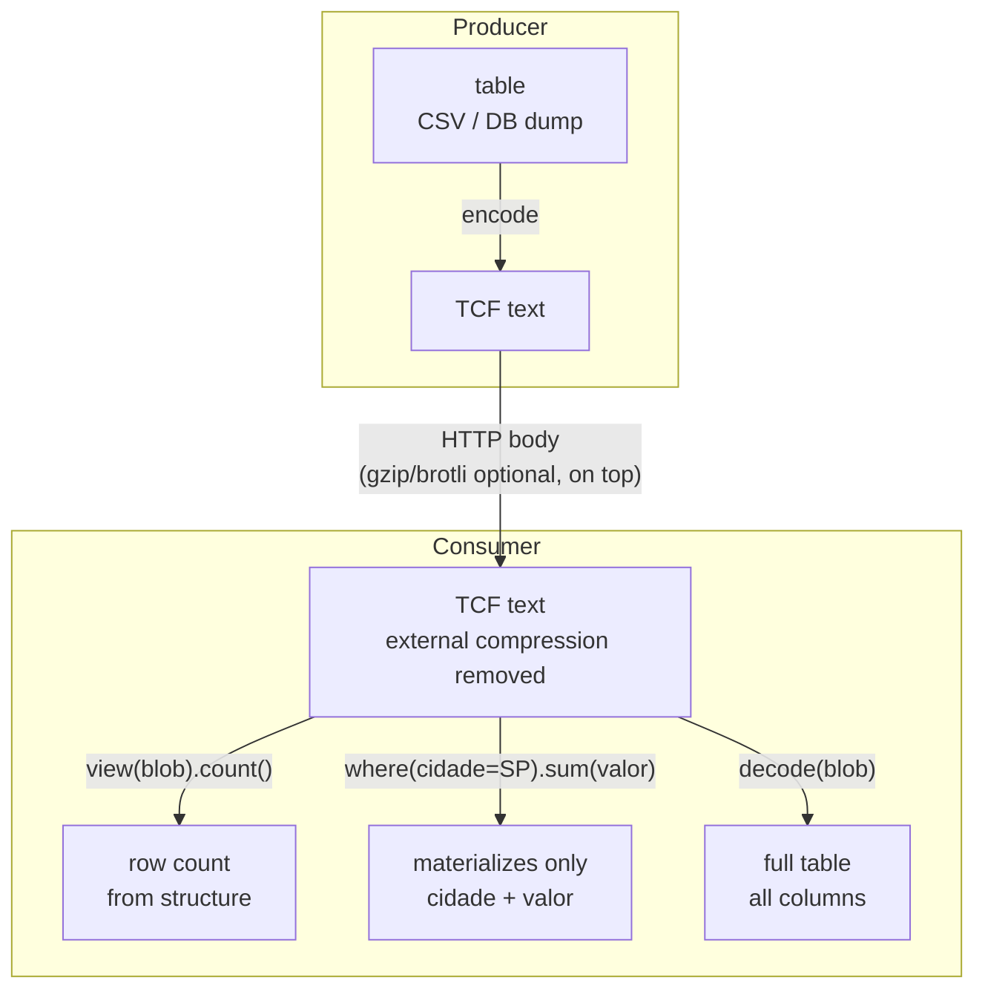

<!-- l10n: doc_id=readme · lang=en · canonical -->
**English** · [Português](README.pt-BR.md)

# TCF · Tabular Compact Format

[](https://github.com/LeoPR/TCF/actions/workflows/ci.yml)


-orange)


**Lossless encoding of tabular and nested data into inspectable text, with a Python API
for encoding, decoding and selective queries.**

**Documentation**: [the manual](docs/README.md) · [short guide](README.pypi.md) · [step-by-step tutorial](docs/tutorials/getting-started.md)

## What TCF is

TCF replaces repeated values and shared text fragments with groups and references. Each
column is encoded separately, so a table can use different representations for names,
categories and numeric values. The result is text you can inspect without reconstructing
the entire dataset, although reading it requires understanding the format's markers.

The Python library accepts columns, tables, records and supported nested data. Its default
contract is `decode(encode(data)) == data`: compression must preserve the input, not discard
information. Optional transformations such as `sort_by` have their own explicit contracts.

TCF defines a data representation; gzip, brotli and zstd compress bytes. They can be combined,
but neither TCF alone nor that combination is guaranteed to beat JSON or CSV on every input.
Headers, data patterns and encoding cost all matter.

This repository contains the implementation, format documentation, tests and experiments.
Start with [installation](#getting-started-1-minute), inspect the
[encoded example](#an-encoded-table-explained), or evaluate the
[results and limits](#results). For query usage, see
[`view()`](#selective-queries-with-view).

## Getting started (1 minute)

```bash
pip install tcf-format        # or: uv pip install tcf-format
```

The **distribution** is called `tcf-format`; the **importable package** is `tcf`, with no
runtime dependencies.

```python
from tcf import encode, decode

# Single-column: a list of strings
text = encode(["joao@gmail.com", "maria@gmail.com", "pedro@gmail.com"])
assert decode(text) == ["joao@gmail.com", "maria@gmail.com", "pedro@gmail.com"]

# Multi-column: a dict of columns
table = {
    "id":    ["1", "2", "3"],
    "email": ["joao@gmail.com", "maria@gmail.com", "pedro@gmail.com"],
}
text = encode(table)
assert decode(text) == table  # lossless round-trip

```

`encode` dispatches on the **shape** of the input. A list of values becomes a single
column, a dict of columns becomes a table, and a list of flat records becomes that same
table, with the record form noted in the header so `decode` hands the list back. `decode`
itself routes by the format signature.

The package is **0.8.4**, using format `#TCF.8`. It is **pre-1.0**: minor versions do not
promise backward compatibility. Pin the package version for persisted data and retain the
matching reader when upgrading. See [versioning](docs/adr/0024-pre-1.0-versioning-git-as-compat.md).

Structured strings (CPF, CNPJ, IP) have optional filters, called *natures*, that may reduce size:
see [Nature filters](#nature-filters-opt-in).


Step-by-step tutorial: [`docs/tutorials/getting-started.md`](docs/tutorials/getting-started.md).
Practical guides: [`docs/how-to/`](docs/how-to/).

## An encoded table, explained

Consider four customer records with shared cities, plans and email domains. The following
representations contain the same data. Sizes refer to the complete four-record example,
without an external compressor; the JSON excerpt is shortened for display.

**JSON** *(451 B)*: in this list-of-objects representation, field names repeat in each record. Measured **compact**
(`separators=(',', ':')`), the same footing as the CSV and JSONL below; indented here only so
you can read it.

```json
[ { "nome": "Ana Souza",  "email": "ana@acme.com.br",
    "cidade": "Sao Paulo", "plano": "Premium",
    "cpf": "111.111.111-11" },
  { "nome": "Bruno Lima", "email": "bruno@acme.com.br",
    "cidade": "Sao Paulo", "plano": "Premium",
    "cpf": "222.222.222-22" }, … ]
```

**CSV** *(277 B)*: writes column names once in the header and values on each record's line.

```csv
nome,email,cidade,plano,cpf
Ana Souza,ana@acme.com.br,Sao Paulo,Premium,111.111.111-11
Bruno Lima,bruno@acme.com.br,Sao Paulo,Premium,222.222.222-22
Carla Nunes,carla@acme.com.br,Sao Paulo,Basic,333.333.333-33
Diego Rocha,diego@acme.com.br,Rio de Janeiro,Premium,444.444.444-44
```

**TCF** *(242 B, format 0.8, actual `encode` output)*: repeated content can become references
or groups, while raw storage remains an option. This encoded text is also called the *wire
representation*.

```
#TCF.8M!2c=nome,2a=email,1c=cidade,14=plano,!cpf
Ana Souza
Bruno Lima
Carla Nunes
Diego Rochaan*a*@acme.com.br
brun*o3
carl2,3
dieg5,3
*3|Sao Paulo
Rio de Janeiro
*2|Premium
Basic
^1
111.111.111-11
222.222.222-22
333.333.333-33
444.444.444-44
```

**TCF + CPF nature** *(210 B)*. Here an opt-in CPF filter, called the `cpf` *nature*, shrinks even
a column with no repeated values.

```
#TCF.8M!2c=nome,2a=email,1c=cidade,14=plano,!cpf:cpf
Ana Souza
Bruno Lima
Carla Nunes
Diego Rochaan*a*@acme.com.br
brun*o3
carl2,3
dieg5,3
*3|Sao Paulo
Rio de Janeiro
*2|Premium
Basic
^1
%g$.u
)K%7l
.1&Cc
0r(LU
```

The `cpf` column carries no factorable repetition, so the default pipeline stores it raw (`!cpf`).

The `cpf` *nature* takes another route. For matching values, it removes the punctuation and the two
check digits, stores the 9 body digits compactly, then rebuilds the original value on `decode`. The header records
`:cpf` only when the result comes out smaller. Each value then goes from 14 characters to 5
(`%g$.u` = `111.111.111-11`).

**How to read it**. The example data uses Portuguese field names, `nome`=name, `cidade`=city,
`plano`=plan and `cpf`=Brazilian tax ID, kept verbatim because the byte counts are measured from it.

- Line 1, the format signature and inline meta: `#TCF.8M` is format 0.8, multi-column;
  sizes are hexadecimal.
- The column meta (`size=name`) uses `!` for raw, `@` for dictionary and `%` for structural
  split, whichever candidate wins. So `!` marks a column stored **raw**, meaning raw came out
  smaller than TCF.
- The last column (`cpf`) carries no size, since it runs to the end. It shows `!cpf:cpf`: the `!`
  says the general pipeline kept the body raw, and `:cpf` names the filter, so `decode` reverses it
  without being handed that filter.
- The bodies come concatenated, **delimited by size, not by line break**.
  That is why the raw `nome` column (`…Diego Rocha`) runs straight into the email (`an*a*…`).
- In the body: `*3|Sao Paulo` means *"Sao Paulo, 3×"* (a repetition).
  `^1` means *"same as line 1"* (a substitution).
- In the **email** column TCF goes deeper (unique prefix + a referenced common domain).
  That is where it saves the most, and where the text gets densest.
- The **`cpf`** nature is opted in via `schema={"cpf": SPEC_CPF}`, as in the two blocks above.
  *Those CPFs are repeated-digit placeholders: mod-11-valid, but never issued by the tax office,
  so they are safe fakes. See "Nature filters" below.*

**Nested data uses the same API.** The next example has two records with phone lists.
TCF encodes the data structure a JSON parser produces, including supported nested objects,
arrays, `null`, booleans and numbers. It does not preserve the formatting of a JSON document.

**JSON** *(184 B)*:

```json
[ {"nome":"Ana Souza","cpf":"111.111.111-11","ativo":true,"fones":["11 98765-4321","11 3555-0100"]},
  {"nome":"Bruno Lima","cpf":"999.999.999-99","ativo":false,"fones":["21 99888-7766"]} ]
```

TCF *shreds the object into columns*, one per field. Field names are therefore written **once** in
the header, not once per record, and the same opt-in `cpf` nature from the flat table applies here.

**TCF + CPF nature** *(144 B, real `encode` output)*. Nested input routes to `#TCF.8H`:

```
#TCF.8Hnome:21,cpf:12:cpf,ativo:11b,fones#:6[
Ana Souza
Bruno Lima
%g$.u
AJ/}}
true
false
\2
\1
\11 *\98765-\4321
1\3555-\0100
\21 \99888-\7766

```

- `cpf:12:cpf` is the same opt-in **`cpf` nature** as the flat table above: it strips the punctuation
  and check digits, so the two values compress to `%g$.u` / `AJ/}}`; the trailing `:cpf` lets `decode`
  rebuild them without being told the filter.
- `ativo:…b` is a **typed bool**: `true`/`false`, distinct from the string `"true"`; a number field
  would carry a type tag too.
- `fones#:…[` is an **array** column; the lengths are their own column (`\2`, `\1`: *2 phones, then 1*),
  so you count the structure **without expanding it**. Digits get a `\` escape so they never collide
  with the reference syntax (`\11 ` = `11 `); `decode` reverses it exactly.

The round-trip preserves supported values and structure, including `null` as distinct from
an absent field or the string `"null"`. Supported root values, ragged records and limits are listed in
[`docs/reference/json-equivalence.md`](docs/reference/json-equivalence.md).

These examples illustrate the trade-off: references save repetition but require knowledge
of the syntax to interpret. The encoder can keep a column's body raw when that is smaller
than the available alternatives; headers and metadata still add overhead. Whether the
complete representation is smaller depends on the input. See [Results](#results).

## How it does it: OBAT + HCC

Two layers, explained by purpose. The specs live in [`docs/algorithms/`](docs/algorithms/).

**OBAT** (Online Bidirectional Affix Tokenizer) *finds what the strings have in common*.

For each value, it looks for the longest prefix **and** suffix shared with earlier ones: email
domains, URL roots, codes of the same family. It writes the shared piece once and references the
rest.

This is **bidirectional front-coding**: it generalizes the classic front-coding of string
dictionaries (Witten et al.; HTFC/RPDac, Brisaboa et al.). The "bidirectional" part is what
captures the shared **suffix** (`@acme.com.br`), not just the prefix.

OBAT uses a **trigram index**, based on three-character fragments, to narrow the candidates
for affix comparison rather than comparing each value with every preceding value. This is
an implementation choice, not a guarantee of near-linear performance on every dataset.
The [index study](docs/theory/estrutura/patricia-trie-exploration.md) discusses the trade-offs
with tree-based alternatives.

**HCC** (Hierarchical Compositional Coding) *decides what is worth naming and groups repetitions*.

It takes OBAT's tokens and factors recurring compositions into **reusable named references**, built
with the `~` operator. It also collapses repeated runs, including near-identical sequences like IDs
that only change at the end.

Since a reference can point to another reference, the result forms a **directed acyclic graph (DAG)
of fragments**: in practice a *grammar*, or straight-line program, of the content.

That is the spirit of **Re-Pair** (Larsson & Moffat 1999) and **Sequitur** (Nevill-Manning & Witten
1997). The difference: TCF operates on OBAT's **tokens** rather than on bytes, and brings its own
operators (`~` creates a named node, `,` just concatenates).

That is what keeps the output small **and** inspectable: the `*N|...` repetition groups stay
in plain sight.

**Performance trade-off.** Encoding searches for reusable patterns; decoding expands the
selected representation without repeating that search. An optional Cython accelerator
supports encoding. Measure both directions on the target workload: data encoded once and
read repeatedly has different costs from data regenerated for every request.

## Nature filters (opt-in)

Input types and nature filters serve different purposes. The encoded representation is text,
but supported input values retain their types when decoded.

Strings return byte for byte. `True` and `3.14` come back as a **bool** and a **float**, never as
the spelling `"True"`. TCF reads the type on the way in, marks it in the header (`#TCF.8b`,
`#TCF.8n`), then reconstructs the **value** rather than the text that represented it:

```python
from tcf import encode, decode

assert decode(encode([True, False])) == [True, False]    # bool, not "True"
assert decode(encode(["True", "False"])) == ["True", "False"]   # here, strings
```

A spec is a different layer: a hypothesis about the **shape** of a text.

| | input type (`bool`, `int`, `float`) | semantic spec (`cpf`, `cnpj`, `ip`) |
|---|---|---|
| who asserts it | **your language**: the value already is a bool | **TCF**, as a hypothesis: *"has the shape of a CPF"* |
| what comes back | the same value, same type (`True`, not `"True"`) | the **original string**, byte for byte |
| when it does not match | not applicable, the type is a fact | falls back to literal: **no failure, no loss** |
| what you gain | the type preserved, plus bits (1-2 per bool) | bytes on the wire |

So a spec is a **compression hypothesis about the form**, not a claim about the data's identity.

It is enabled through `schema` for a column, and competes with the ordinary pipeline, winning only
when it shrinks. A value that does not match the shape becomes a literal in the same column.

It is also **self-describing**. When it wins, the header carries the id (`:cpf`) and `decode`
reverses it without being told.

TCF never validates semantics: it does not check whether a CPF *exists*.

Some values have **known structure** that a generic compressor does not exploit. A CPF
`123.456.789-09` has **9 body digits**: the punctuation is fixed, and the final 2
digits, the check digits, are **derivable** from the other 9.

A *nature filter*, opt-in, uses that:

- **encode** strips the punctuation, stores the 9 digits as a short number (safe base, ~5 chars;
  the current alphabet has 80 usable characters)
  and omits the two derivable check digits;
- **decode** recomputes the check digits (mod-11) and reinserts the punctuation for exact reconstruction.

Each nature is a candidate, not a mandatory transformation. For each column, TCF compares the
complete blob, including the header that identifies the filter.

If the filtered version comes out larger, TCF keeps the ordinary encoding and omits `:id`. Tests
showed why that matters for CNPJ: the filter reduced synthetic columns but increased a real ordered
table, and the measured cases are recorded in [`T-SPEC-STATUS-08`](tickets/T-SPEC-STATUS-08.md).

Filters already implemented ([ADR-0015](docs/adr/0015-natures-templated-checked-weld.md)):

| filter | format | what decode reconstructs |
|---|---|---|
| `SPEC_CPF`  | `NNN.NNN.NNN-DD`     | punctuation + 2 check digits (mod-11) |
| `SPEC_CNPJ` | `AA.AAA.AAA/AAAA-DD` | punctuation + 2 check digits (mod-11) |
| `SPEC_IP`   | IPv4 `N.N.N.N`      | dots + canonical octets (normalizes to make subnet repetitions visible) |
| `SPEC_DATA_ISO` | date `YYYY-MM-DD` | the ISO spelling, from a day ordinal that exposes daily progressions to the sequence RLE |
| `SPEC_INT_PAD` | integers (`list[int]`) | the integers themselves; fixed-width zero padding keeps a progression under one marker when its digit count changes |

`A` = alphanumeric `[0-9A-Z]`, `N` = digit, `D` = check digit.

**The CNPJ body is alphanumeric** since IN RFB 2.229/2024, in force from Jul/2026. The 12 body
positions accept `0-9A-Z`, and only the 2 check digits stay numeric.

A fully numeric CNPJ is a case of the alphanumeric format. The filter supports both;
the [nature guide](docs/how-to/use-natures.md) documents their use.

The same filter mechanism works for **numbers**. `SPEC_IP` above is already numeric, over octets,
and the difference-based pipeline captures numeric sequences and IDs with cadence on its own, via
`*N+delta|`.

Proposals that change precision are outside the lossless contract of these filters;
planned work belongs in the [roadmap](ROADMAP.md).

```python
from tcf import encode, decode
from tcf import SPEC_CPF

# Repeated-digit placeholders: they PASS the mod-11 check (so the nature
# compresses them), but the tax office never issues them, so they do not map
# to a real person: safe for public examples.
cpfs = ["111.111.111-11", "222.222.222-22", "333.333.333-33", "444.444.444-44"]

blob = encode(cpfs, schema=SPEC_CPF)   # the nature WINS here (4 distinct CPFs)
print(blob)
# #TCF.8 :cpf     <- self-describing single-col header: the spec IS applied
# %g$.u           <- "111.111.111-11" (14 B) -> 5 chars: 9-digit body in base-80,
# )K%\7l             the mask and the 2 check digits dropped (decode recomputes them)
# .\1&Cc
# \0r(LU
assert decode(blob) == cpfs            # decode reads `:cpf` from the header, no spec needed

# Same 4 CPFs: 69 B single-col without the nature -> 39 B with it (-43%). In a table,
# pass it per column: encode(table, schema={"cpf": SPEC_CPF}); the cpf
# column's inline meta then carries `:cpf` (e.g. `#TCF.8M!15=nome,!cpf:cpf`).
```

Filter contracts:

- Core natures are **opt-in and self-describing when they win**: single-column output carries
  `#TCF.8 name:id`; multi-column output carries `:id` in the inline meta. `decode(blob)` recognizes
  the official `cpf`, `cnpj`, `ip`, `data-iso` and `int-pad` filters automatically.
- A custom spec can also be used, but its decoder declaration must match the header ID exactly:
  `decode(blob, schema=custom_spec)` or `decode(blob, schema={"col": custom_spec})`.
- A value that does not match (invalid check digit, masked format) falls back to **literal** (`_`) without
  ever breaking the round-trip: the filter **never corrupts** the data.

> **Scope note.** CEP, RG, driver identification, telephone and generic fixed-alphabet codes were
> explored in a separate lab. They are not canonical `.8` specs yet; see the measured decision in
> [`T-SPEC-STATUS-08`](tickets/T-SPEC-STATUS-08.md).

## Format 0.8 (default): where the bytes go

Multi-column `encode` emits **0.8 / `#TCF.8M`** by default, see
[ADR-0032](docs/adr/0032-tcf8-default-format.md). Five things happen, all automatic (no flag), with
each column choosing the smallest representation:

- **Per-column fallback.**
  Stores the column body raw when raw is smaller than the compression candidates; this
  comparison does not remove the file's header and metadata overhead.
  Marked with `!` in the meta, see [ADR-0022](docs/adr/0022-v2a-fallback-identity-weld.md).
- **Low-cardinality dictionary.**
  A column with few distinct values becomes a table of uniques + compact indices,
  instead of one ref per row. Marked with `@` in the meta, see
  [ADR-0025](docs/adr/0025-v2b-dictionary-categorical-weld.md).
- **Structural split.**
  A structured value (decimal, date, datetime, CPF) with a uniform template becomes separate
  fields, the template stored once, and each low-card field then falls into the dictionary.
  Marked with `%` in the meta, see [ADR-0026](docs/adr/0026-structural-split-weld.md).
- **Minimal header.**
  The `M` flag in the signature already declares that columns follow. So the meta goes inline,
  sizes are hexadecimal, separators in names are escaped, and the last column carries no size.
  See [ADR-0023](docs/adr/0023-v2-minimal-header-weld.md).
- **Filters for structured values.**
  CPF/CNPJ/IP are optional candidates, and the encoder compares each option with the ordinary
  column encoding, using the complete blob. If the filtered version is not smaller, it keeps the
  original column and emits no `:id`.

A **list of flat records** takes the same route. A rectangular `list[dict]` is canonicalized
into columns and comes out as `#TCF.8R`, the very `#TCF.8M` wire with the discriminator
swapped, so `decode` knows to hand the list of dicts back. See
[ADR-0049](docs/adr/0049-marcador-r-a-forma-da-entrada-e-metadado.md). An input the
canonicalization refuses stays in `#TCF.8H`: a ragged record, nesting, an array in a cell,
a key that is not a string, or a line break inside a name or a value.

```python
text = encode(table)        # 0.8 / #TCF.8M, the default, no flags

# opt-out knobs (default True): to change the behavior / inspect:
text = encode(table, fallback=False, min_header=False)  # only TCF candidates, verbose meta
text = encode(table, min_header=False)                  # #TCF.8M with all sizes
text = encode(table, min_len=5)                         # override OBAT's min_len (default: auto)
text = encode(table, sort_by="email")                   # ALLOWS sorting rows by that column (order-free)
```

> `sort_by` **allows** reordering the rows by that column, and grouping equal
> values may buy fewer bytes. It is **order-free**: `decode` returns the same set
> of rows, and the original order does not come back. Use it only when row order
> does not matter.
>
> Sorting is a **candidate**, not an instruction to force a particular order: the encoder evaluates both
> versions and keeps the smaller one, so passing `sort_by` never grows the wire.
> Sorting can group repeated key values while disrupting useful patterns in other
> columns. The result may therefore remain in its original order when sorting does
> not help. Checks of this choice are documented in
> [EXP-019](experiments/lab/clean/EXP-019-consistencia-0-8-4/report.md).

For the 5-column record set at the top, the default `#TCF.8M` output is **242 B**, with meta
`!2c=nome,2a=email,1c=cidade,14=plano,!cpf`.

That comes from the current fallback candidates and the minimal inline header. The `cpf` column
falls to **raw** (`!cpf`) instead of inflating, sizes are hexadecimal, and the last column carries
no size.

On small payloads, header overhead can account for a substantial part of the total.

Pre-1.0, the encoder only writes the newest format. Older blobs are reproduced via `git checkout`,
see [ADR-0024](docs/adr/0024-pre-1.0-versioning-git-as-compat.md).

The low-card dictionary (V2-B) and the structural split are already in the default. Lossy
compression stays on the [roadmap](docs/adr/0018-v2-format-roadmap.md).

## Status (pre-1.0)

- **Pre-1.0** ([ADR-0024](docs/adr/0024-pre-1.0-versioning-git-as-compat.md)).
  The current format minor (`#TCF.8`) is a development iteration toward a **solid 1.0**, with no
  rigid compat between minors: git reproduces older versions. v2.0 comes later.
- Canonical implementation in [`src/tcf/`](src/tcf/).
  The default round-trip contract is `decode(encode(x)) == x` for supported inputs.
- Default **0.8 / `#TCF.8M`**: fallback, dictionary, structural split, hexadecimal inline meta,
  escaping and header-authoritative filter IDs, see the section above. Older readers are
  available through published package versions and git tags.
- Tests: run `python -m pytest -q`. The [canonical baselines](tests/test_regression_v1_baseline.py)
  and [real-world snapshots](tests/test_real_world_snapshots.py) guard output bytes and
  round-trips. The CI badge reports the repository's build status.
- Changes: [`CHANGELOG.md`](CHANGELOG.md). Current work: [`STATUS.md`](STATUS.md).

## Results

Compression results need a baseline, an input and a measurement method. The four-record
example above illustrates the format; it is not a scale benchmark. Its sizes in bytes,
with compact JSON/JSONL and external compressors at maximum level, are:

| format | without external compression | gzip | brotli | zstd |
|---|---:|---:|---:|---:|
| JSON | 451 | 206 | 195 | 197 |
| JSONL | 449 | 205 | 194 | 194 |
| CSV | 277 | 177 | 162 | 165 |
| TCF | 242 | 206 | 185 | 193 |

TCF is smallest without an external compressor in this example. Under gzip, JSON, JSONL
and TCF are nearly tied; compressed CSV is smaller than all three. The
[example and measurement sources](docs/divulgacao/2026-09-04-release.en.md) identify the
round-trip checks and byte baselines behind these figures.

Gzip, brotli and zstd can compress any of these representations. In HTTP, many libraries
reverse `Content-Encoding` before delivering the body to the application. On disk or in
transit, decompression can be streamed; it does not inherently require holding the entire
decoded dataset in memory. TCF's selective queries concern the representation available
after that external layer is removed, not direct queries over gzip bytes.

The repository also contains experiments with different purposes:

| evidence | what it measures | how to interpret it |
|---|---|---|
| [EXP-008](experiments/lab/clean/EXP-008-compressao-comparada/) | format and compressor combinations on 15 synthetic datasets | pattern-focused cases, not a representative production workload; JSON/JSONL use default Python spacing, not compact encoding |
| [EXP-019](experiments/lab/clean/EXP-019-consistencia-0-8-4/report.md) | hierarchical vs tabular-record TCF on eight 800-row samples, with round-trip checks | internal TCF comparison, including real and generated data; not a comparison against CSV or a scale benchmark |
| [canonical baselines](tests/test_regression_v1_baseline.py) and [real-world snapshots](tests/test_real_world_snapshots.py) | exact output and round-trip regression checks | protect known cases; do not predict savings on unseen data |

The gains from these experiments should not be combined into one headline percentage.
More rows alone do not guarantee better compression, and using codecs also supported by
Parquet does not constitute a comparison with Parquet's storage format.

For adoption, measure the full path: encoding, optional external compression, storage or
transfer, decoding or queries, and peak memory. Include representative values and column
cardinalities. Encoding once for many reads may justify work that is too expensive to
repeat on every request.

## Selective queries with `view()`

Compression can retain information useful for queries. A repetition count describes a
group without listing each value, and a dictionary stores distinct values separately from
their row indices. TCF's read-only `view()` API takes advantage of the available structure
and decodes data when that structure is insufficient.

The API offers projections, filters, aggregates and grouping as Python methods. It is not
a SQL parser or a general query planner, and it does not implement joins. Its null handling
has its own documented contract rather than inheriting SQL semantics.

For example, a sum filtered by city needs the city and amount columns, not the customer's
name or plan:

```python
from tcf import decode, encode, view

# a small sales table: loaded from a CSV, a DB dump, wherever
table = {
    "cliente": ["Ana Souza", "Bruno Lima", "Carla Nunes", "Diego Rocha", "Eva Martins", "Ana Souza"],
    "cidade":  ["Sao Paulo", "Sao Paulo", "Sao Paulo", "Rio de Janeiro", "Sao Paulo", "Rio de Janeiro"],
    "plano":   ["Premium",   "Premium",   "Basic",     "Premium",        "Basic",     "Premium"],
    "valor":   [        120,          100,         170,              200,        80,               80],
}

blob = encode(table)
assert decode(blob) == table
v = view(blob)

assert v.count() == 6
assert set(v.distinct("cidade")) == {"Sao Paulo", "Rio de Janeiro"}
assert v.n_unique("cliente") == 5
assert v.sum("valor") == 750.0
assert v.where("cidade", "Sao Paulo").sum("valor") == 470.0
assert v.group_sum("cidade", "valor") == {"Sao Paulo": 470.0, "Rio de Janeiro": 280.0}
assert v.group_count("plano") == {"Premium": 4, "Basic": 2}
```
The filtered sum does not need to decode `cliente` or `plano`. A full `decode()` reconstructs
all four columns. An external compressor is a separate layer: removing gzip does not itself
decode TCF columns into Python values.

Not every query is equally cheap. An unfiltered `count()` can use the declared row count;
dictionary columns allow some operations over distinct values and row indices. Aggregates
and selections may need to materialize their columns, and an interleaved `tcf` column may
require complete decoding. Avoid assuming that a visible repetition marker makes every
operation available without expansion.

The query API supports multi-column tables, records, rectangular hierarchical data and
single columns. For supported methods, column modes and costs, see the
[query reference](docs/reference/lazy-view.md). For null groups and differences from
pandas, SQL or polars, see the [semantics guide](docs/how-to/mimetizar-pandas-sql-polars.md).

The same representation can serve different access patterns:


```mermaid
flowchart TB
    subgraph Producer
        direction TB
        A[table<br/>CSV / DB dump] -->|encode| B["TCF text"]
    end
    B -->|"HTTP body<br/>(gzip/brotli optional, on top)"| C
    subgraph Consumer
        direction TB
        C["TCF text<br/>external compression removed"] -->|"view(blob).count()"| D["row count<br/>from structure"]
        C -->|"where(cidade=SP).sum(valor)"| E["materializes only<br/>cidade + valor"]
        C -->|"decode(blob)"| F[full table<br/>all columns]
    end
```

Selective access can avoid work unrelated to a query. The benefit depends on the input,
column encoding and operation; lower latency and memory use must be measured, not inferred
from the compression ratio alone.

## Development and roadmap

For current priorities and planned work, see [ROADMAP.md](ROADMAP.md) and
[STATUS.md](STATUS.md). Design decisions live in the [ADR index](docs/adr/README.md).
Planned features are not part of the installed library's contract.

To work on the implementation, follow [CONTRIBUTING.md](CONTRIBUTING.md). The
[documentation example tests](tests/test_docs_snippets.py) execute the Python blocks in
this README; the regression suites check exact encoded output and round-trips.

## How to cite

See [`CITATION.cff`](CITATION.cff). GitHub renders a "Cite this
repository" badge on the repo page automatically.

---

## Research background

The [archived LLM benchmark](docs/archive/old/llm-benchmark/) and
[findings](docs/archive/findings/) document a separate research track. They are historical
material, not evidence for the current library's performance or supported API.

---

## Where to go next

- **I want to use TCF in my pipeline** → `from tcf import encode, decode`; the public
  surface contract is [docs/reference/api.md](docs/reference/api.md) *(Portuguese)*. Start at
  [getting started](docs/tutorials/getting-started.md), then the [how-to guides](docs/how-to/).
- **I want to understand the architecture** → [docs/theory/](docs/theory/)
- **I want to see planned work** → [ROADMAP.md](ROADMAP.md) and [STATUS.md](STATUS.md)
- **I want SQL-like query paths without full materialization** →
  [`tcf.view`](docs/reference/lazy-view.md) *(Portuguese)*: `count`/`sum`/`where`/group-by touching
  only what is needed, where the column mode permits
- **I want to share / pitch TCF** → [docs/divulgacao/](docs/divulgacao/) (dated news source + one folder per channel; editorial rules in its README)
  *(Portuguese)*: outreach material, post style
- **I want to see how it evolved** → [CHANGELOG.md](CHANGELOG.md) +
  [docs/archive/workbench/](docs/archive/workbench/)
- **I want to work on TCF itself** → [CONTRIBUTING.md](CONTRIBUTING.md): dev setup,
  repository layout and the tools that ship with the repo

---

## License

MIT. See [LICENSE](LICENSE).

## Acknowledgements

Project conceived as part of an academic dissertation (TCC). Datasets:
[UCI Adult Census](https://archive.ics.uci.edu/ml/datasets/adult) and
[TPC-H](https://www.tpc.org/tpch/) (via the DuckDB tpch extension).
