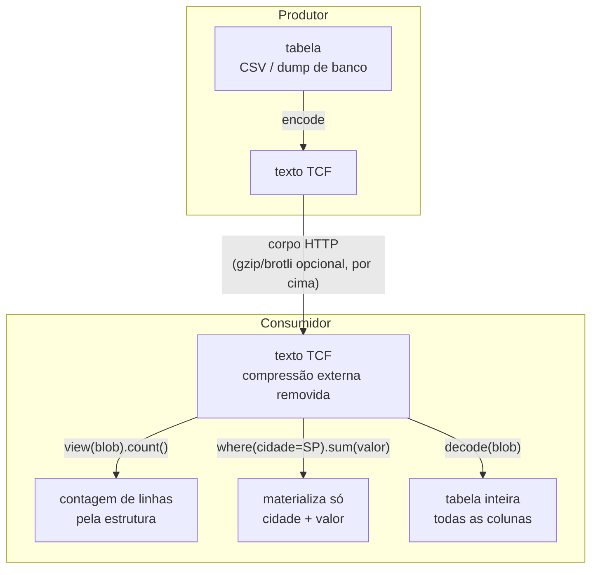

<!-- l10n: doc_id=readme · lang=pt-BR · source_lang=en · translation_of=README.md · synced=2026-07-01 -->
[English](README.md) · **Português**

> Tradução de [`README.md`](README.md). Se houver divergência, o original em inglês prevalece.
> A régua de atualização é o histórico do git: se o `README.md` mudar depois desta tradução, esta versão fica desatualizada.

# TCF · Tabular Compact Format

[](https://github.com/LeoPR/TCF/actions/workflows/ci.yml)


-orange)


**Codificação sem perdas de dados tabulares e aninhados em texto inspecionável, com uma
API Python para codificar, decodificar e consultar colunas seletivamente.**

**Documentação**: [o manual](docs/README.md) · [guia curto](README.pypi.md) · [tutorial passo-a-passo](docs/tutorials/getting-started.pt-BR.md)

## O que é o TCF

O TCF substitui valores repetidos e trechos de texto compartilhados por agrupamentos e
referências. Cada coluna é codificada separadamente, permitindo que nomes, categorias e
valores numéricos usem representações diferentes. O resultado é um texto que pode ser
inspecionado sem reconstruir o conjunto inteiro, embora sua leitura exija conhecer os
marcadores do formato.

A biblioteca Python aceita colunas, tabelas, registros e dados aninhados suportados.
O contrato padrão é `decode(encode(dados)) == dados`: comprimir deve preservar a entrada,
não descartar informação. Transformações opcionais, como `sort_by`, têm contratos explícitos.

O TCF define uma representação de dados; gzip, brotli e zstd comprimem bytes. Eles podem
ser combinados, mas nem o TCF sozinho nem essa combinação garantem um resultado menor
que JSON ou CSV em qualquer entrada. Cabeçalhos, padrões dos dados e custo de codificação
precisam entrar na avaliação.

Este repositório reúne implementação, documentação do formato, testes e experimentos.
Comece pela [instalação](#getting-started-1-minuto), examine o
[exemplo codificado](#uma-tabela-codificada-passo-a-passo) ou consulte os
[resultados e limites](#resultados). Para consultas, veja
[`view()`](#consultas-seletivas-com-view).

## Getting started (1 minuto)

```bash
pip install tcf-format        # ou: uv pip install tcf-format
```

A **distribuição** chama-se `tcf-format`; o **pacote importável** é `tcf`, sem dependências
de runtime.

```python
from tcf import encode, decode

# Single-column: lista de strings
text = encode(["joao@gmail.com", "maria@gmail.com", "pedro@gmail.com"])
assert decode(text) == ["joao@gmail.com", "maria@gmail.com", "pedro@gmail.com"]

# Multi-column: dict de colunas
table = {
    "id":    ["1", "2", "3"],
    "email": ["joao@gmail.com", "maria@gmail.com", "pedro@gmail.com"],
}
text = encode(table)
assert decode(text) == table  # round-trip lossless

```

`encode` escolhe a representação pela **forma** da entrada. Uma lista de valores vira
uma coluna; um dicionário de colunas vira tabela; uma lista de registros planos vira
essa mesma tabela, com a forma da entrada anotada no cabeçalho para `decode` devolver
a lista. O decodificador identifica a representação pela assinatura do formato.

O pacote está na versão **0.8.4**, com o formato `#TCF.8`. É **pré-1.0**: não há garantia
de compatibilidade entre versões menores. Fixe a versão ao persistir dados e mantenha
acesso ao leitor correspondente ao atualizar. Veja a
[política de versões](docs/adr/0024-pre-1.0-versioning-git-as-compat.md).

Strings estruturadas (CPF, CNPJ, IP) têm filtros opcionais, chamados *natures*, que podem reduzir o tamanho:
ver [Filtros por natureza](#filtros-por-natureza-opt-in).


Tutorial passo a passo: [`docs/tutorials/getting-started.pt-BR.md`](docs/tutorials/getting-started.pt-BR.md).
Guias práticos: [`docs/how-to/`](docs/how-to/).

## Uma tabela codificada, passo a passo

Considere quatro clientes com cidades, planos e domínios de e-mail compartilhados.
As representações abaixo contêm os mesmos dados. Os tamanhos se referem ao cadastro
completo, sem compressor externo; o trecho JSON está abreviado apenas para exibição.

**JSON** *(451 B)*: nesta representação como lista de objetos, os nomes dos campos se repetem em cada registro. Medido **compacto**
(`separators=(',', ':')`), no mesmo pé do CSV e do JSONL abaixo; indentado aqui só para você
conseguir ler.

```json
[ { "nome": "Ana Souza",  "email": "ana@acme.com.br",
    "cidade": "Sao Paulo", "plano": "Premium",
    "cpf": "111.111.111-11" },
  { "nome": "Bruno Lima", "email": "bruno@acme.com.br",
    "cidade": "Sao Paulo", "plano": "Premium",
    "cpf": "222.222.222-22" }, … ]
```

**CSV** *(277 B)*: escreve os nomes das colunas uma vez no cabeçalho e os valores em cada linha.

```csv
nome,email,cidade,plano,cpf
Ana Souza,ana@acme.com.br,Sao Paulo,Premium,111.111.111-11
Bruno Lima,bruno@acme.com.br,Sao Paulo,Premium,222.222.222-22
Carla Nunes,carla@acme.com.br,Sao Paulo,Basic,333.333.333-33
Diego Rocha,diego@acme.com.br,Rio de Janeiro,Premium,444.444.444-44
```

**TCF** *(242 B, formato 0.8, saída real do `encode`)*: repetições podem virar referências
ou grupos, enquanto o armazenamento cru continua disponível. Esse texto codificado
também é chamado de *wire*, a representação usada para guardar ou transmitir os dados.

```
#TCF.8M!2c=nome,2a=email,1c=cidade,14=plano,!cpf
Ana Souza
Bruno Lima
Carla Nunes
Diego Rochaan*a*@acme.com.br
brun*o3
carl2,3
dieg5,3
*3|Sao Paulo
Rio de Janeiro
*2|Premium
Basic
^1
111.111.111-11
222.222.222-22
333.333.333-33
444.444.444-44
```

**TCF + nature CPF** *(210 B)*: neste exemplo, um filtro opt-in para CPF, chamado *nature* `cpf`, encolhe até mesmo uma coluna sem valores repetidos.

```
#TCF.8M!2c=nome,2a=email,1c=cidade,14=plano,!cpf:cpf
Ana Souza
Bruno Lima
Carla Nunes
Diego Rochaan*a*@acme.com.br
brun*o3
carl2,3
dieg5,3
*3|Sao Paulo
Rio de Janeiro
*2|Premium
Basic
^1
%g$.u
)K%7l
.1&Cc
0r(LU
```

A coluna `cpf` não tem repetição a fatorar, então o pipeline padrão a guarda crua (`!cpf`).

O filtro *nature* `cpf` usa outra estratégia. Nos valores compatíveis, remove a pontuação e os dois
dígitos verificadores, guarda os 9 dígitos do corpo em uma base compacta e os recompõe no `decode`. Se o resultado for menor, o
cabeçalho registra `:cpf`. Cada valor cai de 14 caracteres para 5 (`%g$.u` = `111.111.111-11`).

**Como ler:**

- Linha 1, a assinatura e o meta inline: `#TCF.8M` é o formato 0.8, multi-coluna;
  os tamanhos estão em hexadecimal.
- O meta (`tamanho=nome`) usa `!` para raw, `@` para dicionário e `%` para split estrutural,
  quando esses candidatos vencem. O `!` marca uma coluna guardada **crua**, ou seja, quando o
  raw fica menor que o TCF.
- A última coluna (`cpf`) não leva tamanho, porque vai até o fim, e mostra `!cpf:cpf`. O `!`
  indica que o corpo foi mantido cru pelo pipeline geral; o `:cpf` identifica o filtro aplicado,
  e é por isso que o `decode` reverte sem receber esse filtro.
- Os corpos vêm concatenados, **delimitados por tamanho, não por quebra de linha**.
  Por isso a coluna crua `nome` (`…Diego Rocha`) emenda direto no e-mail (`an*a*…`).
- No corpo: `*3|Sao Paulo` é *"Sao Paulo, 3×"* (repetição).
  `^1` é *"igual à linha 1"* (substituição).
- Na coluna de **e-mail** o TCF vai mais fundo (prefixo único + domínio comum referenciado).
  É onde mais economiza, e onde o texto fica mais denso.
- A *nature* **`cpf`** é opt-in via `schema={"cpf": SPEC_CPF}` (ver os dois blocos acima).
  Os CPFs do exemplo são placeholders de dígitos repetidos: passam no cálculo do CPF, mas a
  Receita nunca os emite, então são fakes seguros. Ver "Filtros por natureza" abaixo.

**Dados aninhados usam a mesma API.** O próximo exemplo tem dois registros com listas
de telefones. O TCF codifica a estrutura que um parser JSON produz, incluindo objetos,
arrays, `null`, booleanos e números suportados. A formatação do documento JSON não é preservada.

**JSON** *(184 B)*:

```json
[ {"nome":"Ana Souza","cpf":"111.111.111-11","ativo":true,"fones":["11 98765-4321","11 3555-0100"]},
  {"nome":"Bruno Lima","cpf":"999.999.999-99","ativo":false,"fones":["21 99888-7766"]} ]
```

**TCF + nature CPF** *(144 B, saída real do `encode`)*: entrada aninhada roteia pro `#TCF.8H`.

O objeto é *fatiado em colunas*, uma por campo. Assim os nomes de campo aparecem **uma vez** no
header, não em cada registro, e a mesma nature `cpf` opt-in da tabela plana também vale aqui:

```
#TCF.8Hnome:21,cpf:12:cpf,ativo:11b,fones#:6[
Ana Souza
Bruno Lima
%g$.u
AJ/}}
true
false
\2
\1
\11 *\98765-\4321
1\3555-\0100
\21 \99888-\7766

```

- `cpf:12:cpf` é a mesma nature **`cpf`** opt-in da tabela plana acima: remove a pontuação e os dígitos
  verificadores, então os dois valores comprimem para `%g$.u` / `AJ/}}`; o `:cpf` no fim deixa o `decode`
  reconstruir sem receber o filtro.
- `ativo:…b` é um **bool tipado**: `true`/`false`, distinto da string `"true"`; um campo numérico
  também levaria uma tag de tipo.
- `fones#:…[` é uma coluna **array**; os tamanhos são coluna própria (`\2`, `\1`: *2 fones,
  depois 1*), então você conta a estrutura **sem expandi-la**. Dígitos ganham um escape `\` para nunca
  colidir com a sintaxe de referência (`\11 ` = `11 `); o `decode` reverte exatamente.

O round-trip preserva valores e estruturas suportados, incluindo `null` como distinto
de um campo ausente ou da string `"null"`. Valores aceitos na raiz, registros irregulares e limites estão em
[`docs/reference/json-equivalence.md`](docs/reference/json-equivalence.md).

Os exemplos mostram a troca envolvida: referências economizam repetição, mas exigem
conhecer a sintaxe para interpretá-las. O codificador pode manter o corpo de uma coluna
cru quando essa opção é menor que as alternativas; cabeçalhos e metadados ainda ocupam
espaço. O tamanho final depende da entrada. Veja [Resultados](#resultados).

## Como ele faz isso: OBAT + HCC

Duas camadas, explicadas pelo propósito (specs: [`docs/algorithms/`](docs/algorithms/)).

**OBAT** (Online Bidirectional Affix Tokenizer) *acha o que as strings têm em comum.*
Para cada valor, ele procura o maior prefixo **e** sufixo compartilhado com os anteriores.
São domínios de e-mail, raízes de URL, códigos da mesma família. Escreve o trecho uma vez e
referencia o resto.

É um **front-coding bidirecional**: generaliza o front-coding clássico de dicionários de strings
(Witten et al.; HTFC/RPDac, Brisaboa et al.). O "bidirecional" é o que captura o **sufixo** comum
(`@acme.com.br`), não só o prefixo.

O OBAT usa um **índice de trigramas**, baseado em trechos de três caracteres, para
restringir os candidatos à comparação de afixos, em vez de comparar cada valor com todos
os anteriores. É uma escolha de implementação, não uma garantia de desempenho
quase linear para qualquer conjunto. O
[estudo do índice](docs/theory/estrutura/patricia-trie-exploration.md) discute as trocas
envolvidas nas alternativas baseadas em árvores.

**HCC** (Hierarchical Compositional Coding) *decide o que vale a pena nomear e agrupa repetições.*
Ele pega os tokens do OBAT e fatora composições recorrentes em **referências nomeadas
reutilizáveis**. Quem cria essas referências é o operador `~`. Também colapsa repetições
consecutivas, inclusive sequências quase-iguais, tipo IDs que só mudam no fim.

Como referência aponta para referência, o resultado é um **grafo acíclico de fragmentos**: na
prática, uma *gramática* / straight-line program do conteúdo.

É o espírito do **Re-Pair** (Larsson & Moffat 1999) e do **Sequitur** (Nevill-Manning & Witten
1997). A diferença está em dois pontos: o TCF opera sobre os **tokens** do OBAT, não sobre bytes,
e usa operadores próprios, onde `~` cria nó nomeado e `,` só concatena.

É o que mantém a saída pequena **e** inspecionável: os grupos de repetição `*N|...` ficam à vista.

**Custo de execução.** Codificar exige buscar padrões reutilizáveis; decodificar expande
a representação escolhida sem repetir essa busca. Há um acelerador Cython opcional para
a codificação. Meça os dois caminhos na carga de trabalho desejada: preparar dados uma
vez para muitas leituras tem um custo diferente de regenerá-los a cada requisição.

## Filtros por natureza (opt-in)

Tipos de entrada e filtros por natureza têm funções diferentes. A representação codificada
é texto, mas os valores suportados preservam seus tipos na decodificação.

String volta byte a byte. Já `True` e `3.14` voltam **bool** e **float**, não a grafia `"True"`.
O TCF lê o tipo na entrada, marca no header (`#TCF.8b`, `#TCF.8n`) e reconstrói o **valor**, não
o texto que o representava:

```python
from tcf import encode, decode

assert decode(encode([True, False])) == [True, False]    # bool, não "True"
assert decode(encode(["True", "False"])) == ["True", "False"]   # aqui sim, string
```

O spec é outra camada: uma hipótese sobre a **forma** de um texto.

| | tipo de entrada (`bool`, `int`, `float`) | spec semântico (`cpf`, `cnpj`, `ip`) |
|---|---|---|
| quem afirma | a **sua linguagem**: o valor já é um bool | o **TCF**, como hipótese: *"tem a forma de um CPF"* |
| o que volta | o mesmo valor, no mesmo tipo (`True`, não `"True"`) | a **string original**, byte a byte |
| se não casa | não se aplica, o tipo é fato | cai para literal, **sem falhar e sem perder** |
| o que ganha | o tipo preservado, e bits (1-2 por bool) | bytes no fio |

Ou seja: o spec é uma **hipótese de compressão sobre a forma**, não uma afirmação sobre a
identidade do dado.

O filtro é habilitado por `schema` para uma coluna: compete com o pipeline comum e só vence se encolher.
Valor que não casa a forma vira literal na mesma coluna.

E é **auto-descritivo**: quando vence, o header carrega o id (`:cpf`) e o `decode` reverte
sozinho, sem receber nada. O TCF nunca valida semântica: ele não checa se um CPF *existe*.

Alguns valores têm uma estrutura fixa que o compressor genérico não aproveita. Para esses casos, o TCF
oferece um filtro opt-in chamado *nature*: ele guarda apenas a parte necessária e reconstrói o valor
original no `decode`.

Um CPF `123.456.789-09` tem **9 dígitos no corpo**: a pontuação é fixa, e os 2 dígitos finais podem ser
calculados a partir deles. O filtro:

- **encode** tira a pontuação, guarda os 9 dígitos como um número curto (base segura, ~5 chars;
  o alfabeto atual tem 80 caracteres utilizáveis)
  e omite os dois dígitos verificadores deriváveis;
- **decode** recalcula os verificadores (mod-11) e reinsere a pontuação para reconstrução exata.

Essa opção é uma candidata, não uma transformação obrigatória.

Para cada coluna, o TCF compara o blob completo, incluindo o cabeçalho que identifica o filtro.
Se o resultado ficar maior, mantém a codificação comum e não grava `:id`.

Nos testes, isso fez diferença para CNPJ: o filtro reduziu colunas sintéticas, mas aumentou uma
tabela real ordenada. Os casos medidos estão em
[`T-SPEC-STATUS-08`](tickets/T-SPEC-STATUS-08.md).

Filtros já implementados ([ADR-0015](docs/adr/0015-natures-templated-checked-weld.md)):

| filtro | formato | o que o decode reconstrói |
|---|---|---|
| `SPEC_CPF`  | `NNN.NNN.NNN-DD`     | pontuação + 2 díg. verificadores (mod-11) |
| `SPEC_CNPJ` | `AA.AAA.AAA/AAAA-DD` | pontuação + 2 díg. verificadores (mod-11) |
| `SPEC_IP`   | IPv4 `N.N.N.N`      | pontos + octetos canônicos (padroniza para facilitar repetições em subnets) |
| `SPEC_DATA_ISO` | data `AAAA-MM-DD` | a grafia ISO, a partir de um ordinal de dias que expõe a progressão diária ao RLE de sequência |
| `SPEC_INT_PAD` | inteiros (`list[int]`) | os próprios inteiros; a largura fixa com zeros mantém sob um marcador a progressão cujo número de dígitos muda |

`A` = alfanumérico `[0-9A-Z]`, `N` = dígito, `D` = dígito verificador.

**O corpo do CNPJ é alfanumérico** desde a IN RFB 2.229/2024, vigente desde jul/2026: as 12
posições do corpo aceitam `0-9A-Z`, e só os 2 verificadores seguem numéricos.

Um CNPJ inteiramente numérico é um caso do formato alfanumérico. O filtro atende ambos;
o [guia de naturezas](docs/how-to/use-natures.md) documenta o uso.

O mesmo mecanismo de filtro vale para **números**. O `SPEC_IP` acima já é numérico, nos octetos.

Sequências e IDs numéricos com cadência o pipeline de diferenças captura sozinho (`*N+delta|`).
Propostas que alteram precisão ficam fora do contrato sem perdas desses filtros;
o trabalho planejado está no [roadmap](ROADMAP.md).

```python
from tcf import encode, decode
from tcf import SPEC_CPF

# Placeholders de dígitos repetidos: PASSAM no mod-11 (então a nature os comprime),
# mas a Receita nunca os emite: não mapeiam pessoa real (fakes seguros p/ exemplo).
cpfs = ["111.111.111-11", "222.222.222-22", "333.333.333-33", "444.444.444-44"]

blob = encode(cpfs, schema=SPEC_CPF)   # a nature VENCE aqui (4 CPFs distintos)
print(blob)
# #TCF.8 :cpf     <- header single-col auto-descritivo: o spec ESTÁ aplicado
# %g$.u           <- "111.111.111-11" (14 B) -> 5 chars: corpo de 9 díg em base-80,
# )K%\7l             a máscara e os 2 díg verificadores caem (o decode recalcula)
# .\1&Cc
# \0r(LU
assert decode(blob) == cpfs            # decode lê `:cpf` do header, sem passar spec

# Os mesmos 4 CPFs: 69 B single-col sem a nature -> 39 B com ela (-43%). Em tabela,
# passe por coluna: encode(tabela, schema={"cpf": SPEC_CPF}); a meta inline
# da coluna cpf então carrega `:cpf` (ex.: `#TCF.8M!15=nome,!cpf:cpf`).
```

Contratos dos filtros:

- São **opt-in e auto-descritivas quando vencem**: single-column leva `#TCF.8 nome:id`; multi-column
  leva `:id` no meta inline. O `decode(blob)` reconhece automaticamente os filtros oficiais `cpf`, `cnpj`, `ip`, `data-iso` e `int-pad`.
- Spec customizado pode ser usado, mas o decoder precisa receber um spec cujo `name` coincide
  exatamente com o ID do header.
- Valor que não bate (verificador inválido, formato mascarado) cai em **literal** (`_`) sem
  nunca quebrar o round-trip: o filtro **nunca corrompe** o dado.

> **Escopo cadastral em exploração.** CEP, RG, identificação de motorista, telefone e códigos
> genéricos foram medidos fora do core. Nenhum é spec canônico do `.8` ainda; veja a matriz em
> [`T-SPEC-STATUS-08`](tickets/T-SPEC-STATUS-08.md).

## Formato 0.8 (default): onde os bytes vão

O `encode` multi-coluna sai em **0.8 / `#TCF.8M`** por default ([ADR-0032](docs/adr/0032-tcf8-default-format.md)).
Cinco coisas, todas automáticas (sem flag), cada coluna escolhendo a menor representação:

- **Fallback por coluna.**
  Guarda o corpo da coluna cru quando essa opção é menor que os candidatos comprimidos;
  a comparação não elimina o custo do cabeçalho e dos metadados do arquivo.
  Marcada com `!` no meta: [ADR-0022](docs/adr/0022-v2a-fallback-identity-weld.md).
- **Dicionário low-card.**
  Coluna com poucos valores distintos vira tabela de únicos + índices compactos,
  em vez de um ref por linha.
  Marcada com `@` no meta: [ADR-0025](docs/adr/0025-v2b-dictionary-categorical-weld.md).
- **Split estrutural.**
  Valor estruturado (decimal, data, datetime, CPF) com template uniforme vira campos separados,
  com o template guardado uma vez, e cada campo low-card cai no dicionário.
  Marcada com `%` no meta: [ADR-0026](docs/adr/0026-structural-split-weld.md).
- **Header mínimo.**
  O flag `M` na assinatura já declara que vêm colunas. Então o meta é inline, os tamanhos ficam
  em hexadecimal, separadores de nomes são escapados e a última coluna não leva tamanho:
  [ADR-0023](docs/adr/0023-v2-minimal-header-weld.md).
- **Filtros para valores estruturados.**
  CPF/CNPJ/IP são candidatos opt-in. O encoder compara cada opção com a codificação comum usando
  o blob completo, e se a versão filtrada não ficar menor a coluna original permanece, sem emitir
  nenhum `:id`.

Uma **lista de registros planos** segue a mesma rota. A `list[dict]` retangular é canonizada
em colunas e sai como `#TCF.8R`, que é o wire do `#TCF.8M` com o discriminador trocado, para
o `decode` saber que tem de remontar a lista de dicionários. Ver
[ADR-0049](docs/adr/0049-marcador-r-a-forma-da-entrada-e-metadado.md). A entrada que a
canonização recusa fica no `#TCF.8H`: registro ragged, aninhamento, array na célula, chave
que não é string, ou quebra de linha dentro de um nome ou de um valor.

```python
text = encode(table)        # 0.8 / #TCF.8M, é o default, sem flags

# knobs opt-out (default True): pra modificar o comportamento / inspecionar:
text = encode(table, fallback=False, min_header=False)  # só candidatos TCF, meta verboso
text = encode(table, min_header=False)                  # #TCF.8M com todos os tamanhos
text = encode(table, min_len=5)                         # override do min_len do OBAT (default: auto)
text = encode(table, sort_by="email")                   # AUTORIZA ordenar por essa coluna (order-free)
```

> `sort_by` **autoriza** reordenar as linhas pela coluna, e agrupar iguais pode
> render menos bytes. É **order-free**: o `decode` devolve o mesmo conjunto de
> linhas, e a ordem original não volta. Use só quando a ordem não importa.
>
> A ordenação é um **candidato**, não uma imposição: o codificador avalia as
> duas versões e fica com a menor, então passar `sort_by` nunca faz o wire crescer.
> Ordenar pode agrupar valores iguais da chave e desfazer padrões úteis nas outras
> colunas. O resultado pode, portanto, permanecer na ordem original quando a ordenação
> não ajudar. As verificações dessa escolha estão no
> [EXP-019](experiments/lab/clean/EXP-019-consistencia-0-8-4/report.md).

No cadastro de 5 colunas do topo, a saída default `#TCF.8M` dá **242 B**, com o meta
`!2c=nome,2a=email,1c=cidade,14=plano,!cpf`.

Isso vem dos candidatos de fallback e do header inline mínimo. A coluna `cpf` cai para **raw**
(`!cpf`) em vez de inflar, os tamanhos são hexadecimais e a última coluna não leva tamanho.
Em entradas pequenas, o cabeçalho pode representar uma parcela relevante do tamanho total.

Pré-1.0, o encoder só escreve o formato mais novo. Blobs antigos são reproduzidos via
`git checkout`: [ADR-0024](docs/adr/0024-pre-1.0-versioning-git-as-compat.md).

O dicionário low-card (V2-B) e o split estrutural já estão no default. A compressão lossy fica no
[roadmap](docs/adr/0018-v2-format-roadmap.md).

## Estado (pré-1.0)

- **Pré-1.0** ([ADR-0024](docs/adr/0024-pre-1.0-versioning-git-as-compat.md)).
  O minor atual do formato (`#TCF.8`) é uma iteração de desenvolvimento rumo a um **1.0 sólido**.
  Não há compat rígida entre minors, já que o git reproduz versões antigas.
  v2.0 fica pra depois.
- Implementação canônica em [`src/tcf/`](src/tcf/).
  O contrato padrão de round-trip é `decode(encode(x)) == x` para entradas suportadas.
- Default **0.8 / `#TCF.8M`**: fallback, dicionário, split estrutural, meta hexadecimal inline,
  escaping e identificadores de filtros autorizados pelo cabeçalho; veja a seção acima.
  Leitores anteriores estão disponíveis nas versões publicadas do pacote e nas tags do git.
- Testes: execute `python -m pytest -q`. Os [baselines canônicos](tests/test_regression_v1_baseline.py)
  e [snapshots real-world](tests/test_real_world_snapshots.py) protegem os bytes da saída e
  os round-trips. O badge de CI informa o estado da integração do repositório.
- Mudanças: [`CHANGELOG.md`](CHANGELOG.md). Trabalho em curso: [`STATUS.md`](STATUS.md).

## Resultados

Um resultado de compressão precisa de base de comparação, entrada e método de medição.
O cadastro de quatro registros acima ilustra o formato; não é um teste de escala.
Seus tamanhos em bytes, com JSON/JSONL compactos e compressores externos no nível máximo, são:

| formato | sem compressão externa | gzip | brotli | zstd |
|---|---:|---:|---:|---:|
| JSON | 451 | 206 | 195 | 197 |
| JSONL | 449 | 205 | 194 | 194 |
| CSV | 277 | 177 | 162 | 165 |
| TCF | 242 | 206 | 185 | 193 |

Neste exemplo, o TCF é o menor sem compressor externo. Sob gzip, JSON, JSONL e TCF
praticamente empatam; o CSV comprimido é menor que os três. A
[fonte do exemplo e das medições](docs/divulgacao/2026-09-04-lancamento.md) identifica
as verificações de round-trip e os baselines que sustentam esses números.

Gzip, brotli e zstd podem comprimir qualquer uma dessas representações. Em HTTP, muitas
bibliotecas revertem o `Content-Encoding` antes de entregar o corpo à aplicação. No disco
ou na transmissão, a descompressão pode ocorrer em fluxo, sem exigir que todo o conjunto
decodificado permaneça em memória. As consultas seletivas do TCF operam sobre a
representação disponível depois da remoção dessa camada externa, não sobre bytes gzip.

O repositório também reúne experimentos com objetivos diferentes:

| evidência | o que mede | como interpretar |
|---|---|---|
| [EXP-008](experiments/lab/clean/EXP-008-compressao-comparada/) | combinações de formatos e compressores em 15 conjuntos sintéticos | casos voltados a padrões, não uma carga representativa de produção; JSON/JSONL usam o espaçamento padrão do Python, não a forma compacta |
| [EXP-019](experiments/lab/clean/EXP-019-consistencia-0-8-4/report.md) | TCF hierárquico contra TCF de registros tabulares em oito amostras de 800 linhas, com round-trips verificados | comparação interna do TCF, incluindo dados reais e gerados; não compara com CSV nem testa escala |
| [baselines canônicos](tests/test_regression_v1_baseline.py) e [snapshots real-world](tests/test_real_world_snapshots.py) | regressão de saída exata e round-trip | protegem casos conhecidos; não preveem economia em dados novos |

Os ganhos desses experimentos não devem ser reunidos em um único percentual de destaque.
Mais linhas, por si só, não garantem melhor compressão. Usar codecs também disponíveis
no Parquet tampouco constitui uma comparação com seu formato de armazenamento.

Para adoção, meça o caminho completo: codificação, compressão externa opcional,
armazenamento ou transmissão, decodificação ou consultas e pico de memória. Inclua
valores e cardinalidades representativos. Codificar uma vez para muitas leituras pode
justificar um trabalho que seria caro demais a cada requisição.

## Consultas seletivas com `view()`

A compressão pode preservar informações úteis para consultas. Uma contagem de repetições
descreve um grupo sem listar cada valor, e um dicionário separa valores distintos de seus
índices de linha. A API de leitura `view()` aproveita a estrutura disponível e decodifica
os dados quando essa estrutura não basta.

A API oferece projeções, filtros, agregadores e agrupamentos como métodos Python.
Não é um parser SQL nem um planejador geral de consultas, e não implementa joins.
O tratamento de nulos tem contrato próprio, em vez de herdar a semântica do SQL.

Por exemplo, uma soma filtrada por cidade precisa das colunas de cidade e valor, não
do nome do cliente ou do plano:

```python
from tcf import decode, encode, view

# um cadastro pequeno de vendas: carregado de um CSV, dump de banco, onde for
tabela = {
    "cliente": ["Ana Souza", "Bruno Lima", "Carla Nunes", "Diego Rocha", "Eva Martins", "Ana Souza"],
    "cidade":  ["Sao Paulo", "Sao Paulo", "Sao Paulo", "Rio de Janeiro", "Sao Paulo", "Rio de Janeiro"],
    "plano":   ["Premium",   "Premium",   "Basic",     "Premium",        "Basic",     "Premium"],
    "valor":   [        120,          100,         170,              200,        80,               80],
}

blob = encode(tabela)
assert decode(blob) == tabela
v = view(blob)

assert v.count() == 6
assert set(v.distinct("cidade")) == {"Sao Paulo", "Rio de Janeiro"}
assert v.n_unique("cliente") == 5
assert v.sum("valor") == 750.0
assert v.where("cidade", "Sao Paulo").sum("valor") == 470.0
assert v.group_sum("cidade", "valor") == {"Sao Paulo": 470.0, "Rio de Janeiro": 280.0}
assert v.group_count("plano") == {"Premium": 4, "Basic": 2}
```
A soma filtrada dispensa a decodificação de `cliente` e `plano`. Um `decode()` completo
reconstrói as quatro colunas. Um compressor externo é outra camada: remover gzip não
decodifica, por si só, as colunas TCF em valores Python.

Nem toda consulta custa o mesmo. Um `count()` sem filtro pode usar a contagem declarada;
colunas dicionário permitem algumas operações sobre valores distintos e índices de linha.
Agregadores e seleções podem precisar materializar suas colunas, e uma coluna `tcf`
entrelaçada pode exigir decodificação completa. Um marcador de repetição visível não
significa que toda operação esteja disponível sem expansão.

A API atende tabelas de várias colunas, registros, dados hierárquicos retangulares e
colunas únicas. Os métodos, modos de coluna e custos estão na
[referência de consultas](docs/reference/lazy-view.md). Para grupos nulos e diferenças
em relação a pandas, SQL ou polars, veja o
[guia de semântica](docs/how-to/mimetizar-pandas-sql-polars.md).

A mesma representação pode atender formas diferentes de acesso:



O acesso seletivo pode evitar trabalho sem relação com a consulta. O benefício depende
da entrada, da codificação das colunas e da operação; a redução de latência e memória
precisa ser medida, não deduzida apenas da taxa de compressão.

## Desenvolvimento e roadmap

As prioridades e os planos estão em [ROADMAP.md](ROADMAP.md) e [STATUS.md](STATUS.md).
As decisões de projeto ficam no [índice de ADRs](docs/adr/README.md). Funcionalidades
planejadas não fazem parte do contrato da biblioteca instalada.

Para trabalhar na implementação, siga [CONTRIBUTING.pt-BR.md](CONTRIBUTING.pt-BR.md).
Os [testes de exemplos da documentação](tests/test_docs_snippets.py) executam os blocos
Python deste README; as suítes de regressão verificam saída exata e round-trips.

## Como citar

Veja [CITATION.cff](CITATION.cff). O GitHub apresenta a opção "Cite this repository"
na página do projeto.

---

## Contexto de pesquisa

O [benchmark LLM arquivado](docs/archive/old/llm-benchmark/) e seus
[achados](docs/archive/findings/) documentam uma linha de pesquisa separada. São material
histórico, não evidência sobre o desempenho ou a API da biblioteca atual.

---

## Por onde seguir

- **Quero usar TCF no pipeline** → API v0.8: `from tcf import encode, decode` ([src/tcf/](src/tcf/)); veja o [tutorial](docs/tutorials/getting-started.pt-BR.md) e os [guias](docs/how-to/).
- **Quero entender a arquitetura** → [docs/theory/](docs/theory/)
- **Quero ver o trabalho planejado** → [ROADMAP.md](ROADMAP.md) e [STATUS.md](STATUS.md)
- **Quero caminhos de consulta SQL-like sem materializar tudo** → [`tcf.view`](docs/reference/lazy-view.md) (`count`/`sum`/`where`/group-by, quando o modo da coluna permite)
- **Quero divulgar / apresentar o TCF** → [docs/divulgacao/](docs/divulgacao/) (fonte de notícia datada + uma pasta por canal; regras editoriais no README da pasta)
- **Quero ver como evoluiu** → [CHANGELOG.md](CHANGELOG.md) +
  [docs/archive/workbench/](docs/archive/workbench/)
- **Quero mexer no próprio TCF** → [CONTRIBUTING.pt-BR.md](CONTRIBUTING.pt-BR.md): setup de
  desenvolvimento, layout do repositório e as ferramentas que vêm no repo

---

## Licença

MIT. Veja [LICENSE](LICENSE).

## Agradecimentos

Projeto concebido como parte de um trabalho de conclusão de curso (TCC). Fontes de dados:
[UCI Adult Census](https://archive.ics.uci.edu/ml/datasets/adult) e
[TPC-H](https://www.tpc.org/tpch/) pela extensão tpch do DuckDB.
