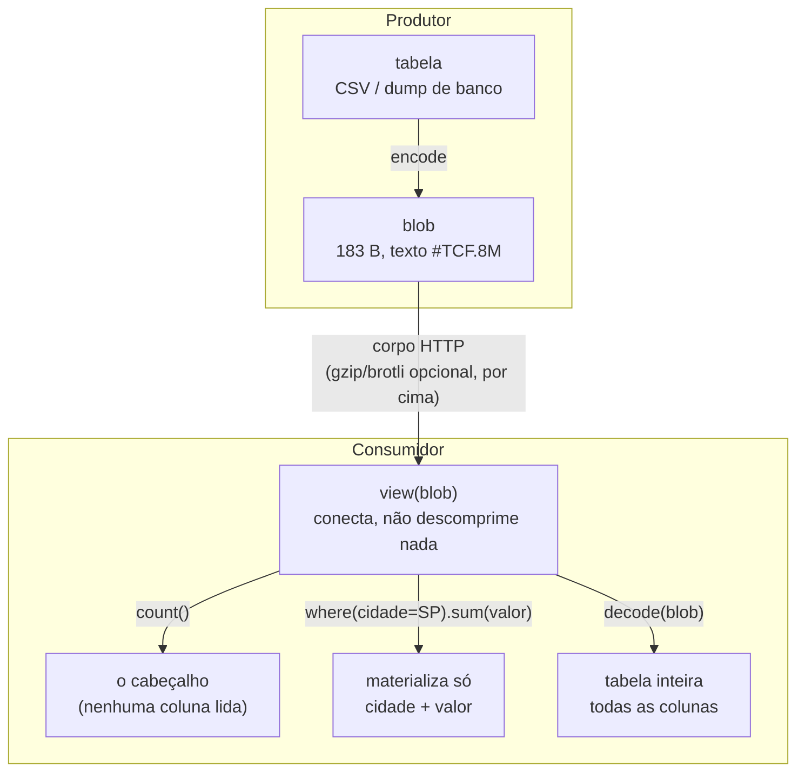
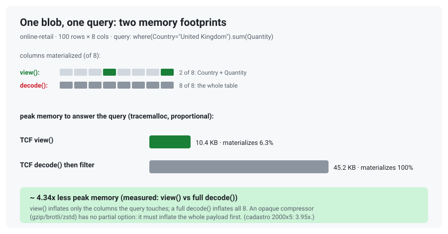

<!-- l10n: doc_id=readme · lang=pt-BR · source_lang=en · translation_of=README.md · synced=2026-07-01 -->
[English](README.md) · **Português**

> Tradução de [`README.md`](README.md). Se houver divergência, o original em inglês prevalece.
> A régua de atualização é o histórico do git: se o `README.md` mudar depois desta tradução, esta versão fica desatualizada.

# TCF · Tabular Compact Format

[](https://github.com/LeoPR/TCF/actions/workflows/ci.yml)


-orange)


> **E se desse pra transmitir a mesma tabela com bem menos bytes,
> sem virar um arquivo binário que ninguém mais consegue abrir e ler?**

Um cadastro pequeno, nos três formatos (bytes reais, saída de verdade):

**JSON** *(596 B)*: repete o nome de cada campo em toda linha.

```json
[ { "nome": "Ana Souza",  "email": "ana@acme.com.br",
    "cidade": "Sao Paulo", "plano": "Premium",
    "cpf": "111.111.111-11" },
  { "nome": "Bruno Lima", "email": "bruno@acme.com.br",
    "cidade": "Sao Paulo", "plano": "Premium",
    "cpf": "222.222.222-22" }, … ]
```

**CSV** *(277 B)*: tira os nomes repetidos, uma linha por registro.

```csv
nome,email,cidade,plano,cpf
Ana Souza,ana@acme.com.br,Sao Paulo,Premium,111.111.111-11
Bruno Lima,bruno@acme.com.br,Sao Paulo,Premium,222.222.222-22
Carla Nunes,carla@acme.com.br,Sao Paulo,Basic,333.333.333-33
Diego Rocha,diego@acme.com.br,Rio de Janeiro,Premium,444.444.444-44
```

**TCF** *(242 B, formato 0.8, saída real do `encode`)*: o que se repete vira referência; o que é único
fica cru.

```
#TCF.8M!2c=nome,2a=email,1c=cidade,14=plano,!cpf
Ana Souza
Bruno Lima
Carla Nunes
Diego Rochaan*a*@acme.com.br
brun*o3
carl2,3
dieg5,3
*3|Sao Paulo
Rio de Janeiro
*2|Premium
Basic
^1
111.111.111-11
222.222.222-22
333.333.333-33
444.444.444-44
```

**TCF + nature CPF** *(210 B)*: neste exemplo, um filtro opt-in para CPF, chamado *nature* `cpf`, encolhe até mesmo uma coluna sem valores repetidos.

```
#TCF.8M!2c=nome,2a=email,1c=cidade,14=plano,!cpf:cpf
Ana Souza
Bruno Lima
Carla Nunes
Diego Rochaan*a*@acme.com.br
brun*o3
carl2,3
dieg5,3
*3|Sao Paulo
Rio de Janeiro
*2|Premium
Basic
^1
%g$.u
)K%7l
.1&Cc
0r(LU
```

A coluna `cpf` não tem repetição a fatorar, então o pipeline padrão a guarda crua (`!cpf`).

Aí entra o filtro *nature* `cpf`. Ele remove a pontuação e o dígito verificador, guarda os 9
dígitos úteis em uma base compacta e os recompõe no `decode`. Se o resultado for menor, o
cabeçalho registra `:cpf`. Cada valor cai de 14 caracteres para 5 (`%g$.u` = `111.111.111-11`).

**Como ler:**

- Linha 1, a assinatura e o meta inline: `#TCF.8M` é o formato 0.8, multi-coluna;
  os tamanhos estão em hexadecimal.
- O meta (`tamanho=nome`) usa `!` para raw, `@` para dicionário e `%` para split estrutural,
  quando esses candidatos vencem. O `!` marca uma coluna guardada **crua**, ou seja, quando o
  raw fica menor que o TCF.
- A última coluna (`cpf`) não leva tamanho, porque vai até o fim, e mostra `!cpf:cpf`. O `!`
  indica que o corpo foi mantido cru pelo pipeline geral; o `:cpf` identifica o filtro aplicado,
  e é por isso que o `decode` reverte sem receber esse filtro.
- Os corpos vêm concatenados, **delimitados por tamanho, não por quebra de linha**.
  Por isso a coluna crua `nome` (`…Diego Rocha`) emenda direto no e-mail (`an*a*…`).
- No corpo: `*3|Sao Paulo` é *"Sao Paulo, 3×"* (repetição).
  `^1` é *"igual à linha 1"* (substituição).
- Na coluna de **e-mail** o TCF vai mais fundo (prefixo único + domínio comum referenciado).
  É onde mais economiza, e onde o texto fica mais denso.
- A *nature* **`cpf`** é opt-in via `schema={"cpf": SPEC_CPF}` (ver os dois blocos acima).
  Os CPFs do exemplo são placeholders de dígitos repetidos: passam no cálculo do CPF, mas a
  Receita nunca os emite, então são fakes seguros. Ver "Filtros por natureza" abaixo.

**E os mesmos registros aninhados**: o JSON que sua API de fato envia.

Desde a 0.8, o `#TCF.8H` faz round-trip do **dataset que sua linguagem constrói a partir do
JSON**: objetos/arrays aninhados, `null`, e `true`/`false`/números tipados. Ele lê o *dataset*
(dict / list / escalar), nunca o texto JSON.

**JSON** *(184 B)*:

```json
[ {"nome":"Ana Souza","cpf":"111.111.111-11","ativo":true,"fones":["11 98765-4321","11 3555-0100"]},
  {"nome":"Bruno Lima","cpf":"999.999.999-99","ativo":false,"fones":["21 99888-7766"]} ]
```

**TCF + nature CPF** *(144 B, saída real do `encode`)*: entrada aninhada roteia pro `#TCF.8H`.

O objeto é *fatiado em colunas*, uma por campo. Assim os nomes de campo aparecem **uma vez** no
header, não em cada registro, e a mesma nature `cpf` opt-in da tabela plana também vale aqui:

```
#TCF.8Hnome:21,cpf:12:cpf,ativo:11b,fones#:6[
Ana Souza
Bruno Lima
%g$.u
AJ/}}
true
false
\2
\1
\11 *\98765-\4321
1\3555-\0100
\21 \99888-\7766

```

- `cpf:12:cpf` é a mesma nature **`cpf`** opt-in da tabela plana acima: remove a pontuação e o dígito
  verificador, então os dois valores comprimem pra `%g$.u` / `AJ/}}`; o `:cpf` no fim deixa o `decode`
  reconstruir sem receber o filtro.
- `ativo:…b` é um **bool tipado**: `true`/`false`, distinto da string `"true"`; um campo numérico
  também levaria uma tag de tipo.
- `fones#:…[` é uma coluna **array**; os tamanhos são coluna própria (`\2`, `\1`: *2 fones,
  depois 1*, então você conta a estrutura **sem expandi-la**. Dígitos ganham um escape `\` pra nunca
  colidir com a sintaxe de referência (`\11 ` = `11 `); o `decode` reverte exatamente.

Toda a classe JSON faz round-trip byte-exato: objetos/arrays aninhados, `null` (distinto de ausente e
de `"null"`), registros ragged, qualquer valor na raiz. Mapa completo e a fronteira declarada:
[`docs/reference/json-equivalence.md`](docs/reference/json-equivalence.md).

JSON repete a estrutura inteira.
CSV repete os valores.
O **TCF fatora o que se repete**, referencia o resto e **mantém cru o que é único**, sem inflar.

E o resultado continua **texto ASCII que você abre e lê**.

Mas quanto mais fundo ele fatora (veja o e-mail), mais denso o texto fica.
*Legível não quer dizer óbvio à primeira vista.*

Em tabelas grandes a diferença cresce: ver [Resultados](#resultados).

## O que é o TCF

Um formato **textual** e **sem perdas** (`decode(encode(x)) == x`) para tabelas de strings.

Comprime parecido com um zip/gzip, com uma diferença: o resultado **continua texto ASCII que você
abre e inspeciona**, sem descomprimir. Não fica tão óbvio quanto o original, porque quanto mais o
TCF fatora, mais denso o texto. Mas nunca vira um blob opaco.

Cada coluna passa por um pipeline próprio.

É essa a faixa que o TCF ocupa: **compacto como um compressor, inspecionável como texto**.

Precisa de ratio máximo? Rode gzip/brotli por cima: eles se compõem.

## Como ele faz isso: OBAT + HCC

Duas camadas, explicadas pelo propósito (specs: [`docs/algorithms/`](docs/algorithms/)).

**OBAT** (Online Bidirectional Affix Tokenizer) *acha o que as strings têm em comum.*
Para cada valor, ele procura o maior prefixo **e** sufixo compartilhado com os anteriores.
São domínios de e-mail, raízes de URL, códigos da mesma família. Escreve o trecho uma vez e
referencia o resto.

É um **front-coding bidirecional**: generaliza o front-coding clássico de dicionários de strings
(Witten et al.; HTFC/RPDac, Brisaboa et al.). O "bidirecional" é o que captura o **sufixo** comum
(`@acme.com.br`), não só o prefixo.

A busca por afixos é da família das **árvores de prefixo/sufixo**: tries, **Patricia/radix tree**
(Morrison 1968), suffix trees. Na prática o OBAT acelera essa busca com um **índice de trigramas**,
que derruba o custo de O(N²) ingênuo para ~O(N^1.42), sub-quadrático e quase-linear.

> Trocar o índice por uma Patricia trie é candidato futuro:
> [exploração](docs/theory/patricia-trie-exploration.md).

**HCC** (Hierarchical Compositional Coding) *decide o que vale a pena nomear e agrupa repetições.*
Ele pega os tokens do OBAT e fatora composições recorrentes em **referências nomeadas
reutilizáveis**. Quem cria essas referências é o operador `~`. Também colapsa repetições
consecutivas, inclusive sequências quase-iguais, tipo IDs que só mudam no fim.

Como referência aponta para referência, o resultado é um **grafo acíclico de fragmentos**: na
prática, uma *gramática* / straight-line program do conteúdo.

É o espírito do **Re-Pair** (Larsson & Moffat 1999) e do **Sequitur** (Nevill-Manning & Witten
1997). A diferença está em dois pontos: o TCF opera sobre os **tokens** do OBAT, não sobre bytes,
e usa operadores próprios, onde `~` cria nó nomeado e `,` só concatena.

É o que mantém a saída pequena **e** inspecionável: os grupos de repetição `*N|...` ficam à vista.

**Velocidade.**
O lado caro é o **encode**, por causa da busca de afixos do OBAT. O índice de trigramas traz esse
custo a quase-linear, e o acelerador Cython opcional ajuda mais.

O **decode** é uma **passada linear única**: expande as referências, com lookups O(1), e os
grupos de repetição, sem nenhuma busca. Rápido e previsível.

## Filtros por natureza (opt-in)

**Um spec não é um tipo, e a diferença é o ponto.** São duas afirmações separadas: o *wire* é
sempre texto, e o **dado volta no tipo em que entrou**.

String volta byte a byte. Já `True` e `3.14` voltam **bool** e **float**, não a grafia `"True"`.
O TCF lê o tipo na entrada, marca no header (`#TCF.8b`, `#TCF.8n`) e reconstrói o **valor**, não
o texto que o representava:

```python
from tcf import encode, decode

assert decode(encode([True, False])) == [True, False]    # bool, não "True"
assert decode(encode(["True", "False"])) == ["True", "False"]   # aqui sim, string
```

O spec é outra camada: uma hipótese sobre a **forma** de um texto.

| | tipo de entrada (`bool`, `int`, `float`) | spec semântico (`cpf`, `cnpj`, `ip`) |
|---|---|---|
| quem afirma | a **sua linguagem**: o valor já é um bool | o **TCF**, como hipótese: *"tem a forma de um CPF"* |
| o que volta | o mesmo valor, no mesmo tipo (`True`, não `"True"`) | a **string original**, byte a byte |
| se não casa | não se aplica, o tipo é fato | cai para literal, **sem falhar e sem perder** |
| o que ganha | o tipo preservado, e bits (1-2 por bool) | bytes no fio |

Ou seja: o spec é uma **hipótese de compressão sobre a forma**, não uma afirmação sobre a
identidade do dado.

Ele é opt-in por valor e **nunca-pior**: compete com o pipeline comum e só vence se encolher.
Valor que não casa a forma vira literal na mesma coluna.

E é **auto-descritivo**: quando vence, o header carrega o id (`:cpf`) e o `decode` reverte
sozinho, sem receber nada. O TCF nunca valida semântica: ele não checa se um CPF *existe*.

Alguns valores têm uma estrutura fixa que o compressor genérico não aproveita. Para esses casos, o TCF
oferece um filtro opt-in chamado *nature*: ele guarda apenas a parte necessária e reconstrói o valor
original no `decode`.

Um CPF `123.456.789-09` tem **9 dígitos úteis**: a pontuação é fixa, e os 2 dígitos finais podem ser
calculados a partir deles. O filtro:

- **encode** tira a pontuação, guarda os 9 dígitos como um número curto (base segura, ~5 chars;
  o alfabeto atual tem 80 caracteres utilizáveis)
  e **descarta o verificador**;
- **decode** **recalcula** o verificador (mod-11) e reinsere a pontuação: reconstrução **exata**.

Essa opção é uma candidata, não uma transformação obrigatória.

Para cada coluna, o TCF compara o blob completo, incluindo o cabeçalho que identifica o filtro.
Se o resultado ficar maior, mantém a codificação comum e não grava `:id`.

Nos testes, isso fez diferença para CNPJ: o filtro reduziu colunas sintéticas, mas aumentou uma
tabela real ordenada. Os casos medidos estão em
[`T-SPEC-STATUS-08`](tickets/T-SPEC-STATUS-08.md).

Filtros já implementados ([ADR-0015](docs/adr/0015-natures-templated-checked-weld.md)):

| filtro | formato | o que o decode reconstrói |
|---|---|---|
| `SPEC_CPF`  | `NNN.NNN.NNN-DD`     | pontuação + 2 díg. verificadores (mod-11) |
| `SPEC_CNPJ` | `AA.AAA.AAA/AAAA-DD` | pontuação + 2 díg. verificadores (mod-11) |
| `SPEC_IP`   | IPv4 `N.N.N.N`      | pontos + octetos canônicos (padroniza para facilitar repetições em subnets) |

`A` = alfanumérico `[0-9A-Z]`, `N` = dígito, `D` = dígito verificador.

**O corpo do CNPJ é alfanumérico** desde a IN RFB 2.229/2024, vigente desde jul/2026: as 12
posições do corpo aceitam `0-9A-Z`, e só os 2 verificadores seguem numéricos.

Um CNPJ todo numérico é um *caso* do alfanumérico. Ele continua gravando nos mesmos 7 chars de
antes, e o `decode` distingue os dois pelo comprimento.

O mesmo mecanismo de filtro vale para **números**. O `SPEC_IP` acima já é numérico, nos octetos.

Sequências e IDs numéricos com cadência o pipeline de diferenças captura sozinho (`*N+delta|`).
E specs de **decimal / monetário / precisão** estão no roadmap, porque cruzam a linha lossy → 2.0.

```python
from tcf import encode, decode
from tcf import SPEC_CPF

# Placeholders de dígitos repetidos: PASSAM no mod-11 (então a nature os comprime),
# mas a Receita nunca os emite: não mapeiam pessoa real (fakes seguros p/ exemplo).
cpfs = ["111.111.111-11", "222.222.222-22", "333.333.333-33", "444.444.444-44"]

blob = encode(cpfs, schema=SPEC_CPF)   # a nature VENCE aqui (4 CPFs distintos)
print(blob)
# #TCF.8 :cpf     <- header single-col auto-descritivo: o spec ESTÁ aplicado
# %g$.u           <- "111.111.111-11" (14 B) -> 5 chars: corpo de 9 díg em base-80,
# )K%\7l             a máscara e os 2 díg verificadores caem (o decode recalcula)
# .\1&Cc
# \0r(LU
assert decode(blob) == cpfs            # decode lê `:cpf` do header, sem passar spec

# Os mesmos 4 CPFs: 69 B single-col sem a nature -> 39 B com ela (-43%). Em tabela,
# passe por coluna: encode(tabela, schema={"cpf": SPEC_CPF}); a meta inline
# da coluna cpf então carrega `:cpf` (ex.: `#TCF.8M!15=nome,!cpf:cpf`).
```

Três detalhes honestos:

- São **opt-in e auto-descritivas quando vencem**: single-column leva `#TCF.8 nome:id`; multi-column
  leva `:id` no meta inline. O `decode(blob)` reconhece automaticamente os filtros oficiais `cpf`, `cnpj` e `ip`.
- Spec customizado pode ser usado, mas o decoder precisa receber um spec cujo `name` coincide
  exatamente com o ID do header.
- Valor que não bate (verificador inválido, formato mascarado) cai em **literal** (`_`) sem
  nunca quebrar o round-trip: o filtro **nunca corrompe** o dado.

> **Escopo cadastral em exploração.** CEP, RG, identificação de motorista, telefone e códigos
> genéricos foram medidos fora do core. Nenhum é spec canônico do `.8` ainda; veja a matriz em
> [`T-SPEC-STATUS-08`](tickets/T-SPEC-STATUS-08.md).

## Getting started (1 minuto)

```python
from tcf import encode, decode

# Single-column: lista de strings
text = encode(["joao@gmail.com", "maria@gmail.com", "pedro@gmail.com"])
assert decode(text) == ["joao@gmail.com", "maria@gmail.com", "pedro@gmail.com"]

# Multi-column: dict de colunas
table = {
    "id":    ["1", "2", "3"],
    "email": ["joao@gmail.com", "maria@gmail.com", "pedro@gmail.com"],
}
text = encode(table)
assert decode(text) == table  # round-trip lossless

# Filtro opcional para valores estruturados: CPF/CNPJ/IP.
# O cabeçalho registra o filtro quando ele produz o menor resultado, então o
# decode não precisa recebê-lo.
from tcf import SPEC_CPF
cpfs = ["111.111.111-11", "222.222.222-22", "333.333.333-33"]  # dígitos repetidos: mod-11-válidos, nunca emitidos (fakes seguros)
text = encode(cpfs, schema=SPEC_CPF)
assert decode(text) == cpfs
```

`encode` dispatcha por tipo (list → single-column, dict → multi-column).
`decode` roteia pela assinatura de formato.

Tutorial passo-a-passo: [`docs/tutorials/getting-started.md`](docs/tutorials/getting-started.md).
Guias praticos: [`docs/how-to/`](docs/how-to/).

## Formato 0.8 (default): onde os bytes vão

O `encode` multi-coluna sai em **0.8 / `#TCF.8M`** por default ([ADR-0032](docs/adr/0032-tcf8-default-format.md)).
Cinco coisas, todas automáticas (sem flag), cada coluna escolhendo a menor representação:

- **Fallback por coluna.**
  Guarda a coluna em raw quando o raw fica menor que o TCF ("nunca pior que raw").
  Marcada com `!` no meta: [ADR-0022](docs/adr/0022-v2a-fallback-identity-weld.md).
- **Dicionário low-card.**
  Coluna com poucos valores distintos vira tabela de únicos + índices compactos,
  em vez de um ref por linha.
  Marcada com `@` no meta: [ADR-0025](docs/adr/0025-v2b-dictionary-categorical-weld.md).
- **Split estrutural.**
  Valor estruturado (decimal, data, datetime, CPF) com template uniforme vira campos separados,
  com o template guardado uma vez, e cada campo low-card cai no dicionário.
  Marcada com `%` no meta: [ADR-0026](docs/adr/0026-structural-split-weld.md).
- **Header mínimo.**
  O flag `M` na assinatura já declara que vêm colunas. Então o meta é inline, os tamanhos ficam
  em hexadecimal, separadores de nomes são escapados e a última coluna não leva tamanho:
  [ADR-0023](docs/adr/0023-v2-minimal-header-weld.md).
- **Filtros para valores estruturados.**
  CPF/CNPJ/IP são candidatos opt-in. O encoder compara cada opção com a codificação comum usando
  o blob completo, e se a versão filtrada não ficar menor a coluna original permanece, sem emitir
  nenhum `:id`.

```python
text = encode(table)        # 0.8 / #TCF.8M, é o default, sem flags

# knobs opt-out (default True): pra modificar o comportamento / inspecionar:
text = encode(table, fallback=False, min_header=False)  # só candidatos TCF, meta verboso
text = encode(table, min_header=False)                  # #TCF.8M com todos os tamanhos
text = encode(table, min_len=5)                         # override do min_len do OBAT (default: auto)
text = encode(table, sort_by="cidade")                  # ordena linhas pela coluna (order-free, +compressão)
```

> `sort_by` reordena as linhas pela coluna (agrupa similares → menos bytes,
> 5-15% com chave low-card). É **order-free**: o `decode` devolve a ordem
> ordenada, não a original. Use só quando a ordem das linhas não importa.

No cadastro de 5 colunas do topo, a saída default `#TCF.8M` dá **242 B**, com o meta
`!2c=nome,2a=email,1c=cidade,14=plano,!cpf`.

Isso vem dos candidatos de fallback e do header inline mínimo. A coluna `cpf` cai para **raw**
(`!cpf`) em vez de inflar, os tamanhos são hexadecimais e a última coluna não leva tamanho.
O ganho é proporcionalmente maior em **payloads pequenos**.

Pré-1.0, o encoder só escreve o formato mais novo. Blobs antigos são reproduzidos via
`git checkout`: [ADR-0024](docs/adr/0024-pre-1.0-versioning-git-as-compat.md).

O dicionário low-card (V2-B) e o split estrutural já estão no default. A compressão lossy fica no
[roadmap](docs/adr/0018-v2-format-roadmap.md).

## Estado (pré-1.0)

- **Pré-1.0** ([ADR-0024](docs/adr/0024-pre-1.0-versioning-git-as-compat.md)).
  O minor atual do formato (`#TCF.8`) é uma iteração de desenvolvimento rumo a um **1.0 sólido**.
  Não há compat rígida entre minors, já que o git reproduz versões antigas.
  v2.0 fica pra depois.
- Implementação canônica em [`src/tcf/`](src/tcf/).
  Round-trip sempre lossless (`decode(encode(x)) == x`).
- Default **0.8 / `#TCF.8M`**: fallback, dicionário, split estrutural, meta hexadecimal inline,
  escaping e identificadores de filtros autorizados pelo cabeçalho; veja a seção acima. Os legados `.6/.7`
  são recuperados via git.
- Suíte: **1366 passed, 1 skipped** na execução local completa atual; rode `pytest` para o número do seu ambiente.
  Baselines de byte = guardas de regressão, re-pináveis em mudança intencional ([ADR-0024](docs/adr/0024-pre-1.0-versioning-git-as-compat.md)).
- Mudanças: [`CHANGELOG.md`](CHANGELOG.md).
  História M0-M14: [`experiments/lab/dirty/notas/2026-05/historia-dirty-lab.md`](experiments/lab/dirty/notas/2026-05/historia-dirty-lab.md).

> O ciclo **v0.5** (formato columnar para LLM benchmark) é acessório e vive separado.
> Ver a seção "Benchmark LLM v0.5" mais abaixo.

## Resultados

**Sem nenhum compressor, o TCF é o formato de _texto_ mais compacto do conjunto.**
Nos 15 datasets sintéticos do [EXP-008](experiments/lab/clean/EXP-008-compressao-comparada/):

| formato (texto puro, sem compressor) | bytes |
|---|---:|
| **TCF** | **3131** |
| CSV | 4872 |
| JSON | 5409 |
| JSONL | 7001 |

~36% menor que CSV e ~42% menor que JSON, continuando legível.

Núcleo pinado em testes: D1-D9 = **1545 B**, 51.8% do raw em single-col; D17a multi-col =
**300 B** no `#TCF.8M`, com meta hexadecimal inline.

Real-world multi-coluna (9 tabelas Adult + TPC-H, 136k linhas): **−33.02% weighted** vs CSV raw.

**E contra gzip / brotli / zstd?**
Outra categoria. São compressores binários *opacos*: para ler qualquer coisa é preciso
descomprimir tudo antes.

E o `view()` não funciona sobre eles, o que é decisivo: qualquer consulta exige inflar o payload
inteiro.

No **cadastro acima**, sob compressão HTTP (`Content-Encoding`, nível máximo):

| formato | cru | gzip | br | zstd |
|---|---:|---:|---:|---:|
| JSON  | 596 | 218 | 212 | 211 |
| JSONL | 449 | **205** | 194 | 194 |
| TCF   | **242** | 206 | **185** | **193** |

Entre os formatos que uma API de fato transmite, o TCF é o menor **cru**: 242 B, contra 449
do JSONL e 596 do JSON. Comprimido, ele segue competitivo. Vence sob `br` e `zstd`, e fica
um byte atrás do JSONL sob `gzip`, sem deixar de ser legível e consultável por `view()`.

O CSV é menor ainda: 277 B cru, e neste tamanho minúsculo ele passa o TCF depois de
comprimido, 162 B contra 185 B sob brotli.

Duas ressalvas honestas. CSV raramente é payload de API. E essa diferença fecha e inverte com
volume, como a seção seguinte mostra.

A troca é explícita: **um pouco de ratio por legibilidade**. Note que o TCF **se compõe** com
esses compressores, em vez de disputar com eles.

A vantagem em *ratio* aparece com volume. Inspecionar, e consultar seletivamente com `view()`,
valem em qualquer tamanho.

Há uma diferença que só conta em payload pequeno. O `gzip` carrega bytes fixos de moldura em
cada mensagem, enquanto `br` e `zstd` quase não carregam.

> Os números acima usam os compressores no **nível máximo**, o melhor caso para eles. Numa API
> simples a compressão às vezes nem está ligada, e quando está usa nível baixo por default:
> nginx gzip `1`, brotli `6`. Ver
> [notas dos compressores](experiments/lab/clean/EXP-008-compressao-comparada/notes/classificacao-compressores.md).

No agregado de 15 datasets sintéticos **single-column** (EXP-008, onde os welds multi-col do 0.7
não se aplicam) a mesma história: `csv+brotli` = 1742 B contra `tcf+brotli` = 2116 B. Tabelas
completas: [reports do EXP-008](experiments/lab/clean/EXP-008-compressao-comparada/reports/).

**Atenção de escala**: o cadastro acima é minúsculo, são 4 linhas.

Em **multi-coluna real**, com milhares de linhas, o quadro **inverte**: o **TCF cheio + brotli
vence o CSV + brotli**.

Veja o Adult com 3 000 linhas: `tcf-0.8+brotli` = **21,8 KB** contra `csv+brotli` = 30,4 KB,
ou −28%.

E quanto **mais** TCF, **menor** o resultado pós-brotli. Isso foi medido em 4 datasets reais:
[`2026-06-16-staged-and-ordering-brotli/`](experiments/lab/dirty/old/refuted/2026-06-16-staged-and-ordering-brotli/).

Em payload minúsculo a moldura domina e não há o que fatorar. **A vantagem do TCF aparece com
volume.**

O mesmo padrão vale para os compressores do **Parquet** (snappy, lz4, zstd), não só os de
**HTTP**. O que decide não é o container: é a estrutura do dado.

Numa **coluna única de texto livre e denso**, o compressor binário vence sozinho. Pôr o TCF por
baixo em geral atrapalha, e a perda chega a −41%: a reescrita em referências do TCF perturba o
modelo de entropia do compressor.

Nem tudo é assim. Algumas células ficam quase neutras, e uma delas, `lz4` em retail-description,
chega a ganhar 7%.

Numa **tabela multi-coluna estruturada** a conta se inverte. O TCF vence sozinho: −72% contra o
CSV.

E ele ainda compõe: `tcf+brotli` fica 30% abaixo de `brotli` sobre o dado cru.

Medido com contra-prova de round-trip em
[`2026-07-13-0156-compressores-http-parquet/`](experiments/lab/dirty/2026-07/2026-07-13/2026-07-13-0156-compressores-http-parquet/result.md).

## Pra onde vai a 1.0: consultar quase sem descomprimir

O que o TCF já faz hoje aponta pra meta da **1.0**: usar a **própria estrutura da compressão
como índice**, pra responder perguntas **quase sem descomprimir** e com **pouca memória**.

A saída textual já carrega dicas que valem como metadados:
- `*N|Sao Paulo` diz que há **N linhas iguais** ali, uma **contagem/agrupamento** pronta,
  sem expandir os N itens.
- `^1` diz "igual à linha 1": multiplicidade/dedup visível.
- `*N+delta|template` descreve uma **progressão** (ex.: IDs sequenciais) sem listar
  cada valor.

Ou seja, dá pra **contar elementos, agrupar e até somar** lendo os marcadores, materializando só
o pedaço necessário. Um compressor binário por cima, gzip ou brotli, faria o oposto: você teria
que **alocar memória e descomprimir tudo** pra só então varrer os dados.

É essa a faixa que a 1.0 quer firmar: **compacto e ao mesmo tempo consultável**, não um blob
opaco.

Os filtros por natureza entram aqui, com CPF/CNPJ/IP hoje e numéricos no roadmap: eles dão
estrutura semântica explícita sem perder a legibilidade. Ainda estão em evolução, veja acima.

### `view()`: caminhos de consulta SQL-like com descompressão seletiva *(API read-only do core)*

Uma API *lazy* sobre o blob: conecta **sem descomprimir** e só materializa a coluna (e as linhas)
que o agregador precisa. Filtrar por algo descomprime **só** o que tem relação.

Ela é SQL-like em capacidade, não um parser SQL. Oferece projeção, filtros, encadeamento AND,
agregadores e agrupamentos como métodos Python.

Não implementa joins, NULL SQL, ORDER/LIMIT ou um planejador geral.

```python
from tcf import encode
from tcf import view                             # API publica desde a 0.8

# um cadastro pequeno de vendas: carregado de um CSV, dump de banco, onde for
table = {
    "cliente": ["Ana Souza", "Bruno Lima", "Carla Nunes", "Diego Rocha", "Eva Martins", "Ana Souza"],
    "cidade":  ["Sao Paulo", "Sao Paulo", "Sao Paulo", "Rio de Janeiro", "Sao Paulo", "Rio de Janeiro"],
    "plano":   ["Premium",   "Premium",   "Basic",     "Premium",        "Basic",     "Premium"],
    "valor":   ["120",       "100",       "170",       "200",            "80",        "80"],
}

blob = encode(table)                            # 183 B de texto ASCII: é isto que se armazena/transmite
v = view(blob)                                  # conecta, não descomprime nada
v.count()                                       # 6        não toca coluna nenhuma
v.sum("valor")                                  # 750      toca: valor
v.avg("valor")                                  # 125
v.max("valor"), v.min("valor")                  # 200, 80
v.where("cidade", "Sao Paulo").count()          # 4        toca: cidade
v.where("cidade", "Sao Paulo").sum("valor")     # 470      toca: cidade, valor
```
*(Saída real do PoC: a tabela acima faz `encode` para um blob de 183 B e volta exata no round-trip.)*

O `toca:` é o ponto (saída real). A soma filtrada materializou **só** `cidade` + `valor`;
`cliente` e `plano` nunca foram descomprimidos.

Um `decode()` materializaria as 4 colunas **inteiras** antes de qualquer conta, e um gzip/brotli
por cima faria o mesmo.

Agregadores: `count`, `sum`, `min`, `max`, `avg` + `where`.

Os **L3–L5 já estão implementados**: contar/agrupar **sem expandir**, via dicionário ou raw;
filtro pelo índice do dicionário; e group-by por **layout ordenado** (`sort_by`). Vale a
ressalva: o `*N|` do modo-tcf é entrelaçado, **não separável**.

Em dados reais (online-retail, 5 000 × 8), responder *"quantos itens o usuário X comprou"* com
`where(CustomerID=X).sum("Quantity")` **materializa 7,9% do blob**, contra 100% de um `decode()`.
Um `count()` não materializa nada: a contagem de linhas está declarada na estrutura,
então sai sem construir um único valor. Memória e latência baixas caem direto da estrutura.

É uma API read-only do core e lê o `#TCF.8M` atual.

Superfície atual: `count`, `sum`, `min`, `max`, `avg`, `where`, `select`, `group_count` e, em
caráter experimental, `group_ranges`/`agg_by` em layouts ordenados.

Colunas `@dict`/raw podem ser consultadas estruturalmente. Já uma coluna `tcf` entrelaçada pode
exigir materialização completa. O contrato detalhado está em
[`docs/reference/lazy-view.md`](docs/reference/lazy-view.md).

**Fim a fim: transmita o texto compacto e consulte na chegada.** O blob fica pequeno **e**
continua texto.

O produtor faz `encode` uma vez e envia como corpo HTTP normal. O consumidor roda `view()` e só
descomprime as colunas que a pergunta toca: nada mais é expandido pra responder um `count()` ou
um agregado filtrado.



O mesmo blob serve três níveis de acesso a partir de uma transmissão: um `count()` barato, um
agregado filtrado seletivo, ou um `decode()` completo: quem chama escolhe quanto paga.

Um compressor opaco não faz isso: pra responder *qualquer* pergunta é preciso `gunzip`/`unbrotli` o
payload **inteiro** antes, e é aí que a memória também vai.



Medido com contra-prova de round-trip, com throughput de tempo e picos de `tracemalloc`, em
[`2026-07-13-0156-compressores-http-parquet/`](experiments/lab/dirty/2026-07/2026-07-13/2026-07-13-0156-compressores-http-parquet/result.md).

Responder `where(Country).sum(Quantity)` no online-retail (100×8) tem pico de **10,4 KB** pelo
`view()` contra **45,2 KB** por um decode completo, **≈4,3× menos**. No cadastro 2000×5 a razão é
3,95×.

O throughput de descompressão é alto em todo codec (gzip ~60, zstd ~130, lz4 ~850 MB/s), mas um
compressor o paga sobre **100%** do payload. O `view()` paga sobre a fração tocada, **6,3%** aqui.
O ganho de latência não é descomprimir *mais rápido*, é descomprimir **menos**.

## Roadmap 2.0

Depois de uma 1.0 sólida (registrado, **não** implementado; ver
[ADR-0018](docs/adr/0018-v2-format-roadmap.md)):

- **Agregados sem perda mesmo sendo lossy por linha**: somas/médias exatas no agregado ao
  arredondar com resíduo, como no parcelamento em que `valor = soma(parcelas)`, e *drop* de
  coluna derivável, como `total = base + imposto`. Isso cruza a linha lossless, então exige
  decisão explícita + GATE; ver Pacote 10,
  [`loss-taxonomia.md`](experiments/lab/dirty/notas/2026-06/loss-taxonomia.md).
- **Streaming / baixa latência (V2-J)** e **disco zero-copy / column-pruning (V2-K)**:
  transmitir e ler por pedaço, sem buffer-over-buffer.
- **Camada binária interna (V2-L)**: empacotar o corpo em bytes mantendo header textual e
  grupos visíveis (estilo Parquet, mas ainda explicável). Não compete com gzip/brotli: é
  representação binária do **mesmo** conteúdo lógico.
- **Mais specs** (templated/checksummed/numéricos), limites de ganho, índices locais e
  **repetição intra-valor**: pesquisa `.9`/pré-1.0, com gate real-world.

## Install

```bash
pip install tcf-format        # ou: uv pip install tcf-format
```

A **distribuição** chama-se `tcf-format`; o **pacote importável** é `tcf` (sem
dependências de runtime):

```python
from tcf import encode, decode

tabela = {
    "nome": ["ana", "bruno", "carla"],
    # CPFs de exemplo com digitos repetidos: invalidos por convencao (rejeitados
    # por qualquer validador; a Receita nunca os emite). Nao correspondem a pessoas reais.
    "cpf":  ["111.111.111-11", "222.222.222-22", "333.333.333-33"],
}
blob = encode(tabela)
assert decode(blob) == tabela        # round-trip lossless
```

Para CPF/CNPJ/IP há *natures* opt-in (ADR-0015, `encode(coluna, schema=SPEC_CPF)`)
que regeneram o dígito verificador no decode.

Pré-1.0 (ADR-0024): o pacote está em `0.8.1`; o *minor* acompanha o formato
(`#TCF.8`) e o *patch* é contador de release, desacoplado do comportamento.

## First-time setup (dev)

```bash
# Clone + install dev deps
git clone https://github.com/LeoPR/TCF.git && cd TCF
pip install -e ".[dev]"

# (recomendado) instalar pre-commit hooks
pre-commit install

# Rodar hooks em todos arquivos (opcional, baseline)
pre-commit run --all-files
```

Hooks configurados (ver [`.pre-commit-config.yaml`](.pre-commit-config.yaml)):
- `ruff` lint + format
- `detect-secrets` (scan)
- basicos: trailing-whitespace, end-of-file-fixer, check-merge-conflict, check-added-large-files
- custom: bloqueia cache dirs (`__pycache__/`, `.pytest_cache/`, etc.) acidentalmente staged

## How to cite

Ver [`CITATION.cff`](CITATION.cff). GitHub renderiza badge "Cite this
repository" na pagina do repo automaticamente.

---

## Benchmark LLM v0.5 (acessorio, projeto paralelo)

> Esta secao resume o ciclo **v0.5** (formato columnar para consumo por LLMs).
> NAO e' o algoritmo TCF v0.7 acima. Todo o material vive separado.

O ciclo v0.5 mediu compreensao de tabelas por LLMs em CSV/JSON/TOON/TCF, com a Linha A
"LLM le e computa" e a Linha B "LLM gera SQL". Foram 7 modelos comerciais + 13 locais,
2 datasets, 2256 registros, 38 findings.

Usava o **motor de niveis** (`EncodeConfig(level=N)`) em [`old/tcf/`](old/tcf/).
Ver [`old/tcf/LEVELS-REVIEW.md`](old/tcf/LEVELS-REVIEW.md) para a semantica L0–L3.

- **Harness** (runners, llm_eval, scripts): [`old/llm-benchmark/`](old/llm-benchmark/)
- **Catalogo de achados** F-Q01..Q38: [`docs/findings/`](docs/findings/)
  + [`docs/FINDINGS_SUMMARY.md`](docs/FINDINGS_SUMMARY.md)
- **Manual / paper v0.5**: [`docs/archive/manual_v05/`](docs/archive/manual_v05/)
  + [`docs/archive/article_v05/`](docs/archive/article_v05/)

Candidato a spin-off (`tcf-llm-tools`) no futuro. Pode re-validar contra v0.7
se Phase 2 for revivida.

---

## Repository layout

```
TCF/
├── src/tcf/                 ← API CANÔNICA v0.8 (OBAT+HCC, encode/decode/view, #TCF.8)
├── old/tcf/                 ← motor v0.5 (niveis L0–L3), congelado-historico (ver LEVELS-REVIEW.md)
├── scripts/                 ← Shaper (stratified sampling), CSV→SQLite, setup_* datasets
├── experiments/lab/         ← labs v0.8 (dirty + clean): compressao composicional
├── old/llm-benchmark/       ← benchmark LLM v0.5 (harness: runners + llm_eval), acessorio
├── tests/                   ← pytest suite (v0.8)
├── datasets/                ← canonical metadata + samples (dados reais fora do repo)
├── tickets/                 ← planejamento markdown (YAML frontmatter)
├── docs/
│   ├── algorithms/          ← specs canonicos v0.8 (OBAT, HCC, TCF-format) [reference]
│   ├── adr/                 ← decisoes numeradas, imutaveis
│   ├── theory/              ← fundamentos teoricos [explanation]
│   ├── how-to/, tutorials/  ← Diataxis
│   ├── findings/            ← catalogo cientifico v0.5 LLM (F-Q01..Q38) [historico]
│   ├── workbench/           ← dev timeline, research notes (partes em _archive/)
│   └── archive/             ← material v0.5/v0.1 congelado (manual_v05, article_v05, etc.)
├── config/                  ← storage.json (aponta a raiz de dados), api_keys (gitignored)
├── README.md                ← you are here
└── CHANGELOG.md             ← release history
```

> Para o mapa detalhado, ver [MAP.md](MAP.md). Os diretorios `docs/manual/`
> e `docs/article/` NAO existem; o material v0.5 correspondente esta em
> `docs/archive/manual_v05/` e `docs/archive/article_v05/`.

---

## Ferramentas entregues (v0.8)

O encoder e' a ferramenta principal; auxiliares de suporte (NAO TCF-core):

- **Shaper** (`src/shaper/`): stratified, FK-preserving sampling framework.
  Standalone-able as a separate library; see
  [shaper-as-standalone-tool note](docs/workbench/research-notes/_archive/2026-04-25-shaper-as-standalone-tool.md)
- **DatasetReader** (`scripts/dataset_reader.py`): uniform interface
  over SQLite hubs (rows, columns, query, column_stats)
- **setup_\*.py** (`scripts/`): download/geracao dos datasets canonicos
  (Adult, TPC-H, IBGE, CNPJ, etc.); ver [datasets/README.md](datasets/README.md)

> Pré-1.0: **library-only** (sem CLI; ver `pyproject.toml`).
> O benchmark LLM v0.5 (CommercialClient, M-series runners) vive em
> [`old/llm-benchmark/`](old/llm-benchmark/), com instrucoes de reproducao no README de la'.

---

## Por onde seguir

- **Quero usar TCF no pipeline** → API v0.8: `from tcf import encode, decode` ([src/tcf/](src/tcf/)); veja o [tutorial](docs/tutorials/getting-started.pt-BR.md) e os [guias](docs/how-to/).
- **Quero ler os achados** → [docs/findings/](docs/findings/) (LLM v0.5, historico)
- **Quero rodar o benchmark LLM** → [old/llm-benchmark/](old/llm-benchmark/) (acessorio v0.5)
- **Quero entender a arquitetura** → [docs/theory/](docs/theory/)
- **Quero ver o roadmap** → [ROADMAP.md](ROADMAP.md) (tiers: pré-1.0 / 2.0 / pesquisa); detalhe granular em [roadmap-hipoteses.md](experiments/lab/dirty/notas/2026-05/roadmap-hipoteses.md)
- **Quero caminhos de consulta SQL-like sem materializar tudo** → [`tcf.view`](docs/reference/lazy-view.md) (`count`/`sum`/`where`/group-by, quando o modo da coluna permite)
- **Quero divulgar / apresentar o TCF** → [docs/divulgacao-tcf.md](docs/divulgacao-tcf.md) (material de divulgação, estilo post)
- **Quero ler o paper** → drafts v0.5: [docs/archive/article_v05/](docs/archive/article_v05/) (paper v0.7 pendente)
- **Quero ver como evoluiu** → [CHANGELOG.md](CHANGELOG.md) +
  [docs/workbench/](docs/workbench/)

---

## Licença

MIT. Veja [LICENSE](LICENSE).

## Acknowledgements

Project conceived as part of an academic dissertation (TCC). Datasets:
[UCI Adult Census](https://archive.ics.uci.edu/ml/datasets/adult) and
[TPC-H](https://www.tpc.org/tpch/) (via DuckDB tpch extension).
(Ciclo v0.5) Commercial LLM testing supported by personal credits;
total spend $9.46 USD for 1968 records (75% cache savings).
