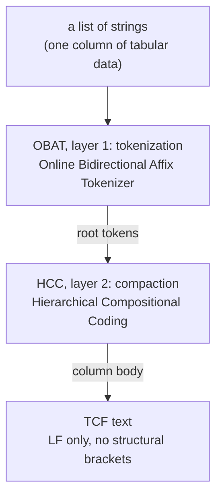

<!-- l10n: doc_id=algorithms-index · lang=en · canonical -->
# TCF algorithms

Specifications of the canonical algorithms. Each document explains **what** the algorithm is
in plain language, **how** it works, **where** the name comes from, **how it compares** to the
literature, and **where it sits** in the pipeline.

## The pipeline

## Documents

| algorithm | layer | document |
|---|---|---|
| **OBAT**: Online Bidirectional Affix Tokenizer | 1, tokenization | [OBAT.md](OBAT.md) |
| **HCC**: Hierarchical Compositional Coding | 2, compaction | [HCC.md](HCC.md) |
| **TCF**: Tabular Compact Format | the format | [TCF-format.md](TCF-format.md) |

Each of the three is a bilingual pair: `X.md` is a **router** (language picker) pointing to
`X.en.md` (English, canonical) and `X.pt-BR.md` (Portuguese). Links to `X.md` stay valid.

**Cross-cutting reference**, not an algorithm but the map of what flows between the layers:

| document | for what |
|---|---|
| [core-data-model.md](core-data-model.md) | in-memory structures (tokens, pieces, aliases, IDs) and the CORE/HOST boundary: the map for a C/Rust port |
| [output-convention.md](output-convention.md) | what a `.tcf` file is on disk: line endings, final LF, encoding |

## Codenames

`alg16` (OBAT) and `M8.A` (HCC) were the working names during experimental development. Code,
public documentation and external references use the official names; the codenames survive only
in the lab narrative, as markers of experimental origin.

## See also

- [`../reference/api.md`](../reference/api.md): the public surface contract *(Portuguese)*
- [`../../src/tcf/`](../../src/tcf/): the canonical implementation
