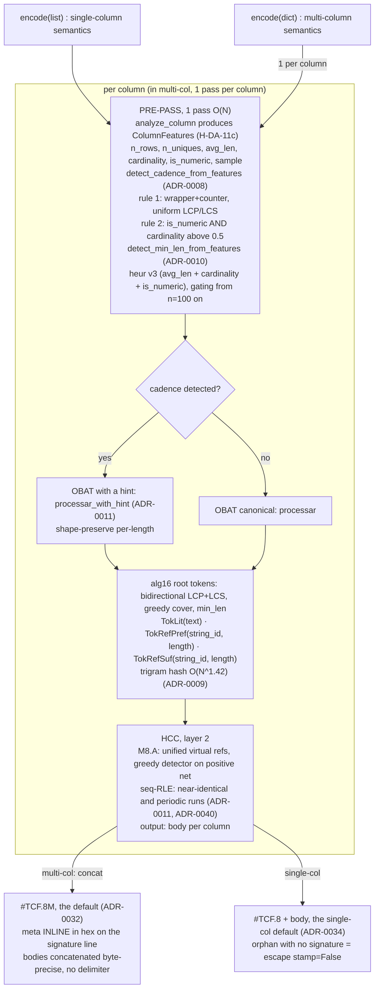
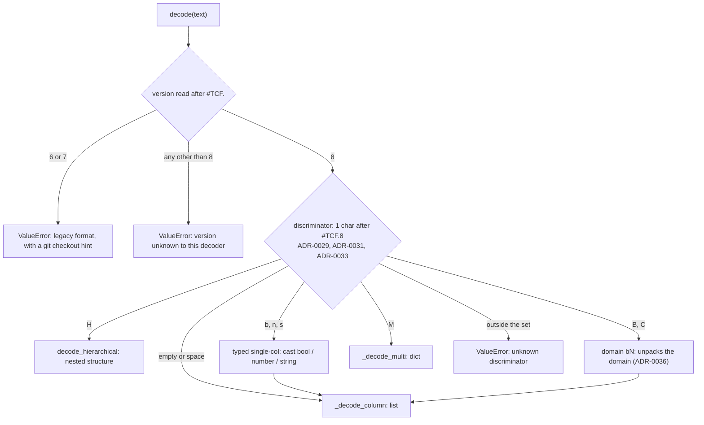
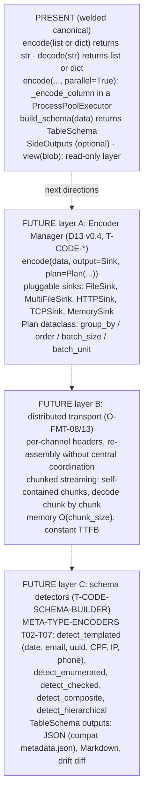

<!-- l10n: doc_id=tcf-format · lang=en · canonical -->
**English** · [Português](TCF-format.pt-BR.md)

# TCF: Tabular Compact Format

## Overview

TCF is a textual format for representing **tabular data** in a
**compact** way, while preserving:

- **Text output** (no binary): visual inspection and
  processing by LLMs/line-oriented pipelines
- **Lossless roundtrip** of VALUES: `decode(encode(values)) == values`. Row
  ORDER comes back unchanged too, except under `sort_by`
  (see [encode-knobs.md](../reference/encode-knobs.md))
- **Structural compression**: exploits patterns in columns (shared
  affixes, recurring sub-patterns, detectable cadences,
  near-identical runs)

Format designed for:
- Columns of tabular data where values share structure
  (URLs, emails, IDs, dates, paths, structured identifiers)
- Medium volumes (does not replace gzip for massive logs; replaces
  CSV/JSON when readability matters)
- Multi-column tables where each column benefits from its own
  pipeline (independent per-column encoder)

## Versioning (pre-1.0)

> **Three axes** ([ADR-0024](../adr/0024-pre-1.0-versioning-git-as-compat.md),
> [ADR-0028](../adr/0028-pre-1.0-versioning-minor-format-coupling-release-cadence.md)), distinguish:
> - **(A) FORMAT version**: the **format signature / magic number** `#TCF.N` (canonical term;
>   **not** "shebang", which is `#!`, analogous to `%PDF-1.7`; see [vocabulary.md](../vocabulary.md)).
>   On-disk contract; only changes with a format change. Today `#TCF.8` (default, ADR-0032); `#TCF.6/.7`
>   cut from `src/tcf` (git-as-compat: recover the era to read/compare).
> - **(B) Encoder generation**: internal development milestone (the `M10` that shows up in the pipeline
>   and in [ADR-0011](../adr/0011-pacote1-weld-canonical.md)). NOT a public version, never travels on the wire.
> - **(C) Package version** (PyPI), pre-1.0 = `0.<format>.<release>`: minor = format number
>   (`0.N` ↔ `#TCF.N`); release/patch = a delivery WITHIN the format.
>
> **Bump rule**: a FORMAT change moves the minor (`0.(N+1).0`); a delivery that leaves the format alone
> moves the release (`0.N.x+1`). E.g.: `#TCF.8` default ([ADR-0032](../adr/0032-tcf8-default-format.md)) =
> package `0.8.x`. `1.0` only once the final format freezes, and strict semver starts there.
> Terms: [`../vocabulary.md`](../vocabulary.md) §Versionamento.

TCF distinguishes the **FORMAT version** (signature `#TCF.N`, axis A) from the **PACKAGE version**
(semver `0.N.x`, axis C); do not confuse the two (ADR-0028).

### Format version (signature)

| Signature | What decode does |
|---|---|
| `#TCF.8` | **current format** (multi-col + single-col self-describing): encode emits it, decode reads it |
| `#TCF.7` / `#TCF.6` | **named legacy error**, carrying the `git checkout` hint for reading/comparing that era (git-as-compat, [ADR-0024](../adr/0024-pre-1.0-versioning-git-as-compat.md)) |
| any other `#TCF.<N>` | unknown-version error |

Verifiable (the messages come from the code, in Portuguese): `decode('#TCF.6M ...')` raises
*"formato legado ... nao suportado no 0.8"*; `decode('#TCF.5M ...')` raises
*"blob #TCF.5: versao desconhecida deste decoder"*.

**`#TCF.8` is the DEFAULT format** ([ADR-0032](../adr/0032-tcf8-default-format.md)): every multi-col
emits `#TCF.8M`; flat single-col emits **`#TCF.8`** by DEFAULT (7 B). The orphan (body with no
signature) is the explicit ESCAPE `stamp=False`
([ADR-0034](../adr/0034-header-default-100-porcento-single-col.md); ADR-0029 layer 1 /
[ADR-0030](../adr/0030-freeze-single-col-body-at-1.0.md) freeze). Legacy `#TCF.6`/`#TCF.7` is
fail-loud on decode, with a git hint. Self-describing: natures (ADR-0027) + hex + escaping travel in
the header.

**1-char discriminator** ([ADR-0029](../adr/0029-version-format-identification-semi-implicit.md) +
[ADR-0031](../adr/0031-hierarchical-discriminator-H.md) + [ADR-0033](../adr/0033-hierarchical-codec-weld.md)):
the character right after `#TCF.8` decides the structure. **9 values**, plus the punctuation range
consumed by the polarity pre-pass ([ADR-0035](../adr/0035-delimitador-de-polaridade-single-col.md)):

| after `#TCF.8` | type | header |
|---|---|---|
| *(nothing, body directly)* | orphan single-col, **explicit ESCAPE** (`stamp=False`): transmission or parquet-style container, where the version already travels outside. **NOT the default** ([ADR-0034](../adr/0034-header-default-100-porcento-single-col.md)) | - |
| `\n` | single version-stamp, **the default** | `#TCF.8` (magic number for `file`/libmagic) |
| `M` | flat multi-col | `#TCF.8M<meta>` (meta INLINE on the signature line) |
| `H` | hierarchical multi-col (specialization of `M`), [ADR-0033](../adr/0033-hierarchical-codec-weld.md) | `#TCF.8H<tree-meta>` |
| ` ` (space) | single + spec | `#TCF.8 [name]:spec` (name optional, label only) |
| `b` / `n` / `s` | typed single-col (bool / number / string) | `#TCF.8<tag>[<mode><n-hex>]`; the `n` tag emits the short form `#TCF.8n`. The three modes of the `b` tag: [`api.md`](../reference/api.md) |
| `B` / `C` | domain bN (domain first / domain last), ADR-0036 | `#TCF.8B<w><n>` |

A discriminator outside the set above is **fail-loud** on decode (it never degrades to orphan). A
punctuation suffix on the signature line is the **polarity delimiter**
([ADR-0035](../adr/0035-delimitador-de-polaridade-single-col.md)), stripped by a pre-pass before
dispatch. It does not act on `M`/`H`. The same elected char marks, in the BODY, the literal ↔
reference switch: it costs 1 byte per TRANSITION, not per occurrence, and comes from the complement
of the column alphabet (punctuation range only).

**`#TCF.8M` meta**: INLINE, on the signature line itself (`#TCF.8M<meta>\n<bodies>`). Each column
= `[<pre>]<size>[=<name>][:<id>]`:
- **byte-size in HEX** ([T-FMT-HEADER-BASE-HEX](../../tickets/T-FMT-HEADER-BASE-HEX.md), ADR-0032 §3):
  `format(n,'x')` (lowercase, no `0x`, no leading zeros). Collision-free with the separators. Decimal
  only via an inspection command (it is not the stored format).
- **mode prefix** `!`=raw (V2-A) · `@`=dict (V2-B) · `%`=split (V2-C), before the size.
- **`:id` suffix** = nature (ADR-0027). The core registry has **5**: `cpf` · `cnpj` · `ip` ·
  `dt` (ISO date) · `ipad` (int-pad). Resolved through a fixed core-only dict keyed by **`wire_id`**
  (ADR-0041; `name` is the CODE plane and never travels). **An unknown id is FAIL-LOUD**
  (`ValueError`: *"registry core fechado; forneca o spec out-of-band"*), NOT raw+warning: a
  third-party spec comes in from outside and is accepted only if its `wire_id` **matches** the
  header `:id`. The nature `:id` = LAST UN-escaped `:`.
- **name with a separator** (`,`/`=`/`:`/`\`/leading `!@%`): **backslash-escaped**
  ([T-FMT-NAME-ESCAPING](../../tickets/T-FMT-NAME-ESCAPING.md)); the tokenizer splits on the
  UN-escaped separator. The only forbidden one is `\n` (the meta line separator).
- **last column without size** (`min_header`, body up to EOF, O-FMT-15/ADR-0023): pair without `=`.
- **anonymous columns** (`drop_names`): omits `=name`; decode reconstructs by ORDER (`{'0':..,'1':..}`).
- **empty name** (`''`): emitted as **`\z`**, the same sentinel the `.8H` uses (ADR-0033 → ADR-0046);
  decode returns `''`. **Not** the same as anonymous: anonymous omits the name and decodes positional;
  `\z` is a name. `\z` is unemittable by data (a literal `\z` name is escaped as `\\z`) and is only
  valid as the WHOLE token: an embedded `\z` stays a corruption error.

**Single-col signature**: `#TCF.8\n` + body. The `M` marks multi-col; single-col does not use it.
Current gate: **D1-D9 = 1545 B** and **real-world = 89430 B**, pinned in
[`test_regression_v1_baseline.py`](../../tests/test_regression_v1_baseline.py) and
[`test_real_world_snapshots.py`](../../tests/test_real_world_snapshots.py).

**Body canonicity**: a body does NOT contain a line starting with `#TCF.<digit>` (concatenating two
finished wires corrupts the references: decode each one and re-encode the set), and the counter of
`*N|` is only canonical with `N >= 2` in ASCII digits. Both cases raise `ValueError` on decode.
Declared limit: a raw column (`!`) is verbatim, so a join INSIDE one stays undetectable.

**Examples.** Each case carries the `encode()` call that produced the wire, the REAL wire right below
it, and what the signature says. Roundtrip checked on all of them.

**1. Multi-col with a nature**: `encode({"doc": [3 CNPJs], "obs": ["nota-1","nota-2","nota-3"]}, schema={"doc": "cnpj"})`

```text
#TCF.8M16=doc:cnpj,obs
!K\9p\5B$
!Kx\0n)$
^1
nota-*\1
1\2
1\3
```

`M` = flat multi-col. In `16=doc:cnpj`, the `doc` column takes `0x16` = 22 bytes of body and won with
the `cnpj` spec (the `:id` suffix). `obs` is the LAST column: it goes without a size, body up to EOF.

**2. Multi-col in dictionary mode**: `encode({"uf": ["SP","RJ"]*3, "cid": ["Santos","Niteroi"]*3})`

```text
#TCF.8M@e=uf,@cid
6
SP
RJ
!"!"!"15
Santos
Niteroi
!"!"!"
```

`@` on both: each column became a symbol table plus an index stream. `uf` takes `0xe` = 14 bytes,
`cid` is the last one (no size). The cut between columns is by BYTE, not by line: the line `!"!"!"15`
carries the end of the `uf` stream and already the start of the `cid` body.

**3. The same with `min_header=False`**: the body comes out byte-identical to case 2, only the
signature changes.

```text
#TCF.8M@e=uf,@18=cid
```

Now the last column declares its size (`0x18` = 24 bytes). Useful for inspection: the wire goes from
56 to 59 bytes in this example.

**4. Single-col with a spec**: `encode([3 CPFs], schema="cpf", name="docs")`

```text
#TCF.8 docs:cpf
\2y/h-
%gc\9g
^1
```

The SPACE after `#TCF.8` is the "single + spec" discriminator. `docs` is only a label and is optional
(without `name=` the signature comes out as `#TCF.8 :cpf`); `:cpf` is the spec that decode inverts.

**5. Single-col version-stamp**: `encode(["log-01","log-02","log-03"])`

```text
#TCF.8
log-\0*\1
1\2
1\3
```

The discriminator is the `\n` itself: signature alone on the first line, pure single-col body after
it. This is the single-col default and the magic number for `file`/libmagic.

**6. Typed single-col (bool)**: `encode([True, False, True])`

```text
#TCF.8b13
oA==
```

`b` = bool domain; `1` = width in bits per element (1 bit = bool without null; `2` is the ternary
with null, `encode([True, None, False])` comes out as `#TCF.8b23`); `3` = element count, in hex. The
body is the bit-pack in base64.

**7. Hierarchical**: `encode([{"id":"a","end":{"uf":"SP"}}, {"id":"b","end":{"uf":"RJ"}}])`

```text
#TCF.8Hid:4,end{uf
a
b
SP
RJ
```

`H` = tree, and the meta describes the topology. `id:4` = leaf `id` with 4 bytes of body (`a\nb\n`);
`end{uf` = object `end` holding the leaf `uf`, which goes without a size because it is the LAST one.
Each leaf is compressed like an ordinary column.

**Column candidates** (the per-column fallback, all inside `#TCF.8M`; `min(tcf,raw,dict,split)`):
- **V2-A fallback identity** ([ADR-0022](../adr/0022-v2a-fallback-identity-weld.md), `fallback=True`):
  min(TCF, raw); a raw column is marked `!<size>=<name>`.
- **Minimal header** ([ADR-0023](../adr/0023-v2-minimal-header-weld.md), `min_header=True`): omits the
  size of the LAST column (body up to EOF). Aimed at small payloads.
- **V2-B dictionary** ([ADR-0025](../adr/0025-v2b-dictionary-categorical-weld.md), `@`) and **structural
  split** ([ADR-0026](../adr/0026-structural-split-weld.md), `%`): more per-column candidates.

### Public surface

Pre-1.0 is ADDITIVE ([ADR-0024](../adr/0024-pre-1.0-versioning-git-as-compat.md)): new names come in,
existing ones do not change signature without a deliberate re-pin. The export list is **frozen by
test** in [`test_regression_v1_baseline.py`](../../tests/test_regression_v1_baseline.py)
(`EXPECTED_PUBLIC_API`): that test is the source, not this prose.

```python
from tcf import (
    encode, decode,                            # core
    SideOutputs,                               # debug/stats opt-in
    PipelineConfig,                            # toggle layers
    build_schema, TableSchema, ColumnSchema,   # schema introspection
    TemplatedCheckedSpec, TemplatedPaddedSpec, # nature definitions
    SPEC_CPF, SPEC_CNPJ, SPEC_IP, SPEC_DATA_ISO, SPEC_INT_PAD, SPEC_REGISTRY,
    view, LazyTCF, Filtered,                   # read-only layer
)
```

Detail on each name, with the kwargs of every entry point: [`api.md`](../reference/api.md),
[`encode-knobs.md`](../reference/encode-knobs.md) and [`lazy-view.md`](../reference/lazy-view.md).
Strict semver applies from `1.0` on, once the final format freezes.

### Formal regression suite

[`tests/test_regression_v1_baseline.py`](../../tests/test_regression_v1_baseline.py)
captures byte-canonical for D1-D9 (**1545 B** total) and D17a (**300 B**, `#TCF.8M` default).
A failure in CI = regression. The snapshot only moves through a deliberate re-pin, recorded in an ADR
and in [`CHANGELOG.md`](../../CHANGELOG.md)
([ADR-0024](../adr/0024-pre-1.0-versioning-git-as-compat.md),
[ADR-0028](../adr/0028-pre-1.0-versioning-minor-format-coupling-release-cadence.md)).

## Full pipeline



Multi-col wire: `#TCF.8M` + inline meta (columns `[<pre>]<size>[=<name>][:<id>]` separated by `,`) +
`\n` + `<body1><body2><body3>...` concatenated. The encoder has no route to `#TCF.6`/`#TCF.7`.

**Body markers** (what HCC emits; a port needs all of them):

- `~` creates an auto-named ref · `,` ephemeral concat · `1..5` range (sugar) · `*` separator ([ADR-0007](../adr/0007-comma-in-literals-bug.md))
- `*N|<line>`: RLE over adjacent identical lines (`N >= 2`)
- `*N+delta|<template>`: seq-RLE, a near-identical run with a constant delta ([ADR-0011](../adr/0011-pacote1-weld-canonical.md))
- `*N~d1,...,dp|<template>`: PERIODIC seq-RLE, the delta CYCLES across the lines and the cycle is paid once ([ADR-0040](../adr/0040-seq-rle-periodico.md))
- `\X`: escape
- polarity char: marks the literal ↔ reference switch, 1 byte per TRANSITION ([ADR-0035](../adr/0035-delimitador-de-polaridade-single-col.md))

**Encode dispatch by input type** (the signature it emits; the per-route kwargs table lives in
[`api.md`](../reference/api.md)):

| input | signature | measured example |
|---|---|---|
| flat `list[str]` | `#TCF.8` | `encode(["abc","abcd","abcde"])` |
| `dict[str, list]` | `#TCF.8M<meta>` | `encode({"id": [...], "nome": [...]})` |
| `list[int]` | `#TCF.8n` | `encode([1,2,3])` |
| `list[bool]` | `#TCF.8b<mode><n>` | `encode([True,False]*12)` gives `#TCF.8b118` |
| bool + str in the same list | `#TCF.8bB<n>`, lazytype ([ADR-0039](../adr/0039-lazytype-bool-cabeca-congelada-extras.md)) | `encode([True,"abc",False])` gives `#TCF.8bB23` |
| low-cardinality list | `#TCF.8B<w><n>`, domain bN ([ADR-0036](../adr/0036-bn-de-dominio-cardinalidade-baixa.md)) | `encode(["0","1"]*100)` gives `#TCF.8B1c8` |
| nested, empty or ragged | `#TCF.8H<tree-meta>` ([ADR-0033](../adr/0033-hierarchical-codec-weld.md)) | `encode([{"a":1}])` gives `#TCF.8Ha:3n`; `encode({})` gives `#TCF.8H#E` |

### Decode (mirror)



The order is the real dispatch order: version, polarity pre-pass (which does not act on `M`/`H`),
then the discriminator. Self-describing: the signature identifies the format and the decoder
dispatches on its own, so the caller does not need to know whether the output comes back as a `list`
or a `dict`.

## Detailed layers

### Layer 0: Pre-pass

Before entering OBAT, each column goes through an O(N) analysis that
produces `ColumnFeatures` + heuristic hints. These hints calibrate
OBAT (shape-preserve or canonical) and the optimal min_len.

Modules:
- [`column_features.py`](../../src/tcf/column_features.py): `analyze_column()` (H-DA-11c)
- [`auto_cadence.py`](../../src/tcf/auto_cadence.py): `detect_cadence_from_features()` (ADR-0008)
- [`auto_min_len.py`](../../src/tcf/auto_min_len.py): `detect_min_len_from_features()` (ADR-0010)

### Layer 1: OBAT

Tokenizes each string of the column into refs (prefix/suffix of previous
strings) + literals. Produces **discrete tokens** that HCC consumes.

Doc: [OBAT.md](OBAT.md). Implementation: [`src/tcf/core/online.py`](../../src/tcf/core/online.py)
+ [`src/tcf/obat_shape.py`](../../src/tcf/obat_shape.py).

### Layer 2: HCC

Detects recurring compositions in the tokens (refs that repeat
together become pairwise named refs) + compacts near-identical runs
into `*N+delta|template`. Produces the final **TCF text** of the body.

Doc: [HCC.md](HCC.md). Implementation: [`src/tcf/composicional/syntax.py`](../../src/tcf/composicional/syntax.py)
+ [`src/tcf/composicional/hcc_seqrle.py`](../../src/tcf/composicional/hcc_seqrle.py).

### Layer 3: Multi-column wrapper

For `dict[str, list[str]]` input, each column goes through layers
0-2 independently. The bodies are concatenated byte-precise with a
`#TCF.8M` header (DEFAULT, ADR-0032) + INLINE meta.

> **`#TCF.8M`** ([ADR-0032](../adr/0032-tcf8-default-format.md)): `encode(dict)` emits `#TCF.8M`
> with `fallback` + V2-B dictionary + split + `min_header` **automatic**, meta INLINE on the
> signature line, byte-sizes in **HEX**, per-column mode markers (`!` raw, `@` dict, `%` split),
> names with a separator **escaped**, and the last column without a size. Measured example (hex sizes):
> `encode({"id": ["1","2","3"], "nome": ["ana","bruno","carla"], "plano": ["free","pro","free"]})`
> gives `#TCF.8M!5=id,!f=nome,plano\n...` (`f` = 15 in hex; `plano`, being the last one, goes without a size).

**V2-A fallback identity (ADR-0022, `fallback`)**: per column it picks min(TCF, raw);
a raw column becomes `!<size>=<name>`. **On by default**.

**Minimal header ([ADR-0023](../adr/0023-v2-minimal-header-weld.md), `min_header`)**: the meta is
INLINE, on the signature line itself; `min_header` omits the size of the last column (body up to
EOF): meta `<s1>=<n1>,...,<nN>`. **On by default**. Focus: small payloads (the fixed header
dominates). `fallback`/`min_header` are opt-out knobs: they change the per-column choice, not the
format (always `#TCF.8M`).

**V2-B dictionary (ADR-0025, `@`) + structural split (ADR-0026, `%`)**: extra
per-column fallback candidates (categorical dictionary; structural field split).
They enter the default when they shrink the column.

Restrictions:
- Column names with a separator (`,`/`=`/`:`/`\`/leading `!@%`) are **backslash-escaped**
  (T-FMT-NAME-ESCAPING); only `\n` is forbidden (meta line separator)
- All columns must have the same number of values
- `None` is **preserved**, it does NOT become `""`. In flat single-col it occupies the pre-allocated
  null slot (`0`): `encode(["x", None, "y"])` gives `#TCF.8\nx\n0\ny\n` and the roundtrip returns
  `["x", None, "y"]`. Inside a `dict` the route is a different one: a column carrying `None` pulls the
  table into `.8H`. Detail: [`api.md`](../reference/api.md) §Índices de referência PRÉ-ALOCADOS.

Implementation: [`src/tcf/multi/`](../../src/tcf/multi/). ADR: [0004](../adr/0004-multi-column-header-compacto.md), [0013](../adr/0013-multi-column-canonical-api.md), [0014](../adr/0014-unified-api-side-outputs.md).

## Minimal API

```python
from tcf import encode, decode, view, SideOutputs

# Single-column
text = encode(["joao@gmail.com", "maria@gmail.com", "pedro@gmail.com"])
values = decode(text)  # list[str]

# Multi-column
table = {
    "timestamp": ["2026-01-01", "2026-01-02"],
    "email": ["a@x.com", "b@x.com"],
}
text = encode(table)
result = decode(text)  # dict[str, list[str]]

# Optional side outputs (debug, stats, future schema)
side = SideOutputs()
text = encode(table, side_outputs=side)
print(side.hcc_trace)                       # detector iterations
print(side.per_col["email"].column_features) # pre-pass features
print(side.multi_info)                       # header_bytes, body_bytes

# Column spec: `schema=` is the ONE spec parameter (ADR-0047)
text = encode(["529.982.247-25", "111.444.777-35"], schema="cpf")
text = encode(table, schema={"timestamp": "data-iso"})  # per column, in multi-col

# Read-only layer: query without materializing the table
lz = view(encode(table))
lz.columns                                  # ['timestamp', 'email']
```

Full surface (every `encode` kwarg, the `max_length` of `decode`, the `view` layer):
[`api.md`](../reference/api.md), [`encode-knobs.md`](../reference/encode-knobs.md) and
[`lazy-view.md`](../reference/lazy-view.md). One knob deserves a mention right here because it
touches the roundtrip: `sort_by` reorders the rows, so under it the original ORDER does not come back
(the VALUES do).

### SideOutputs (ADR-0014)

Optional container that captures information produced internally
by the pipeline but that would normally be discarded. Useful for:

- Debug (inspecting HCC detector decisions, OBAT cover
  choices)
- Compression analysis (which column did not benefit, why)
- Future schema builder (consumes features + heuristics to produce
  a rich schema)

Fields:
- Pre-pass: `column_features`, `cadence_detected`, `cadence_info`, `min_len`
- OBAT: `obat_log`, `obat_used_hint`
- HCC: `hcc_trace`, `hcc_rede`, `seq_rle_runs`
- Bytes: `body_bytes` (per column)
- Multi-col: `multi_info`, `per_col` (SideOutputs nested per column)

Without `side_outputs=`: zero overhead (logs continue being generated and
discarded as before). Doc: [SideOutputs](../../src/tcf/side_outputs.py).

## Future layers (registered, not implemented)



The per-channel header of layer B has the shape `#TCF.8...C name=<column> chunk=1/3 of=<table>`
(the `.8` family, still with no encode route).

Plan tickets:
- [T-CODE-ENCODER-MANAGER](../../tickets/T-CODE-ENCODER-MANAGER.md) (P2): Revives D13 v0.4
- [T-CODE-OUTPUT-SINKS](../../tickets/T-CODE-OUTPUT-SINKS.md) (P2): Pluggable `Sink` contract
- [T-CODE-PLAN-CONTRACT](../../tickets/T-CODE-PLAN-CONTRACT.md) (P3): Plan dataclass
- [T-CODE-SCHEMA-BUILDER](../../tickets/T-CODE-SCHEMA-BUILDER.md) (P3): Consumes SideOutputs

## Positioning in the compression literature

TCF sits at the intersection of three classic families:

### 1. Structural compression of string dictionaries

**Family**: front-coding and variants (Witten et al., HTFC and RPDac by
Brisaboa et al. 2011, etc.)

**Comparison**:
- TCF, via OBAT, generalizes front-coding with **bidirectionality**
  (LCP + LCS), captures "email-like" patterns where the suffix
  (`@gmail.com`) is stable and the prefix varies.
- TCF, via HCC, adds **hierarchical compositions**; there is no
  direct analog in classic front-coding.

### 2. Grammar-based compression

**Family**: Re-Pair (Larsson & Moffat 1999), Sequitur
(Nevill-Manning & Witten 1997).

**Comparison**:
- HCC is greedy iterative, in the spirit of Re-Pair but on OBAT tokens
  (not bytes).
- HCC has **distinct semantic operators** (`~` vs `,`); there is no
  analog in Re-Pair (every substitution creates a rule).
- HCC is **offline** (analyzes the complete body) but simpler than
  Sequitur (which maintains complex online invariants).

### 3. Compaction for LLM consumption (accessory to the core)

**Family**: TabLLM (2023), TOON, JSON-tabular, compact formats
for LLMs to read tables (Sui 2024 review).

**Comparison**:
- TCF compresses **column structure**, not LLM readability: the two do cross
  paths, but the design criterion here is bytes and roundtrip.
- The LLM-reading study the project ran lives in
  [`docs/findings/`](../findings/) (Q01-Q38) and is **accessory** to the core.

## Aggregated differentiators

| Feature | TCF | LZ77/gzip | Re-Pair | Front-coding |
|---|---|---|---|---|
| Output | textual | binary | binary | binary/textual |
| Visually inspectable | yes | no | no | partial |
| Online (streaming-friendly) | partial | yes | no (offline) | yes |
| Bidirectional (prefix + suffix) | yes | n/a | n/a | prefix only |
| Hierarchy of compositions | yes | implicit | yes (grammar) | no |
| Auto-naming without explicit dict | yes | n/a | no (needs dict) | yes |
| Native multi-column | yes | no | no | no |
| Suited to columnar | yes (designed for it) | generic | generic | yes |

## When to use TCF

**Good use**:
- Columns of strings with textual patterns (URLs, emails, IDs, dates,
  paths)
- Medium volume (hundreds to thousands of rows; validated up to 60k in
  TPC-H lineitem)
- Text output is a requirement (inspection, line-oriented pipelines,
  consumption by LLMs)
- Multi-column tables where each column benefits from its own
  pipeline

**When to prefer alternatives**:
- **CSV/JSON**: very simple format, no need for
  compression (but TCF preserves readability)
- **gzip/brotli/zstd**: VERY large datasets, critical compression,
  binary OK
- **Re-Pair/Sequitur/HTFC**: huge dictionaries, binary output OK,
  random search matters

## Validation

> The live numbers are in the TESTS, not in this prose:
> [`test_regression_v1_baseline.py`](../../tests/test_regression_v1_baseline.py) (D1-D9 single-col +
> D17a `#TCF.8M`) and [`test_real_world_snapshots.py`](../../tests/test_real_world_snapshots.py) are
> the two byte-canonical guardians, a required gate in CI. Run `pytest -q`. Package state:
> [STATUS.md](../../STATUS.md).

**Single-column**: the D1-D9 synthetics (RT 9/9, with the default header) and the three real-world
slices (online-retail description/stockcode, TPC-H lineitem comment) are the snapshots pinned in the
two tests above.

**Multi-column** ([ADR-0014](../adr/0014-unified-api-side-outputs.md) + V2
[ADR-0022](../adr/0022-v2a-fallback-identity-weld.md)/[0023](../adr/0023-v2-minimal-header-weld.md)/[0025](../adr/0025-v2b-dictionary-categorical-weld.md)/[0026](../adr/0026-structural-split-weld.md)):
D17a synthetic (13x4) pinned in the baseline test. Over 9 real-world tables (Adult Census + TPC-H
tier 1+2, 136k rows, 15.8 MB raw): **-33.02% weighted vs raw** and **-31.46%** vs single-col
concatenated, RT 9/9; lineitem 60k x 16: **-17.11%** vs raw.

**Extended real-world (UCI/OpenML, T-DATA-1)**:
- wine-quality 6.5k x 13: 90.9% ratio (chemical decimals, low repetition)
- beijing-pm25 43.8k x 13: 71.7% (sensors + timestamps)
- online-retail 541k x 8: **23.7%** (StockCode/Country/InvoiceDate repeated)

**Benchmark vs csv/jsonl + gzip/brotli/zstd** (9 datasets): TCF won in **7/9**. It lost in D17a tiny
(the fixed header dominates the payload) and in wine-quality (nearly unique decimals, no structure to
exploit). The lab folder with the run is a local reference, outside git:
`experiments/lab/dirty/2026-05/2026-05-24/2026-05-24-benchmark-formats-compression/`.

## Connections

### Algorithms
- [OBAT](OBAT.md): layer 1 (tokenization)
- [HCC](HCC.md): layer 2 (compositional compaction)

### ADRs
The full index, with status and supersedes, is [`docs/adr/README.md`](../adr/README.md). The ADRs that
define each rule in this document are linked next to the rule itself, in the body of the text.

### Future plan tickets
- [T-CODE-ENCODER-MANAGER](../../tickets/T-CODE-ENCODER-MANAGER.md): P2, parallelism + sinks
- [T-CODE-OUTPUT-SINKS](../../tickets/T-CODE-OUTPUT-SINKS.md): P2, pluggable Sink
- [T-CODE-PLAN-CONTRACT](../../tickets/T-CODE-PLAN-CONTRACT.md): P3, Plan dataclass
- [T-CODE-SCHEMA-BUILDER](../../tickets/T-CODE-SCHEMA-BUILDER.md): P3, build_schema
- [META-TYPE-ENCODERS](../../tickets/META-TYPE-ENCODERS.md): natures (T02-T07)

### Narrative
- [`historia-dirty-lab.md`](../../experiments/lab/dirty/notas/2026-05/historia-dirty-lab.md): M0-M14 development
- [`roadmap-hipoteses.md`](../../experiments/lab/dirty/notas/2026-05/roadmap-hipoteses.md): active/closed hypotheses
- `naturezas-numericas-2026-05-23.md`: cataloging of 12 natures (local reference in
  `experiments/lab/dirty/notas/2026-05/`, outside git)
- [`futuras-otimizacoes-formato.md`](../../experiments/lab/dirty/notas/2026-05/futuras-otimizacoes-formato.md): O-FMT-* registry
