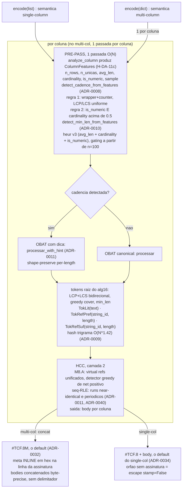
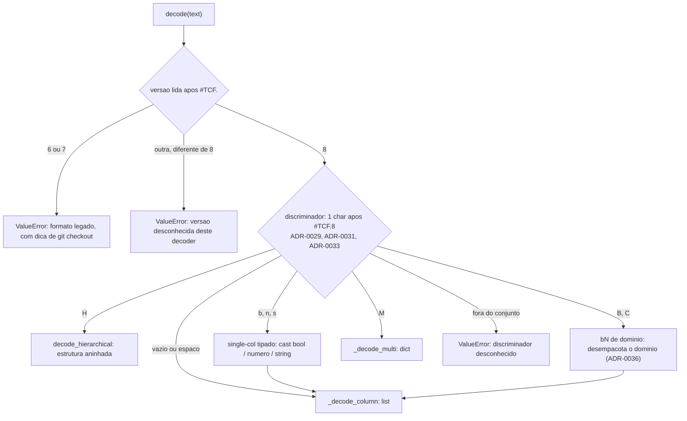
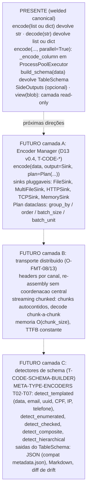

<!-- l10n: doc_id=tcf-format · lang=pt-BR · source_lang=en · translation_of=TCF-format.en.md · synced=2026-08-23 -->
[English](TCF-format.en.md) · **Português**

> Tradução de [`TCF-format.en.md`](TCF-format.en.md). Se houver divergência, o original em inglês prevalece.
> A régua de atualização é o histórico do git.

# TCF: Tabular Compact Format

## Visão geral

TCF é um formato textual para representar **dados tabulares** de
forma **compacta**, mantendo:

- **Output em texto** (sem binário): inspeção visual e
  processamento por LLMs/pipelines line-oriented
- **Roundtrip lossless** de VALORES: `decode(encode(values)) == values`. A
  ORDEM das linhas também volta igual, exceto sob `sort_by`
  (ver [encode-knobs.md](../reference/encode-knobs.md))
- **Compressão estrutural**: explora padrões em colunas (afixos
  compartilhados, sub-padrões recorrentes, cadências detectáveis,
  runs near-identical)

Formato projetado para:
- Colunas de dados tabulares onde valores compartilham estrutura
  (URLs, emails, IDs, datas, paths, identificadores estruturados)
- Volumes médios (não substitui gzip pra logs massivos; substitui
  CSV/JSON quando legibilidade importa)
- Tabelas multi-coluna onde cada coluna se beneficia de pipeline
  próprio (encoder per-column independente)

## Versionamento (pré-1.0)

> **Três eixos** ([ADR-0024](../adr/0024-pre-1.0-versioning-git-as-compat.md),
> [ADR-0028](../adr/0028-pre-1.0-versioning-minor-format-coupling-release-cadence.md)), distinga:
> - **(A) Versão de FORMATO**: a **assinatura de formato / magic number** `#TCF.N` (termo canônico;
>   **não** "shebang", que é `#!`, análogo a `%PDF-1.7`; ver [vocabulary.md](../vocabulary.md)).
>   Contrato on-disk; só muda com mudança de formato. Hoje `#TCF.8` (default, ADR-0032); `#TCF.6/.7`
>   cortados de `src/tcf` (git-as-compat: recupere a era pra ler/comparar).
> - **(B) Geração do encoder**: marco interno do desenvolvimento (o `M10` que aparece no pipeline
>   e na [ADR-0011](../adr/0011-pacote1-weld-canonical.md)). NÃO é versão pública, não viaja no wire.
> - **(C) Versão do pacote** (PyPI), pré-1.0 = `0.<formato>.<release>`: minor = nº do formato
>   (`0.N` ↔ `#TCF.N`); release/patch = entrega DENTRO do formato.
>
> **Regra de bump**: mudança de FORMATO move o minor (`0.(N+1).0`); entrega sem mudar formato move o
> release (`0.N.x+1`). Ex.: `#TCF.8` default ([ADR-0032](../adr/0032-tcf8-default-format.md)) =
> pacote `0.8.x`. `1.0` só quando o formato final congelar → aí semver estrito.
> Termos: [`../vocabulary.md`](../vocabulary.md) §Versionamento.

TCF distingue **versão de FORMATO** (assinatura `#TCF.N`, eixo A) de **versão de PACOTE**
(semver `0.N.x`, eixo C), não confundir os dois (ADR-0028).

### Format version (assinatura)

| Assinatura | O que o decode faz |
|---|---|
| `#TCF.8` | **formato vigente** (multi-col + single-col self-describing): encode emite, decode le |
| `#TCF.7` / `#TCF.6` | **erro nomeado** de legado, com dica de `git checkout` da era pra ler/comparar (git-as-compat, [ADR-0024](../adr/0024-pre-1.0-versioning-git-as-compat.md)) |
| qualquer outro `#TCF.<N>` | erro de versao desconhecida |

Verificavel: `decode('#TCF.6M ...')` levanta *"formato legado ... nao suportado no 0.8"*;
`decode('#TCF.5M ...')` levanta *"blob #TCF.5: versao desconhecida deste decoder"*.

**`#TCF.8` e' o formato DEFAULT** ([ADR-0032](../adr/0032-tcf8-default-format.md)): todo multi-col
emite `#TCF.8M`; single-col plano emite **`#TCF.8`** por DEFAULT (7 B). O orfao (body sem
assinatura) e' o ESCAPE explicito `stamp=False`
([ADR-0034](../adr/0034-header-default-100-porcento-single-col.md); ADR-0029 camada 1 /
[ADR-0030](../adr/0030-freeze-single-col-body-at-1.0.md) freeze). O legado `#TCF.6`/`#TCF.7` da'
fail-loud no decode, com dica de git. Self-describing: natures (ADR-0027) + hex + escaping viajam
no header.

**1-char discriminator** ([ADR-0029](../adr/0029-version-format-identification-semi-implicit.md) +
[ADR-0031](../adr/0031-hierarchical-discriminator-H.md) + [ADR-0033](../adr/0033-hierarchical-codec-weld.md)):
o caractere logo apos `#TCF.8` decide a estrutura. **9 valores**, mais a faixa de pontuacao
consumida pelo pre-passe de polaridade ([ADR-0035](../adr/0035-delimitador-de-polaridade-single-col.md)):

| apos `#TCF.8` | tipo | header |
|---|---|---|
| *(nada, body direto)* | single-col orfao, **ESCAPE explicito** (`stamp=False`): transmissao/container tipo parquet, onde a versao ja' viaja fora. **NAO e' o default** ([ADR-0034](../adr/0034-header-default-100-porcento-single-col.md)) | - |
| `\n` | single version-stamp, **o default** | `#TCF.8` (magic number p/ `file`/libmagic) |
| `M` | multi-col plano | `#TCF.8M<meta>` (meta INLINE na linha de assinatura) |
| `H` | multi-col hierarquico (especializacao de `M`), [ADR-0033](../adr/0033-hierarchical-codec-weld.md) | `#TCF.8H<tree-meta>` |
| ` ` (espaco) | single + spec | `#TCF.8 [nome]:spec` (nome opcional, so' rotulo) |
| `b` / `n` / `s` | single-col tipado (bool / numero / string) | `#TCF.8<tag>[<modo><n-hex>]`; a tag `n` emite a forma curta `#TCF.8n`. Os tres modos da tag `b`: [`api.md`](../reference/api.md) |
| `B` / `C` | bN de dominio (dominio primeiro / por ultimo), ADR-0036 | `#TCF.8B<w><n>` |

Discriminador fora do conjunto acima -> **fail-loud** no decode (nunca degrada pra orfao). Um
sufixo de pontuacao na linha de assinatura e' o **delimitador de polaridade**
([ADR-0035](../adr/0035-delimitador-de-polaridade-single-col.md)), retirado por um pre-passe antes
do dispatch. Ele NAO age em `M`/`H`. O mesmo char eleito marca no CORPO a troca literal ↔
referencia: custa 1 byte por TRANSICAO, nao por ocorrencia, e sai do complemento do alfabeto da
coluna (faixa so' de pontuacao).

**Meta do `#TCF.8M`**: INLINE, na propria linha da assinatura (`#TCF.8M<meta>\n<bodies>`). Cada
coluna = `[<pre>]<size>[=<nome>][:<id>]`:
- **byte-size em HEX** ([T-FMT-HEADER-BASE-HEX](../../tickets/T-FMT-HEADER-BASE-HEX.md), ADR-0032 §3):
  `format(n,'x')` (minusculo, sem `0x`, sem zero a esquerda). Colisao-livre com os separadores. Decimal
  so' via comando de inspecao (nao e' formato armazenado).
- **prefixo de modo** `!`=raw (V2-A) · `@`=dict (V2-B) · `%`=split (V2-C), antes do size.
- **tag de tipo** logo APÓS o size: `N` número, `B` bool. Ausente = texto, o default.
  O tipo primitivo do dado é uma declaração que não se deduz do corpo (`["1","2"]` e
  `[1,2]` geram os mesmos bytes), então ele viaja no header, e custa **1 byte**. Maiúscula
  porque o size é hex minúsculo canônico: fora do alfabeto hex, a tag é inequívoca.
  `int` e `float` compartilham `N`, como no `.8H`: a distinção sai do próprio valor.
  A última coluna, que normalmente omite o size (`min_header`), passa a emiti-lo quando
  é tipada, porque sem size não há onde ancorar a tag.
- **sufixo `:id`** = nature (ADR-0027). O registry core tem **5**: `cpf` · `cnpj` · `ip` ·
  `dt` (data ISO) · `ipad` (int-pad). Resolve via dict fixo core-only pelo **`wire_id`**
  (ADR-0041, `name` e' plano do CODIGO e nunca viaja). **Id desconhecido e' FAIL-LOUD**
  (`ValueError`: *"registry core fechado; forneca o spec out-of-band"*), NAO cru+warning:
  o spec de terceiro entra por fora e so' e' aceito se o `wire_id` **coincidir** com o `:id`
  do header. O `:id` da nature = ULTIMO `:` NAO-escapado.
- **nome com separador** (`,`/`=`/`:`/`\`/prefixo `!@%` inicial): **escapado com backslash**
  ([T-FMT-NAME-ESCAPING](../../tickets/T-FMT-NAME-ESCAPING.md)); tokenizer splita em separador
  NAO-escapado. Unico proibido: `\n` (separador de linha do meta).
- **ultima coluna sem size** (`min_header`, corpo ate' EOF, O-FMT-15/ADR-0023): par sem `=`.
- **colunas anonimas** (`drop_names`): omite `=nome`; decode reconstroi pela ORDEM (`{'0':..,'1':..}`).
- **nome vazio** (`''`): emitido como **`\z`**, o mesmo sentinela que o `.8H` usa (ADR-0033 → ADR-0046); o
  decode devolve `''`. **Nao** e' o mesmo que anonima: anonima omite o nome e decoda posicional; `\z` e' um nome.
  `\z` e' inemitivel por dado (o nome literal `\z` sai escapado `\\z`) e so' vale como token INTEIRO: `\z`
  embutido segue erro de corrupcao.

**Assinatura do single-col**: `#TCF.8\n` + body. O `M` marca o multi-col; o single-col nao o usa.
Gate vigente: **D1-D9 = 1545 B** e **real-world = 89430 B**, pinados em
[`test_regression_v1_baseline.py`](../../tests/test_regression_v1_baseline.py) e
[`test_real_world_snapshots.py`](../../tests/test_real_world_snapshots.py).

**Canonicidade do corpo**: o corpo NAO contem linha que comece com `#TCF.<digito>` (concatenar dois
wires prontos corrompe as referencias: decode cada um e re-encode o conjunto) e o contador de `*N|`
so' e' canonico com `N >= 2` em digitos ASCII. Os dois casos levantam `ValueError` no decode. Limite
declarado: coluna raw (`!`) e' verbatim, entao uma juncao DENTRO dela segue indetectavel.

**Exemplos.** Cada caso traz a chamada `encode()` que gerou o wire, o wire REAL logo abaixo e o que a
assinatura diz. Roundtrip conferido em todos.

**1. Multi-col com nature**: `encode({"doc": [3 CNPJs], "obs": ["nota-1","nota-2","nota-3"]}, schema={"doc": "cnpj"})`

```text
#TCF.8M16=doc:cnpj,obs
!K\9p\5B$
!Kx\0n)$
^1
nota-*\1
1\2
1\3
```

`M` = multi-col plano. Em `16=doc:cnpj`, a coluna `doc` ocupa `0x16` = 22 bytes de corpo e venceu com
o spec `cnpj` (sufixo `:id`). `obs` e' a ULTIMA coluna: vai sem size, corpo ate' EOF.

**2. Multi-col em modo dicionario**: `encode({"uf": ["SP","RJ"]*3, "cid": ["Santos","Niteroi"]*3})`

```text
#TCF.8M@e=uf,@cid
6
SP
RJ
!"!"!"15
Santos
Niteroi
!"!"!"
```

`@` nas duas: cada coluna virou tabela de simbolos + stream de indices. `uf` ocupa `0xe` = 14 bytes,
`cid` e' a ultima (sem size). O corte entre colunas e' por BYTE, nao por linha: a linha `!"!"!"15`
carrega o fim do stream de `uf` e ja' o comeco do corpo de `cid`.

**3. O mesmo com `min_header=False`**: o corpo sai byte-identico ao do caso 2, so' a assinatura muda.

```text
#TCF.8M@e=uf,@18=cid
```

Agora a ultima coluna declara o size (`0x18` = 24 bytes). Serve pra inspecao: o wire vai de 56 pra 59
bytes neste exemplo.

**4. Single-col com spec**: `encode([3 CPFs], schema="cpf", name="docs")`

```text
#TCF.8 docs:cpf
\2y/h-
%gc\9g
^1
```

O ESPACO depois de `#TCF.8` e' o discriminador de "single + spec". `docs` e' so' rotulo, opcional
(sem `name=` a assinatura sai `#TCF.8 :cpf`); `:cpf` e' o spec que o decode inverte.

**5. Single-col version-stamp**: `encode(["log-01","log-02","log-03"])`

```text
#TCF.8
log-\0*\1
1\2
1\3
```

O discriminador e' o proprio `\n`: assinatura sozinha na primeira linha, body single-col puro
depois. E' o default do single-col e o magic number pro `file`/libmagic.

**6. Single-col tipado (bool)**: `encode([True, False, True])`

```text
#TCF.8b13
oA==
```

`b` = dominio bool; `1` = largura em bits por elemento (1 bit = bool sem null; `2` e' o ternario com
null, `encode([True, None, False])` sai `#TCF.8b23`); `3` = contagem de elementos, em hex. O corpo e'
o bit-pack em base64.

**7. Hierarquico**: `encode([{"id":"a","end":{"uf":"SP"}}, {"id":"b","end":{"uf":"RJ"}}])`

```text
#TCF.8Hid:4,end{uf
a
b
SP
RJ
```

`H` = arvore, e o meta descreve a topologia. `id:4` = folha `id` com 4 bytes de corpo (`a\nb\n`);
`end{uf` = objeto `end` contendo a folha `uf`, que por ser a ULTIMA vai sem size. Cada folha e'
comprimida como uma coluna comum.

**Candidatos de coluna** (o fallback per-coluna, todos no `#TCF.8M`; `min(tcf,raw,dict,split)`):
- **V2-A fallback identity** ([ADR-0022](../adr/0022-v2a-fallback-identity-weld.md), `fallback=True`):
  min(TCF, raw); coluna raw marcada `!<size>=<name>`.
- **Header minimo** ([ADR-0023](../adr/0023-v2-minimal-header-weld.md), `min_header=True`): omite o size
  da ULTIMA coluna (corpo ate' EOF). Voltado a payload pequeno.
- **V2-B dicionario** ([ADR-0025](../adr/0025-v2b-dictionary-categorical-weld.md), `@`) e **split
  estrutural** ([ADR-0026](../adr/0026-structural-split-weld.md), `%`): mais candidatos per-coluna.

### Superficie publica

Pre-1.0 e ADITIVA ([ADR-0024](../adr/0024-pre-1.0-versioning-git-as-compat.md)): nomes novos entram,
os que ja' existem nao mudam de assinatura sem re-pin deliberado. A lista de exports esta'
**congelada por teste** em
[`test_regression_v1_baseline.py`](../../tests/test_regression_v1_baseline.py)
(`EXPECTED_PUBLIC_API`): esse teste e' a fonte, nao esta prosa.

```python
from tcf import (
    encode, decode,                            # core
    SideOutputs,                               # debug/stats opt-in
    PipelineConfig,                            # toggle layers
    build_schema, TableSchema, ColumnSchema,   # schema introspection
    TemplatedCheckedSpec, TemplatedPaddedSpec, # nature definitions
    SPEC_CPF, SPEC_CNPJ, SPEC_IP, SPEC_DATA_ISO, SPEC_INT_PAD, SPEC_REGISTRY,
    view, LazyTCF, Filtered,                   # camada read-only
)
```

Detalhe de cada nome, com os kwargs de cada porta: [`api.md`](../reference/api.md),
[`encode-knobs.md`](../reference/encode-knobs.md) e [`lazy-view.md`](../reference/lazy-view.md).
Semver estrito vale a partir do `1.0`, quando o formato final congelar.

### Suite regressao formal

[`tests/test_regression_v1_baseline.py`](../../tests/test_regression_v1_baseline.py)
captura bytes-canonical de D1-D9 (**1545 B** total) e D17a (**300 B**, `#TCF.8M` default).
Falha em CI = regressao. O snapshot so' se move por re-pin deliberado, registrado em ADR e no
[`CHANGELOG.md`](../../CHANGELOG.md)
([ADR-0024](../adr/0024-pre-1.0-versioning-git-as-compat.md),
[ADR-0028](../adr/0028-pre-1.0-versioning-minor-format-coupling-release-cadence.md)).

## Pipeline completo



Wire do multi-col: `#TCF.8M` + meta inline (colunas `[<pre>]<size>[=<nome>][:<id>]` separadas por
`,`) + `\n` + `<body1><body2><body3>...` concatenados. O encoder nao tem rota para `#TCF.6`/`#TCF.7`.

**Marcadores do corpo** (o que o HCC emite; um port precisa de todos):

- `~` cria ref auto-nomeado · `,` concat efemero · `1..5` range (acucar) · `*` separator ([ADR-0007](../adr/0007-comma-in-literals-bug.md))
- `*N|<linha>`: RLE de linhas identicas adjacentes (`N >= 2`)
- `*N+delta|<template>`: seq-RLE, run near-identical com delta constante ([ADR-0011](../adr/0011-pacote1-weld-canonical.md))
- `*N~d1,...,dp|<template>`: seq-RLE PERIODICO, o delta CICLA entre as linhas e o ciclo paga uma vez ([ADR-0040](../adr/0040-seq-rle-periodico.md))
- `\X`: escape
- char de polaridade: marca a troca literal ↔ referencia, 1 byte por TRANSICAO ([ADR-0035](../adr/0035-delimitador-de-polaridade-single-col.md))

**Dispatch do encode por tipo de entrada** (assinatura emitida; a tabela de kwargs por rota esta' em
[`api.md`](../reference/api.md)):

| entrada | assinatura | exemplo medido |
|---|---|---|
| `list[str]` plana | `#TCF.8` | `encode(["abc","abcd","abcde"])` |
| `dict[str, list]` | `#TCF.8M<meta>` | `encode({"id": [...], "nome": [...]})` |
| `list[int]` | `#TCF.8n` | `encode([1,2,3])` |
| `list[bool]` | `#TCF.8b<modo><n>` | `encode([True,False]*12)` sai `#TCF.8b118` |
| bool + str na mesma lista | `#TCF.8bB<n>`, lazytype ([ADR-0039](../adr/0039-lazytype-bool-cabeca-congelada-extras.md)) | `encode([True,"abc",False])` sai `#TCF.8bB23` |
| lista de cardinalidade baixa | `#TCF.8B<w><n>`, bN de dominio ([ADR-0036](../adr/0036-bn-de-dominio-cardinalidade-baixa.md)) | `encode(["0","1"]*100)` sai `#TCF.8B1c8` |
| aninhado ou ragged (o dict retangular de 0 linhas fica no `.8M`, com corpo `@` de tabelinha vazia) | `#TCF.8H<tree-meta>` ([ADR-0033](../adr/0033-hierarchical-codec-weld.md)) | `encode([{"a":1}])` sai `#TCF.8Ha:3n`; `encode({})` sai `#TCF.8H#E` |

### Decode (espelho)



A ordem e' a do dispatch real: versao, pre-passe de polaridade (que nao age em `M`/`H`), depois o
discriminador. Self-describing: a assinatura identifica o formato e o decoder dispatcha sozinho, o
chamador nao precisa saber se a saida vem como `list` ou `dict`.

## Camadas detalhadas

### Camada 0: Pre-pass

Antes de entrar no OBAT, cada coluna passa por análise O(N) que
produz `ColumnFeatures` + hints heurísticos. Esses hints calibram
OBAT (shape-preserve ou canonical) e min_len ótimo.

Módulos:
- [`column_features.py`](../../src/tcf/column_features.py): `analyze_column()` (H-DA-11c)
- [`auto_cadence.py`](../../src/tcf/auto_cadence.py): `detect_cadence_from_features()` (ADR-0008)
- [`auto_min_len.py`](../../src/tcf/auto_min_len.py): `detect_min_len_from_features()` (ADR-0010)

### Camada 1: OBAT

Tokeniza cada string da coluna em refs (prefixo/sufixo de strings
anteriores) + literais. Produz **tokens discretos** que HCC consome.

Doc: [OBAT.md](OBAT.md). Implementação: [`src/tcf/core/online.py`](../../src/tcf/core/online.py)
+ [`src/tcf/obat_shape.py`](../../src/tcf/obat_shape.py).

### Camada 2: HCC

Detecta composições recorrentes nos tokens (refs que se repetem
juntos viram refs nomeados pairwise) + compacta runs near-identical
em `*N+delta|template`. Produz **texto TCF** final do body.

Doc: [HCC.md](HCC.md). Implementação: [`src/tcf/composicional/syntax.py`](../../src/tcf/composicional/syntax.py)
+ [`src/tcf/composicional/hcc_seqrle.py`](../../src/tcf/composicional/hcc_seqrle.py).

### Camada 3: Multi-column wrapper

Para input `dict[str, list[str]]`, cada coluna passa pelas camadas
0-2 independentemente. Os bodies são concatenados byte-precise com
header `#TCF.8M` (DEFAULT, ADR-0032) + meta INLINE.

> **`#TCF.8M`** ([ADR-0032](../adr/0032-tcf8-default-format.md)): `encode(dict)` emite `#TCF.8M`
> com `fallback` + dicionário V2-B + split + `min_header` **automáticos**, meta INLINE na linha da
> assinatura, byte-sizes em **HEX**, markers de modo por coluna (`!` raw, `@` dict, `%` split),
> nomes com separador **escapados** e a última coluna sem size. Ex. medido (sizes hex):
> `encode({"id": ["1","2","3"], "nome": ["ana","bruno","carla"], "plano": ["free","pro","free"]})`
> sai `#TCF.8M!5=id,!f=nome,plano\n...` (`f` = 15 em hex; `plano`, por ser a última, vai sem size).

**V2-A fallback identity (ADR-0022, `fallback`)**: por coluna escolhe min(TCF, raw);
coluna raw vira `!<size>=<name>`. **Ligado por default**.

**Header mínimo ([ADR-0023](../adr/0023-v2-minimal-header-weld.md), `min_header`)**: o meta é
INLINE, na própria linha da assinatura; `min_header` omite o size da última coluna (corpo até EOF):
meta `<s1>=<n1>,...,<nN>`. **Ligado por default**. Foco: payload pequeno (header fixo domina).
`fallback`/`min_header` são knobs opt-out: mudam a escolha por coluna, não o formato (sempre
`#TCF.8M`).

**V2-B dicionário (ADR-0025, `@`) + split estrutural (ADR-0026, `%`)**: candidatos
extras do fallback por coluna (dicionário categórico; quebra de campo estrutural).
Entram no default quando reduzem a coluna.

Restrições:
- Nomes de coluna com separador (`,`/`=`/`:`/`\`/prefixo `!@%`) são **escapados com backslash**
  (T-FMT-NAME-ESCAPING); só `\n` é proibido (separador de linha do meta)
- Todas as colunas devem ter o mesmo número de valores
- `None` e' **preservado**, NAO vira `""`. Em single-col plano ele ocupa o slot nulo pre-alocado
  (`0`): `encode(["x", None, "y"])` sai `#TCF.8\nx\n0\ny\n` e o roundtrip devolve
  `["x", None, "y"]`. Dentro de um `dict` a rota e' outra: a coluna com `None` puxa a tabela pro
  `.8H`. Detalhe: [`api.md`](../reference/api.md) §Indices de referencia PRE-ALOCADOS.

Implementação: [`src/tcf/multi/`](../../src/tcf/multi/). ADR: [0004](../adr/0004-multi-column-header-compacto.md), [0013](../adr/0013-multi-column-canonical-api.md), [0014](../adr/0014-unified-api-side-outputs.md).

## API mínima

```python
from tcf import encode, decode, view, SideOutputs

# Single-column
text = encode(["joao@gmail.com", "maria@gmail.com", "pedro@gmail.com"])
values = decode(text)  # list[str]

# Multi-column
table = {
    "timestamp": ["2026-01-01", "2026-01-02"],
    "email": ["a@x.com", "b@x.com"],
}
text = encode(table)
result = decode(text)  # dict[str, list[str]]

# Side outputs opcional (debug, stats, schema futuro)
side = SideOutputs()
text = encode(table, side_outputs=side)
print(side.hcc_trace)                       # detector iterations
print(side.per_col["email"].column_features) # pre-pass features
print(side.multi_info)                       # header_bytes, body_bytes

# Spec de coluna: `schema=` e' o parametro UNICO de spec (ADR-0047)
text = encode(["529.982.247-25", "111.444.777-35"], schema="cpf")
text = encode(table, schema={"timestamp": "data-iso"})  # por coluna, no multi-col

# Camada read-only: consulta sem materializar a tabela
lz = view(encode(table))
lz.columns                                  # ['timestamp', 'email']
```

Superficie completa (todos os kwargs de `encode`, o `max_length` do `decode`, a camada `view`):
[`api.md`](../reference/api.md), [`encode-knobs.md`](../reference/encode-knobs.md) e
[`lazy-view.md`](../reference/lazy-view.md). Um knob merece destaque aqui porque toca o roundtrip:
`sort_by` reordena as linhas, entao sob ele a ORDEM original nao volta (os VALORES, sim).

### SideOutputs (ADR-0014)

Recipiente opcional que captura informação produzida internamente
pelo pipeline mas que normalmente seria descartada. Útil para:

- Debug (inspecionar decisões do detector HCC, escolhas de cobertura
  do OBAT)
- Análise de compressão (qual coluna não se beneficiou, por quê)
- Schema builder futuro (consume features + heurísticas pra produzir
  schema rico)

Campos:
- Pre-pass: `column_features`, `cadence_detected`, `cadence_info`, `min_len`
- OBAT: `obat_log`, `obat_used_hint`
- HCC: `hcc_trace`, `hcc_rede`, `seq_rle_runs`
- Bytes: `body_bytes` (per coluna)
- Multi-col: `multi_info`, `per_col` (SideOutputs aninhado por coluna)

Sem `side_outputs=`: overhead zero (logs continuam sendo gerados e
descartados como antes). Doc: [SideOutputs](../../src/tcf/side_outputs.py).

## Camadas futuras (registradas, não implementadas)



O header por canal da camada B tem a forma `#TCF.8...C name=<coluna> chunk=1/3 of=<tabela>`
(família `.8`, ainda sem rota de encode).

Tickets de plano:
- [T-CODE-ENCODER-MANAGER](../../tickets/T-CODE-ENCODER-MANAGER.md) (P2): Revive D13 v0.4
- [T-CODE-OUTPUT-SINKS](../../tickets/T-CODE-OUTPUT-SINKS.md) (P2): Contract `Sink` pluggable
- [T-CODE-PLAN-CONTRACT](../../tickets/T-CODE-PLAN-CONTRACT.md) (P3): Plan dataclass
- [T-CODE-SCHEMA-BUILDER](../../tickets/T-CODE-SCHEMA-BUILDER.md) (P3): Consume SideOutputs

## Posicionamento na literatura de compressão

TCF se localiza no cruzamento de três famílias clássicas:

### 1. Compressão estrutural de string dictionaries

**Família**: front-coding e variantes (Witten et al., HTFC e RPDac de
Brisaboa et al. 2011, etc.)

**Comparação**:
- TCF, via OBAT, generaliza front-coding com **bidirecionalidade**
  (LCP + LCS), captura padrões "tipo email" onde sufixo
  (`@gmail.com`) é estável e prefixo varia.
- TCF, via HCC, adiciona **composições hierárquicas**: não há
  análogo direto em front-coding clássico.

### 2. Grammar-based compression

**Família**: Re-Pair (Larsson & Moffat 1999), Sequitur
(Nevill-Manning & Witten 1997).

**Comparação**:
- HCC é greedy iterative, espírito Re-Pair mas em tokens de OBAT
  (não bytes).
- HCC tem **operadores semânticos distintos** (`~` vs `,`): não há
  análogo em Re-Pair (toda substituição cria regra).
- HCC é **offline** (analisa body completo) mas mais simples que
  Sequitur (que mantém invariantes online complexos).

### 3. Compactação para LLM consumption (acessório ao core)

**Família**: TabLLM (2023), TOON, JSON-tabular, formatos compactos
para LLMs lerem tabelas (Sui 2024 review).

**Comparação**:
- O TCF comprime **estrutura de coluna**, não legibilidade por LLM: as duas
  coisas se cruzam, mas o critério de projeto aqui é byte e roundtrip.
- O estudo de leitura por LLM que o projeto conduziu está em
  [`docs/findings/`](../findings/) (Q01-Q38) e é **acessório** ao core.

## Diferenciais agregados

| Característica | TCF | LZ77/gzip | Re-Pair | Front-coding |
|---|---|---|---|---|
| Output | textual | binário | binário | binário/textual |
| Inspecionável visualmente | sim | não | não | parcial |
| Online (streaming-friendly) | parcial | sim | não (offline) | sim |
| Bidirecional (prefixo + sufixo) | sim | n/a | n/a | só prefixo |
| Hierarquia de composições | sim | implícita | sim (grammar) | não |
| Auto-naming sem dict explícito | sim | n/a | não (precisa dict) | sim |
| Multi-coluna nativo | sim | não | não | não |
| Adequado a colunar | sim (desenhado pra) | genérico | genérico | sim |

## Quando usar TCF

**Bom uso**:
- Colunas de strings com padrões textuais (URLs, emails, IDs, datas,
  paths)
- Volume médio (centenas a milhares de linhas; valida até 60k em
  lineitem TPC-H)
- Output em texto é requisito (inspeção, pipelines line-oriented,
  consumo por LLMs)
- Tabelas multi-coluna onde cada coluna se beneficia de pipeline
  próprio

**Quando preferir alternativas**:
- **CSV/JSON**: formato muito simples, sem necessidade de
  compressão (mas TCF mantém legibilidade)
- **gzip/brotli/zstd**: datasets MUITO grandes, compressão crítica,
  binário OK
- **Re-Pair/Sequitur/HTFC**: dicionários gigantes, output binário OK,
  busca aleatória importante

## Validação

> Os números vivos estão nos TESTES, não nesta prosa:
> [`test_regression_v1_baseline.py`](../../tests/test_regression_v1_baseline.py) (D1-D9 single-col +
> D17a `#TCF.8M`) e [`test_real_world_snapshots.py`](../../tests/test_real_world_snapshots.py) são os
> dois guardiões byte-canonical, gate obrigatório em CI. Rode `pytest -q`. Estado do pacote:
> [STATUS.md](../../STATUS.md).

**Single-column**: D1-D9 sintéticos (RT 9/9, com o header default) e os três recortes real-world
(online-retail description/stockcode, TPC-H lineitem comment) são os snapshots pinados nos dois
testes acima.

**Multi-column** ([ADR-0014](../adr/0014-unified-api-side-outputs.md) + V2
[ADR-0022](../adr/0022-v2a-fallback-identity-weld.md)/[0023](../adr/0023-v2-minimal-header-weld.md)/[0025](../adr/0025-v2b-dictionary-categorical-weld.md)/[0026](../adr/0026-structural-split-weld.md)):
D17a sintético (13x4) pinado no teste de baseline. Sobre 9 tabelas real-world (Adult Census + TPC-H
tier 1+2, 136k linhas, 15.8 MB raw): **-33.02% weighted vs raw** e **-31.46%** vs single-col
concatenado, RT 9/9; lineitem 60k x 16: **-17.11%** vs raw.

**Real-world estendido (UCI/OpenML, T-DATA-1)**:
- wine-quality 6.5k x 13: 90.9% ratio (decimais químicos, baixa repetição)
- beijing-pm25 43.8k x 13: 71.7% (sensores + timestamps)
- online-retail 541k x 8: **23.7%** (StockCode/Country/InvoiceDate repetidos)

**Benchmark vs csv/jsonl + gzip/brotli/zstd** (9 datasets): TCF venceu em **7/9**. Perdeu em D17a
tiny (o header fixo domina o payload) e em wine-quality (decimais quase únicos, sem estrutura pra
explorar). A pasta do lab com a corrida é referência local, fora do git:
`experiments/lab/dirty/2026-05/2026-05-24/2026-05-24-benchmark-formats-compression/`.

## Conexões

### Algoritmos
- [OBAT](OBAT.md): camada 1 (tokenização)
- [HCC](HCC.md): camada 2 (compactação composicional)

### ADRs
O índice completo, com status e supersedes, é [`docs/adr/README.md`](../adr/README.md). Os ADRs que
definem cada regra deste documento estão linkados ao lado dela, no corpo do texto.

### Tickets de plano futuro
- [T-CODE-ENCODER-MANAGER](../../tickets/T-CODE-ENCODER-MANAGER.md): P2, paralelismo + sinks
- [T-CODE-OUTPUT-SINKS](../../tickets/T-CODE-OUTPUT-SINKS.md): P2, Sink pluggable
- [T-CODE-PLAN-CONTRACT](../../tickets/T-CODE-PLAN-CONTRACT.md): P3, Plan dataclass
- [T-CODE-SCHEMA-BUILDER](../../tickets/T-CODE-SCHEMA-BUILDER.md): P3, build_schema
- [META-TYPE-ENCODERS](../../tickets/META-TYPE-ENCODERS.md): naturezas (T02-T07)

### Narrativa
- [`historia-dirty-lab.md`](../../experiments/lab/dirty/notas/2026-05/historia-dirty-lab.md): M0-M14 desenvolvimento
- [`roadmap-hipoteses.md`](../../experiments/lab/dirty/notas/2026-05/roadmap-hipoteses.md): hipóteses ativas/fechadas
- `naturezas-numericas-2026-05-23.md`: catalogação de 12 naturezas (referência local em
  `experiments/lab/dirty/notas/2026-05/`, fora do git)
- [`futuras-otimizacoes-formato.md`](../../experiments/lab/dirty/notas/2026-05/futuras-otimizacoes-formato.md): O-FMT-* registry
