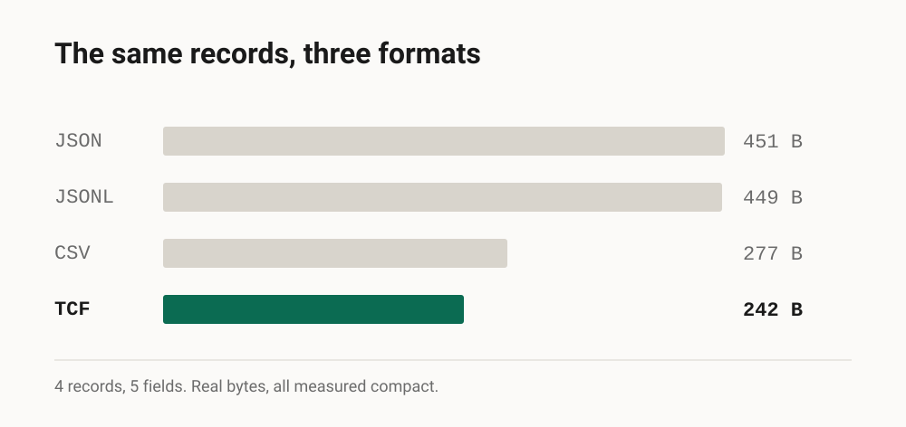
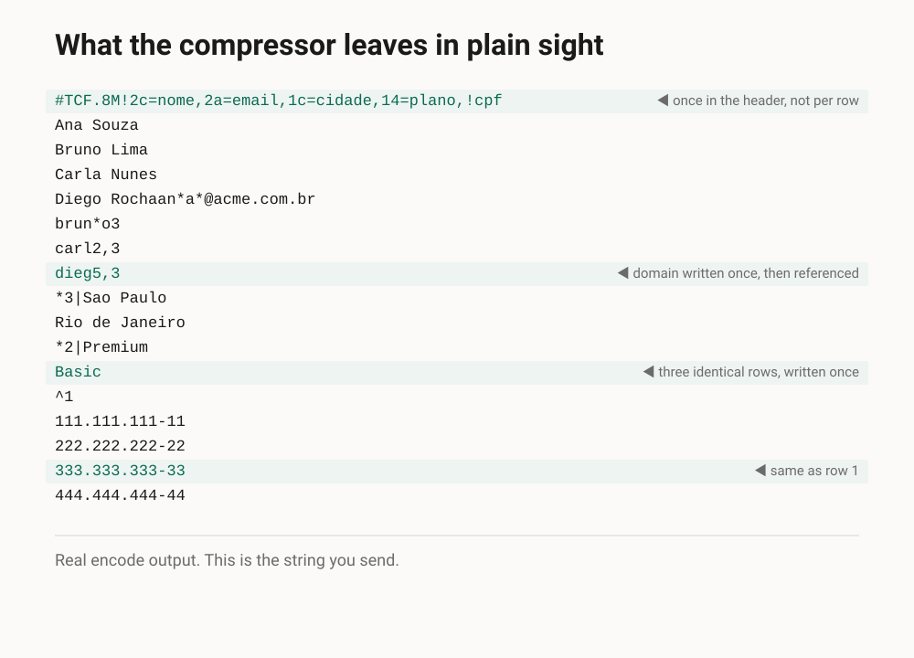
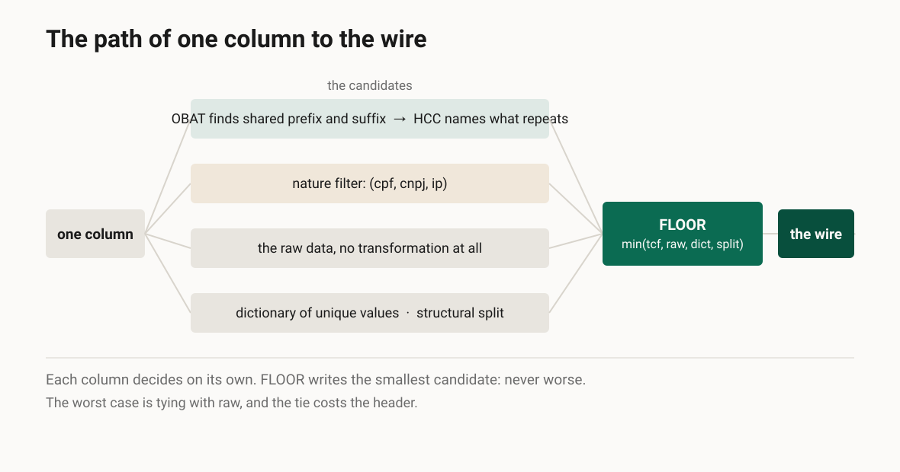
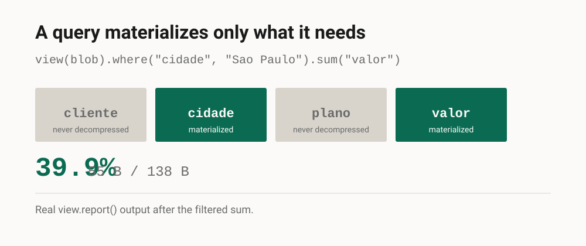
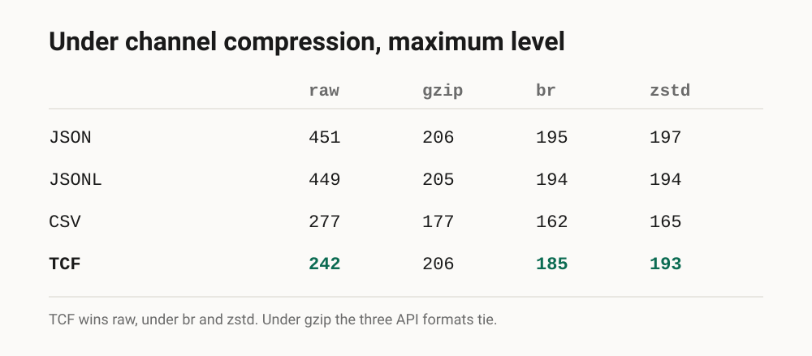

**English** · [Português](artigo.pt-BR.md)

# TCF: compressing tables without turning them into a blob nobody can open

*Technical article, derived from the repository README. Every number here already lives in a
test or in a dated report of the project, and the code blocks on this page run in the suite.*

Source: [`../2026-09-04-release.en.md`](../2026-09-04-release.en.md). The figures are in
[`figuras/en/`](figuras/en/); upload `0-capa` to the header frame and the others where the text
calls them.

---

To a system, a table is text that has to be stored and transmitted. The usual formats for that
carry a cost you do not see at first: JSON repeats every field name on every row, CSV repeats
nothing but also exploits nothing, and gzip solves the size by turning everything into an
opaque block that you can only read after inflating it whole.

TCF (Tabular Compact Format) sits between those two worlds. It compresses much like gzip, with
one difference: the result **stays ASCII text you can open and inspect**, without
decompressing. It does not stay as obvious as the original, because the more TCF factors, the
denser the text gets. But it never becomes an opaque blob.

It is lossless: `decode(encode(x)) == x`, always.

## The same data in three formats

Four people, five fields, every format measured compact.

**JSON**, 451 bytes: repeats every field name on every row.

**CSV**, 277 bytes: drops the names, one line per record.

**TCF**, 242 bytes: what repeats becomes a reference, what is unique stays raw.



```python
from tcf import decode, encode

table = {
    "nome":   ["Ana Souza", "Bruno Lima", "Carla Nunes", "Diego Rocha"],
    "email":  ["ana@acme.com.br", "bruno@acme.com.br",
               "carla@acme.com.br", "diego@acme.com.br"],
    "cidade": ["Sao Paulo", "Sao Paulo", "Sao Paulo", "Rio de Janeiro"],
    "plano":  ["Premium", "Premium", "Basic", "Premium"],
    "cpf":    ["111.111.111-11", "222.222.222-22",
               "333.333.333-33", "444.444.444-44"],
}

wire = encode(table)

# the only guarantee that matters: the data comes back identical
assert decode(wire) == table
```

That is 242 bytes, and the line that matters is the last one: the round-trip closes, so
nothing below cost any information.

And the wire is this, real `encode` output:

```
#TCF.8M!2c=nome,2a=email,1c=cidade,14=plano,!cpf
Ana Souza
Bruno Lima
Carla Nunes
Diego Rochaan*a*@acme.com.br
brun*o3
carl2,3
dieg5,3
*3|Sao Paulo
Rio de Janeiro
*2|Premium
Basic
^1
111.111.111-11
222.222.222-22
333.333.333-33
444.444.444-44
```



Column names appear once, in the header. `*3|Sao Paulo` says there are three identical cidade
rows, written once. `^1` says "same as row 1", which is how the fourth `plano` row becomes
`Premium` again without being written out. And the domain `@acme.com.br` was written once and
referenced by the other three e-mails.

The second half of the figure turns the CPF filter on: the column then stores 5 characters per
value, and the wire drops from 242 to 210 bytes.

## How it does that: two layers

**OBAT** (Online Bidirectional Affix Tokenizer) finds what the strings have in common. For each
value it looks for the longest prefix **and** suffix shared with the previous ones: e-mail
domains, URL roots, codes from the same family. It writes the fragment once and references the
rest. It is bidirectional front-coding, and the "bidirectional" is what captures the shared
suffix, not only the prefix.

Finding the longest shared affix between strings is a problem with a family of its own: **prefix
and suffix trees**, from tries to the **Patricia/radix tree** (Morrison, 1968) and suffix trees.
Comparing each value against every earlier one is quadratic, and on real data that does not
close.

What runs today is not a tree, it is a **trigram index**: instead of comparing against the whole
history, it uses three-character fragments to find the few candidates that can share an affix.
It measured a 5.4x speedup and takes the cost from O(N²) to about **O(N^1.42)**, sub-quadratic.

The Patricia trie is on file as a candidate for after 1.0, and that is not modesty: a
feasibility study compared the two and the decision was to **keep the trigram index**. A
Patricia gives deterministic traversal and alphabetical ordering for free, and charges for it in
cache locality, because its pointers scatter where a hash table concentrates. Swapping would
also mean redoing the byte-canonical gates, since the structure changes which affix wins a tie.

**HCC** (Hierarchical Compositional Coding) decides what is worth naming and groups repetition.
It takes OBAT's tokens and factors recurring compositions into reusable named references. It
also collapses consecutive repeats, including near-identical sequences such as IDs that only
change at the end. Since a reference points to a reference, the result is an acyclic graph of
fragments, in the spirit of Re-Pair and Sequitur, operating on tokens rather than bytes.



Each column runs its own pipeline, and for each one the encoder generates the candidates and
writes the **smallest**: `min(tcf, raw, dictionary, split)`. The result is never worse by
construction. You do not need to test whether the format inflated your data, because it cannot.

## The three shapes of repetition

HCC collapses repetition, and that is more than "the same value N times". There are three
shapes, and the last two are the ones that show up in system data.

**Identical adjacent rows**, the `*N|` marker. It is what appears in the cidade column of the
example above:

```
["Sao Paulo"] * 5 + ["Rio de Janeiro"]

#TCF.8
*5|Sao Paulo
Rio de Janeiro
```

64 bytes become 35.

**A sequence with a constant step**, `*N+delta|`. This is the case of incremental IDs, order
numbering, any column that walks by a fixed amount:

```python
from tcf import decode, encode

ids = [str(i) for i in range(100, 160, 5)]
wire = encode(ids)                  # 12 values
assert decode(wire) == ids
```

The entire wire is this:

```
#TCF.8
*12+5|\100
```

47 bytes become 18, and none of the twelve values is written down. The first value, the step and
the count are, and `decode` rebuilds the rest.

**A periodic sequence**, `*N~d1,d2,...|`, when the step cycles instead of staying constant:

```
[0, 3, 10, 13, 20, 23, 30, 33, ...]

#TCF.8!!
0
3
*14~3,7|10
```

The `3,7` cycle is paid once and covers the fourteen rows that follow.

And this is where readability stops being comfort and becomes capability. `*5|Sao Paulo` **is
already a count**: knowing how many rows carry that value means reading the `5`, not expanding
five strings. `*12+5|` **is already a progression**, so minimum, maximum and sum can be answered
without materializing the column. That property is what the next section uses.

## Nature filters, when the data has a fixed shape

Some values carry a structure a generic compressor cannot exploit. A Brazilian CPF like
`123.456.789-09` has nine useful digits: the punctuation is fixed, and the last two digits are
computed from the others. The opt-in filter stores only the nine, and `decode` recomputes the
check digits and reinserts the punctuation. Exact reconstruction.

Four CPFs in a single column: 69 bytes without the filter, 39 with it, −43%. There are filters
for CPF, CNPJ and IPv4, and all of them are **never-worse**: they compete with the ordinary
pipeline and only win if they shrink it. A value that does not match the shape falls back to a
literal in the same column, without breaking the round-trip.

One detail that matters: a filter is not a type. TCF never validates semantics, and does not
check whether a CPF exists. It is a hypothesis about the **shape** of the text, and the string
comes back byte for byte.

## Querying almost without decompressing

A gzip block on disk makes you allocate memory and inflate everything before you can scan
anything. TCF's structure works as an index: `*N|` is already a ready count, `^1` is already
visible dedup. You can count, group and even sum by reading the markers, materializing only the
part you need.

`view()` is the API over that. It connects without decompressing and only materializes the
column, and the rows, that the aggregator needs.

```python
from tcf import encode, view

table = {
    "cliente": ["Ana", "Bruno", "Carla", "Diego", "Eva", "Ana"],
    "cidade": ["SP", "SP", "SP", "RJ", "SP", "RJ"],
    "plano": ["Premium", "Premium", "Basic",
              "Premium", "Basic", "Premium"],
    "valor": [120, 100, 170, 200, 80, 80],
}

blob = encode(table)
v = view(blob)              # connects, decompresses nothing

v.count()                   # 6, touches no column at all
v.sum("valor")              # 750.0, touches: valor
v.group_count("plano")      # {'Premium': 4, 'Basic': 2}
v.where("cidade", "SP").sum("valor")     # 470.0
```

The filtered sum materializes only `cidade` and `valor`. The other two columns are never
decompressed, and `view.report()` says how much of the blob was read.



## The numbers on larger sets

Across the 15 synthetic datasets of EXP-008, with no compressor at all, TCF is the most compact
text format of the set: 3131 bytes against 4872 for CSV, about 36% smaller.

On real multi-column data, 9 Adult and TPC-H tables totalling 136k rows, it is **−33.02%
weighted** against raw CSV. And across the 8 real datasets of EXP-019 the set fell from 390,863
to 290,949 bytes, **−25.6%**, ranging from −4.1% to −46.6% depending on the data.

The format reads nested structure as of 0.8. It consumes the dataset your language builds from
JSON, so nested objects, arrays, `null` and typed booleans round-trip byte for byte. Two
records with a list inside: 184 bytes in compact JSON, 144 in TCF with the CPF filter.

## And against gzip, brotli, zstd?

Not a competitor, a layer underneath. In transmission `Content-Encoding` is negotiated by the
transport and is invisible to your code: by the time your handler reads the body, it has
already been inflated. The honest question is not "TCF or brotli", it is **what my process
holds and parses once the channel has done its invisible work**.

On the four-record set, under channel compression at maximum level:



Under `gzip` the three API formats tie within 1 byte. TCF wins raw, under `br` and under
`zstd`. And CSV, which is rarely an API payload and has no `view`, is smaller once compressed
at this tiny size.

## Where this applies today

**It is pre-1.0**, at 0.8.4. The current cycle closed functionality: four wire families welded
and published. The next cycle is algorithm optimization, and it has not started.

**Writing is expensive, reading is cheap.** The work sits in `encode`, in the affix search.
`decode` is a single linear pass, with O(1) lookups and no search. That decides where the
format pays off: cacheable data pays the encode once and distributes many times, while data
personalized per request pays it every time.

**Under `gzip`, TCF does not win.** At tiny sizes, CSV beats it.

**Comparison against Parquet and storage formats has not been done.** They occupy a different
place and deserve their own measurement.

## Practical

Python 3.10 or newer, zero runtime dependencies, MIT.

```
pip install tcf-format
```

The code, the measurements and the documentation of what does not work are open:

https://github.com/LeoPR/TCF

#Python #Compression #DataEngineering #OpenSource #DataFormats
