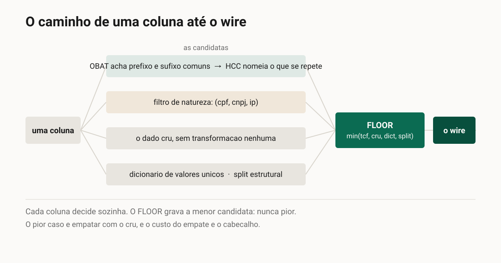

**Português** · [English](artigo.en.md)

# TCF: comprimir tabelas sem virar um blob que ninguém abre

*Artigo técnico, derivado do README do repositório. Cada número aqui já vive num teste ou num
relatório datado do projeto, e os blocos de código desta página rodam na suíte.*

Fonte: [`../2026-09-04-lancamento.md`](../2026-09-04-lancamento.md). As figuras estão em
[`figuras/pt-BR/`](figuras/pt-BR/); suba a `0-capa` no quadro do topo e as outras onde o texto
as chama.

---

Para um sistema, uma tabela é texto que precisa ser guardado e transmitido. Os formatos mais
usados para isso têm um custo que não se vê de cara: o JSON repete o nome de cada campo em toda
linha, o CSV não repete nada mas também não aproveita nada, e o gzip resolve o tamanho
transformando tudo num bloco opaco, que você só consegue ler depois de descomprimir inteiro.

O TCF (Tabular Compact Format) ocupa a faixa entre esses dois mundos. Ele comprime parecido com
um gzip, com uma diferença: o resultado **continua texto ASCII que você abre e inspeciona**,
sem descomprimir. Não fica tão óbvio quanto o original, porque quanto mais ele fatora, mais
denso o texto. Mas nunca vira um blob opaco.

É um formato sem perdas: `decode(encode(x)) == x`, sempre.

## O mesmo dado em três formatos

Um cadastro de quatro pessoas e cinco campos, com todos os formatos medidos compactos.

**JSON**, 451 bytes: repete o nome de cada campo em toda linha.

**CSV**, 277 bytes: joga os nomes fora, uma linha por registro.

**TCF**, 242 bytes: o que se repete vira referência, e o que é único fica cru.


```python
from tcf import decode, encode

tabela = {
    "nome":   ["Ana Souza", "Bruno Lima", "Carla Nunes", "Diego Rocha"],
    "email":  ["ana@acme.com.br", "bruno@acme.com.br",
               "carla@acme.com.br", "diego@acme.com.br"],
    "cidade": ["Sao Paulo", "Sao Paulo", "Sao Paulo", "Rio de Janeiro"],
    "plano":  ["Premium", "Premium", "Basic", "Premium"],
    "cpf":    ["111.111.111-11", "222.222.222-22",
               "333.333.333-33", "444.444.444-44"],
}

wire = encode(tabela)

# a única garantia que importa: o dado volta idêntico
assert decode(wire) == tabela
```

São 242 bytes, e a linha que importa é a última: o roundtrip fecha, então nada do que vem
abaixo custou informação.

E o wire é isto, saída real do `encode`:

```
#TCF.8M!2c=nome,2a=email,1c=cidade,14=plano,!cpf
Ana Souza
Bruno Lima
Carla Nunes
Diego Rochaan*a*@acme.com.br
brun*o3
carl2,3
dieg5,3
*3|Sao Paulo
Rio de Janeiro
*2|Premium
Basic
^1
111.111.111-11
222.222.222-22
333.333.333-33
444.444.444-44
```


Os nomes das colunas aparecem uma vez, no cabeçalho. `*3|Sao Paulo` diz que há três linhas
iguais de cidade, escritas uma vez. `^1` diz "igual à linha 1", que é como a quarta linha de
`plano` volta a ser `Premium` sem ser escrita de novo. E o domínio `@acme.com.br` foi escrito
uma vez e referenciado nos outros três e-mails.

A segunda metade da figura liga o filtro de CPF: a coluna passa a guardar 5 caracteres por
valor, e o wire cai de 242 para 210 bytes.

## Como ele faz isso: duas camadas

**OBAT** (Online Bidirectional Affix Tokenizer) acha o que as strings têm em comum. Para cada
valor, procura o maior prefixo **e** sufixo compartilhado com os anteriores: domínios de e-mail,
raízes de URL, códigos da mesma família. Escreve o trecho uma vez e referencia o resto. É um
front-coding bidirecional, e o "bidirecional" é o que captura o sufixo comum, não só o prefixo.

**HCC** (Hierarchical Compositional Coding) decide o que vale a pena nomear e agrupa
repetições. Pega os tokens do OBAT e fatora composições recorrentes em referências nomeadas
reutilizáveis. Também colapsa repetições consecutivas, inclusive sequências quase iguais, tipo
IDs que só mudam no fim. Como referência aponta para referência, o resultado é um grafo
acíclico de fragmentos, no espírito do Re-Pair e do Sequitur, operando sobre tokens em vez de
bytes.



Cada coluna passa por um pipeline próprio, e para cada uma o codificador gera as candidatas e
grava a **menor**: `min(tcf, cru, dicionário, split)`. O resultado é nunca pior por construção.
Não é preciso testar para descobrir se o formato inchou o seu dado, porque ele não pode inchar.

## Filtros por natureza, quando o dado tem forma fixa

Alguns valores têm uma estrutura que o compressor genérico não aproveita. Um CPF
`123.456.789-09` tem nove dígitos úteis: a pontuação é fixa, e os dois dígitos finais são
calculados a partir dos outros. O filtro opt-in guarda só os nove, e o `decode` recalcula o
verificador e reinsere a pontuação. Reconstrução exata.

Quatro CPFs em coluna única: 69 bytes sem o filtro, 39 com ele, −43%. Existem filtros para CPF,
CNPJ e IPv4, e todos são **nunca-pior**: competem com o pipeline comum e só vencem se
encolherem. Valor que não casa a forma vira literal na mesma coluna, sem quebrar o roundtrip.

Um detalhe que importa: um filtro não é um tipo. O TCF nunca valida semântica, não checa se um
CPF existe. É uma hipótese sobre a **forma** do texto, e a string volta byte a byte.

## Consultar quase sem descomprimir

Um bloco gzip no disco faz você alocar memória e descomprimir tudo para só então varrer os
dados. A estrutura do TCF funciona como índice: `*N|` já é uma contagem pronta, `^1` já é
dedup visível. Dá para contar, agrupar e somar lendo os marcadores, materializando só o pedaço
necessário.

A `view()` é a API sobre isso. Conecta sem descomprimir e só materializa a coluna e as linhas
que o agregador precisa.

```python
from tcf import encode, view

tabela = {
    "cliente": ["Ana", "Bruno", "Carla", "Diego", "Eva", "Ana"],
    "cidade": ["SP", "SP", "SP", "RJ", "SP", "RJ"],
    "plano": ["Premium", "Premium", "Basic",
              "Premium", "Basic", "Premium"],
    "valor": [120, 100, 170, 200, 80, 80],
}

blob = encode(tabela)
v = view(blob)              # conecta, não descomprime nada

v.count()                   # 6, não toca coluna nenhuma
v.sum("valor")              # 750.0, toca: valor
v.group_count("plano")      # {'Premium': 4, 'Basic': 2}
v.where("cidade", "SP").sum("valor")     # 470.0
```

A soma filtrada materializa só `cidade` e `valor`. As outras duas colunas nunca são
descomprimidas, e o `view.report()` diz quanto do blob foi lido.


## Os números em conjunto maior

Nos 15 datasets sintéticos do EXP-008, sem nenhum compressor, o TCF é o formato de texto mais
compacto do conjunto: 3131 bytes contra 4872 do CSV, cerca de 36% menor.

Em multi-coluna real, 9 tabelas do Adult e do TPC-H somando 136 mil linhas, são **−33,02%
ponderado** contra o CSV cru. E nos 8 datasets reais do EXP-019, o conjunto caiu de 390.863
para 290.949 bytes, **−25,6%**, com a faixa indo de −4,1% a −46,6% conforme o dado.

O formato lê estrutura aninhada desde a 0.8. Ele consome o dataset que a sua linguagem monta a
partir do JSON, então objeto aninhado, lista, `null` e booleanos tipados voltam byte a byte.
Dois registros com uma lista dentro: 184 bytes em JSON compacto, 144 no TCF com o filtro de
CPF.

## E contra gzip, brotli, zstd?

Não é concorrente, é uma camada por baixo. Em transmissão, o `Content-Encoding` é negociado
pelo transporte e é invisível ao seu código: quando o handler lê o corpo, ele já foi inflado.
A pergunta honesta não é "TCF ou brotli", é **o que o meu processo segura e faz parse depois
que o canal fez o trabalho invisível dele**.

No cadastro de quatro registros, sob compressão de canal em nível máximo:


Sob `gzip` os três formatos de API empatam dentro de 1 byte. O TCF ganha cru, sob `br` e sob
`zstd`. E o CSV, que raramente é payload de API e não tem `view`, é menor depois de comprimido
neste tamanho minúsculo.

## Onde isto se aplica hoje

**É pré-1.0**, na 0.8.4. O ciclo atual fechou funcionalidade: quatro famílias de wire
soldadas e publicadas. O ciclo seguinte é o de otimização de algoritmo, e ainda não começou.

**Escrever é caro, ler é barato.** O trabalho está no `encode`, na busca de afixos. O `decode`
é uma passada linear única, com lookups O(1) e sem busca. Isso decide onde o formato compensa:
dado cacheável paga o encode uma vez e distribui muitas; dado personalizado por requisição paga
toda vez.

**Sob `gzip`, o TCF não ganha.** No tamanho minúsculo, o CSV passa.

**Comparação com Parquet e formatos de armazenamento não foi feita.** Ocupam um lugar diferente
e merecem medição própria.

## Prático

Python 3.10 ou mais novo, zero dependências de runtime, MIT.

```
pip install tcf-format
```

O código, as medições e a documentação do que não funciona estão abertos:

https://github.com/LeoPR/TCF

#Python #Compressao #DataEngineering #OpenSource #FormatosDeDados
