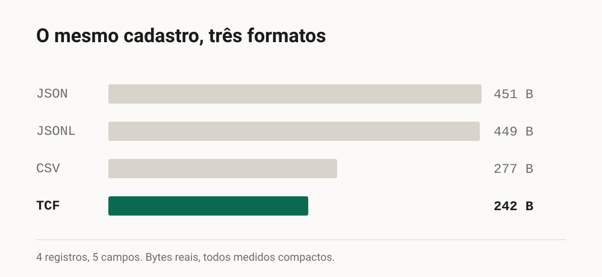
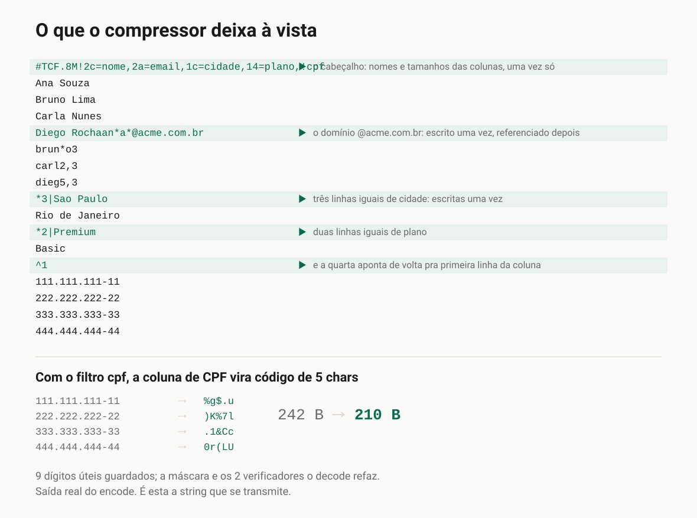
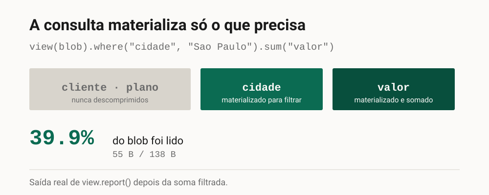
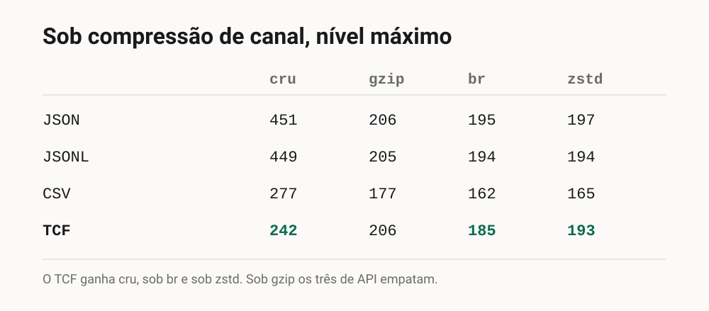

**Português** · [English](page.md)

# TCF: compacto como um compressor, inspecionável como texto

Página ilustrada para montar em qualquer canal. As imagens ficam em
[`figuras/pt-BR/`](figuras/pt-BR/) e podem ser reordenadas ou usadas soltas. Nada aqui é
desenhado: os bytes são medidos com roundtrip validado, e o wire desenhado é o que o `encode`
devolve. Tudo sai de `python scripts/make_divulgacao_figuras.py`.

Para um sistema, uma tabela é texto que precisa ser guardado e transmitido. Os formatos usados
para isso têm um custo que não se vê de cara: o JSON repete o nome de cada campo em toda linha,
o CSV não repete nada mas também não aproveita nada, e o gzip resolve o tamanho transformando
tudo num bloco opaco.

As figuras estão vinculadas em **SVG**, que é o que o repositório versiona e o que o
GitHub renderiza. Para subir no LinkedIn, converta para PNG: qualquer navegador abre o SVG e
exporta, e o script gera o PNG sozinho se `cairosvg` estiver instalado.

## 1. O mesmo cadastro, três formatos

Quatro pessoas e cinco campos. O JSON gasta 451 bytes porque grava `"nome"`, `"email"`,
`"cidade"`, `"plano"` e `"cpf"` de novo em cada registro. O CSV joga os nomes fora e cai para
277. O TCF chega a 242 fatorando o que se repete dentro das colunas, não só entre as linhas.

A diferença não é o formato ser mais esperto em geral. É ele olhar a tabela **por coluna**, onde
a repetição de fato mora.

## 2. O que o compressor deixa à vista

Esta é a string que se transmite. Não é um dump hexadecimal, e não precisa de ferramenta para
abrir.

O cabeçalho traz os nomes das colunas uma vez. `*3|Sao Paulo` diz que há três linhas iguais ali,
escritas uma vez só. `^1` diz "igual à linha 1". E o domínio `@acme.com.br` aparece uma vez,
referenciado pelos outros três e-mails.

Vale ser exato sobre o que isso significa, porque a densidade engana. **Não é perda:** o
roundtrip devolve a tabela idêntica, `decode(encode(x)) == x`. O que sumiu foi a repetição, não
o dado.

## 3. A consulta materializa só o que precisa

É aqui que a legibilidade deixa de ser conforto e vira capacidade.

Um bloco comprimido no disco obriga a alocar memória e descomprimir tudo antes de varrer
qualquer coisa. Como a estrutura do TCF fica à vista, ela serve de índice: dá para contar,
agrupar e somar lendo os marcadores.

Na soma filtrada da figura, `cidade` e `valor` foram materializadas, `cliente` e `plano` nunca
foram tocadas, e o total lido foi 39,9% do blob. O número sai do `view.report()`, não de
estimativa.

## 4. E contra gzip, brotli, zstd?

Não é concorrente, é uma camada por baixo, e a comparação costuma ser mal colocada.

Em transmissão o `Content-Encoding` é negociado pelo transporte e é invisível ao seu código:
quando o handler lê o corpo, ele já foi inflado. A pergunta que sobra é o que o seu processo
segura e faz parse depois disso.

Os números dizem o resto sem precisar de defesa. Sob `gzip` os três formatos de API empatam
dentro de 1 byte. O TCF ganha cru, sob `br` e sob `zstd`. E o CSV, que raramente é payload de
API e não tem `view`, é menor depois de comprimido neste tamanho minúsculo.

## Onde isto se aplica hoje

É pré-1.0, na 0.8.4. O ciclo atual fechou funcionalidade, e o de otimização de algoritmo é o
próximo. Escrever é caro e ler é barato, então o formato compensa em dado cacheável e cobra caro
em dado personalizado por requisição. E a comparação com Parquet e formatos de armazenamento
ainda não foi feita.

`pip install tcf-format` · Python 3.10 ou mais novo · zero dependências · MIT.

https://github.com/LeoPR/TCF
